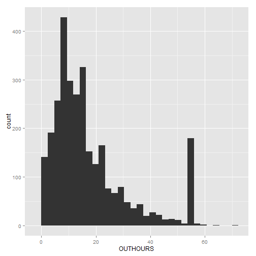
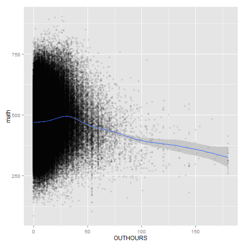
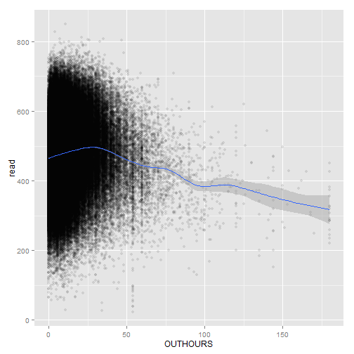
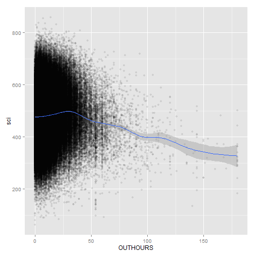
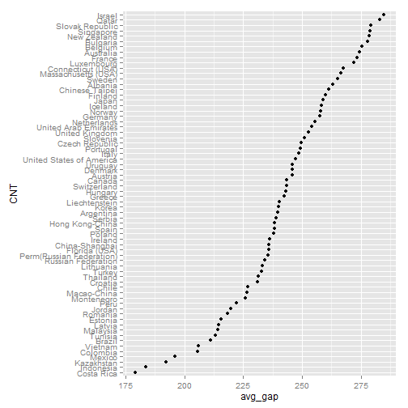

OUTHOURS vs Scores and 20-20 ratio
========================================================


While looking at my favorite country with a city named Tirana, I noticed that something strange was happening.  No other country appears to have this.

```r
# peak at 54 hours
qplot(OUTHOURS, data = subset(student2012, CNT == "Albania"))
```

```
## stat_bin: binwidth defaulted to range/30. Use 'binwidth = x' to adjust this.
```

 


Not much correlation between scores and out of school study hours

```r
qplot(x = OUTHOURS, y = math, 
      data = student2012 %>% 
        select(OUTHOURS, math) %>% 
        filter(!is.na(OUTHOURS)), 
      alpha = I(0.1)) + stat_smooth()
```

```
## geom_smooth: method="auto" and size of largest group is >=1000, so using gam with formula: y ~ s(x, bs = "cs"). Use 'method = x' to change the smoothing method.
```

 

```r
qplot(x = OUTHOURS, y = read, 
      data = student2012 %>% 
        select(OUTHOURS, read) %>% 
        filter(!is.na(OUTHOURS)), 
      alpha = I(0.1) ) + stat_smooth()
```

```
## geom_smooth: method="auto" and size of largest group is >=1000, so using gam with formula: y ~ s(x, bs = "cs"). Use 'method = x' to change the smoothing method.
```

 

```r
qplot(x = OUTHOURS, y = sci, 
      data = student2012 %>% 
        select(OUTHOURS, sci) %>% 
        filter(!is.na(OUTHOURS)), 
      alpha = I(0.1) ) + stat_smooth()
```

```
## geom_smooth: method="auto" and size of largest group is >=1000, so using gam with formula: y ~ s(x, bs = "cs"). Use 'method = x' to change the smoothing method.
```

 


Mean scores in the top 20 and bottom 20 percent for each nation

```r
library(reshape2)
best_worst = student2012 %>% 
  select(CNT, math, read, sci, OUTHOURS) %>% 
  group_by(CNT) %>% 
  summarise(math_high = mean(math[math > quantile(math, probs = seq(0, 1, 0.2))[5]]),
            math_low = mean(math[math < quantile(math, probs = seq(0, 1, 0.2))[2]]),
            sci_high = mean(sci[sci > quantile(sci, probs = seq(0, 1, 0.2))[5]]),
            sci_low = mean(sci[sci < quantile(sci, probs = seq(0, 1, 0.2))[2]]),
            read_high = mean(read[read > quantile(read, probs = seq(0, 1, 0.2))[5]]),
            read_low = mean(read[read < quantile(read, probs = seq(0, 1, 0.2))[2]])) %>%
  mutate(math_gap = math_high - math_low,
         sci_gap = sci_high - sci_low,
         read_gap = read_high - read_low) %>%
  mutate(avg_gap = (math_gap + sci_gap + read_gap)/3 ) %>%
  arrange(desc(avg_gap))
head(best_worst)
```

```
## Source: local data frame [6 x 11]
## 
##               CNT math_high math_low sci_high sci_low read_high read_low
## 1          Israel     606.9    327.3    611.0   328.9     625.1    332.9
## 2           Qatar     524.0    257.4    536.6   254.5     540.0    239.5
## 3 Slovak Republic     623.7    345.3    609.3   334.1     598.6    314.9
## 4       Singapore     704.9    419.2    680.4   399.9     666.1    395.2
## 5     New Zealand     638.0    367.7    654.8   372.4     649.4    366.4
## 6        Bulgaria     572.5    320.7    584.8   316.0     590.6    278.1
## Variables not shown: math_gap (dbl), sci_gap (dbl), read_gap (dbl),
##   avg_gap (dbl)
```

```r


best_worst$CNT = factor(best_worst$CNT, levels = best_worst$CNT[order(best_worst$avg_gap)])
qplot(x = avg_gap, y = CNT, data = best_worst)
```

 

```r


qplot(x = value, y = CNT, data = best_worst %>% 
        select(CNT, math_gap, read_gap, sci_gap) %>% 
        melt(id.vars = "CNT"), color = variable)
```

 


