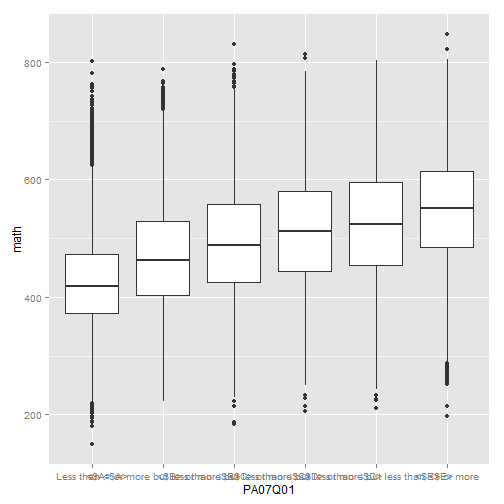

OECD
========================================================

```r
library(ggplot2)
library(dplyr)
```

```
## Warning: package 'dplyr' was built under R version 3.0.3
```

```
## 
## Attaching package: 'dplyr'
## 
## The following objects are masked from 'package:stats':
## 
##     filter, lag
## 
## The following objects are masked from 'package:base':
## 
##     intersect, setdiff, setequal, union
```

```r
setwd("..")
sets <- c("item", "parent", "school", "scoredItem", "student")

# function to build the file names
fn_build <- function(file_name) {
    
    template <- c("2012.rda", "2012dict.rda")
    
    file_name %>% vapply(paste0, template, template) %>% file.path(".", "data", 
        .)
}

# load the data
sets %>% fn_build %>% lapply(load, .GlobalEnv)
```

```
## [[1]]
## [1] "item2012"
## 
## [[2]]
## [1] "item2012dict"
## 
## [[3]]
## [1] "parent2012"
## 
## [[4]]
## [1] "parent2012dict"
## 
## [[5]]
## [1] "school2012"
## 
## [[6]]
## [1] "school2012dict"
## 
## [[7]]
## [1] "scoredItem2012"
## 
## [[8]]
## [1] "scoredItem2012dict"
## 
## [[9]]
## [1] "student2012"
## 
## [[10]]
## [1] "student2012dict"
```

```r


# function to convert to data-frames
fn_make_df <- function(named_vector) {
    data.frame(variable = attr(named_vector, "names"), description = named_vector, 
        row.names = NULL)
}

# there's a clever way to do this, but beyond me for naw
dict_item2012 <- fn_make_df(item2012dict)
dict_parent2012 <- fn_make_df(parent2012dict)
dict_school2012 <- fn_make_df(school2012dict)
dict_scoredItem2012 <- fn_make_df(scoredItem2012dict)
dict_student2012 <- fn_make_df(student2012dict)
```


Average test scores: each student has 5 scores for each area.  

```r
avg_test = function(subj) {
    apply(student2012[, paste0("PV", 1:5, subj)], 1, mean)
}
subj = c("MATH", "MACC", "MACQ", "MACS", "MACU", "MAPE", "MAPF", "MAPI", "READ", 
    "SCIE")

# rank avg math scores by country
student2012$math = avg_test("MATH")

math_scores = student2012 %>% select(CNT, math) %>% group_by(CNT) %>% summarise(m_math = mean(math)) %>% 
    arrange(m_math)

# rank avg reading scores by country
student2012$read = avg_test("READ")

read_scores = student2012 %>% select(CNT, read) %>% group_by(CNT) %>% summarise(m_read = mean(read)) %>% 
    arrange(m_read)

# rank avg science scores by country
student2012$sci = avg_test("SCIE")

sci_scores = student2012 %>% select(CNT, sci) %>% group_by(CNT) %>% summarise(m_sci = mean(sci)) %>% 
    arrange(m_sci)

print(math_scores)
```

```
## Source: local data frame [68 x 2]
## 
##                         CNT m_math
## 1                      Peru  367.9
## 2                 Indonesia  375.6
## 3                     Qatar  376.3
## 4                    Brazil  382.5
## 5                    Jordan  382.7
## 6                  Colombia  386.0
## 7                   Tunisia  387.4
## 8                   Albania  394.9
## 9                 Argentina  395.6
## 10               Costa Rica  406.0
## 11               Montenegro  406.7
## 12                  Uruguay  411.0
## 13                   Mexico  418.6
## 14                 Malaysia  422.0
## 15               Kazakhstan  431.2
## 16     United Arab Emirates  431.4
## 17                 Thailand  441.4
## 18                 Bulgaria  442.5
## 19                    Chile  444.7
## 20                  Romania  445.1
## 21                   Serbia  447.5
## 22                   Turkey  449.4
## 23                   Greece  453.5
## 24            Florida (USA)  464.5
## 25                   Israel  468.5
## 26                  Croatia  470.0
## 27                   Sweden  479.2
## 28                Lithuania  479.2
## 29 United States of America  481.7
## 30       Russian Federation  483.0
## 31                 Slovenia  484.5
## 32                  Hungary  484.9
## 33                 Portugal  485.1
## 34          Slovak Republic  485.7
## 35 Perm(Russian Federation)  485.8
## 36                  Denmark  486.2
## 37                   Norway  489.3
## 38           United Kingdom  489.7
## 39               Luxembourg  490.5
## 40                    Italy  492.1
## 41                  Iceland  492.9
## 42                Australia  493.3
## 43                    Spain  495.4
## 44                   Latvia  495.5
## 45                   France  498.4
## 46              New Zealand  500.8
## 47        Connecticut (USA)  501.2
## 48                  Ireland  501.3
## 49      Massachusetts (USA)  506.5
## 50                  Finland  507.3
## 51                  Austria  507.8
## 52                   Canada  509.4
## 53                  Vietnam  510.7
## 54                  Germany  513.9
## 55              Netherlands  518.5
## 56                  Belgium  519.7
## 57           Czech Republic  520.1
## 58                   Poland  520.5
## 59              Switzerland  521.0
## 60                  Estonia  522.3
## 61                    Japan  535.9
## 62              Macao-China  538.3
## 63            Liechtenstein  538.9
## 64                    Korea  553.8
## 65           Chinese Taipei  558.3
## 66          Hong Kong-China  561.1
## 67                Singapore  568.5
## 68           China-Shanghai  611.4
```

```r
print(read_scores)
```

```
## Source: local data frame [68 x 2]
## 
##                         CNT m_read
## 1                      Peru  384.5
## 2                     Qatar  387.4
## 3                Kazakhstan  394.1
## 4                   Albania  396.3
## 5                    Jordan  396.5
## 6                 Indonesia  397.1
## 7                  Malaysia  400.2
## 8                    Brazil  400.4
## 9                 Argentina  403.6
## 10                  Tunisia  403.6
## 11                  Uruguay  413.3
## 12                 Colombia  414.2
## 13               Montenegro  420.0
## 14                   Mexico  428.9
## 15     United Arab Emirates  437.2
## 16                  Romania  438.7
## 17               Costa Rica  440.6
## 18                 Bulgaria  442.0
## 19                   Serbia  445.7
## 20                 Thailand  453.1
## 21                    Chile  460.3
## 22                 Slovenia  462.0
## 23          Slovak Republic  467.9
## 24                   Turkey  475.9
## 25       Russian Federation  475.9
## 26                   Greece  477.6
## 27                Lithuania  477.9
## 28                  Iceland  482.8
## 29                  Denmark  483.6
## 30                  Croatia  484.2
## 31                 Portugal  484.8
## 32                   Sweden  485.2
## 33 Perm(Russian Federation)  486.8
## 34               Luxembourg  488.4
## 35            Florida (USA)  489.2
## 36                   Israel  491.4
## 37                  Austria  491.5
## 38                    Spain  493.9
## 39                    Italy  495.3
## 40                   Latvia  495.6
## 41                  Hungary  496.2
## 42              Switzerland  497.8
## 43 United States of America  498.0
## 44           United Kingdom  498.1
## 45                Australia  501.1
## 46                   Norway  504.2
## 47              Netherlands  506.4
## 48                  Germany  507.4
## 49                  Vietnam  508.4
## 50                   France  509.0
## 51              Macao-China  509.1
## 52                  Finland  510.7
## 53                   Canada  511.0
## 54                  Belgium  512.3
## 55           Czech Republic  512.4
## 56              New Zealand  514.0
## 57        Connecticut (USA)  517.0
## 58                  Estonia  518.2
## 59            Liechtenstein  518.3
## 60      Massachusetts (USA)  520.2
## 61                   Poland  520.8
## 62           Chinese Taipei  522.2
## 63                  Ireland  523.6
## 64                    Korea  535.8
## 65                    Japan  537.7
## 66                Singapore  537.7
## 67          Hong Kong-China  544.5
## 68           China-Shanghai  568.6
```

```r
print(sci_scores)
```

```
## Source: local data frame [68 x 2]
## 
##                         CNT m_sci
## 1                      Peru 373.4
## 2                 Indonesia 382.7
## 3                     Qatar 383.5
## 4                    Brazil 395.5
## 5                   Tunisia 397.8
## 6                   Albania 398.9
## 7                    Jordan 404.8
## 8                Montenegro 408.2
## 9                  Colombia 408.9
## 10                Argentina 410.5
## 11                  Uruguay 417.6
## 12                   Mexico 419.5
## 13                 Malaysia 421.0
## 14               Kazakhstan 426.1
## 15               Costa Rica 429.1
## 16                  Romania 439.3
## 17                   Serbia 443.9
## 18     United Arab Emirates 444.8
## 19                 Bulgaria 451.1
## 20                 Thailand 456.1
## 21                   Turkey 464.1
## 22                    Chile 464.7
## 23                   Greece 467.5
## 24                   Israel 473.5
## 25          Slovak Republic 476.3
## 26                  Iceland 478.1
## 27                  Denmark 482.1
## 28            Florida (USA) 482.3
## 29 Perm(Russian Federation) 482.6
## 30                   Sweden 486.3
## 31       Russian Federation 486.6
## 32                 Portugal 487.1
## 33                  Croatia 490.3
## 34               Luxembourg 492.0
## 35                   Norway 494.5
## 36                 Slovenia 496.1
## 37                Lithuania 496.4
## 38 United States of America 498.2
## 39                    Italy 500.2
## 40                  Hungary 501.6
## 41                   France 502.4
## 42              Switzerland 503.8
## 43                    Spain 504.3
## 44                   Latvia 506.1
## 45                  Austria 508.0
## 46           United Kingdom 509.6
## 47                  Belgium 510.3
## 48                Australia 511.6
## 49                   Canada 514.5
## 50        Connecticut (USA) 516.6
## 51              Netherlands 517.3
## 52              New Zealand 517.5
## 53      Massachusetts (USA) 519.8
## 54              Macao-China 520.7
## 55                  Ireland 522.2
## 56           Chinese Taipei 522.4
## 57                  Germany 524.1
## 58           Czech Republic 527.2
## 59            Liechtenstein 527.6
## 60                  Finland 527.7
## 61                  Vietnam 528.1
## 62                   Poland 528.2
## 63                    Korea 537.8
## 64                  Estonia 543.2
## 65                    Japan 546.4
## 66                Singapore 546.8
## 67          Hong Kong-China 555.0
## 68           China-Shanghai 579.6
```


I've heard that Chinese students on average spend the most time studying and Finnish students spend the least amount of time.  We can see that Finnish students study very little outside of school.

```r
# removing the stupid attributes from atomic vectors
student2012$MMINS = as.numeric(student2012$MMINS)
student2012$LMINS = as.numeric(student2012$LMINS)
student2012$SMINS = as.numeric(student2012$SMINS)
student2012$ST57Q01 = as.numeric(student2012$ST57Q01)
student2012$ST57Q02 = as.numeric(student2012$ST57Q02)
student2012$ST57Q03 = as.numeric(student2012$ST57Q03)
student2012$ST57Q04 = as.numeric(student2012$ST57Q04)
student2012$ST57Q05 = as.numeric(student2012$ST57Q05)

# all time related vars
dict_student2012[grep("time", dict_student2012[, 2], ignore.case = TRUE), ]
```

```
##     variable
## 81   ST37Q01
## 111  ST46Q01
## 141  ST57Q01
## 142  ST57Q02
## 143  ST57Q03
## 144  ST57Q04
## 145  ST57Q05
## 146  ST57Q06
## 147  ST61Q01
## 220  ST82Q01
## 221  ST82Q02
## 222  ST82Q03
## 228  ST84Q02
## 232  ST85Q03
## 249  ST88Q02
## 397  ST23Q05
## 398  ST23Q06
## 461    LMINS
## 467    MMINS
## 472 OUTHOURS
## 477    SMINS
## 485  TIMEINT
##                                                                   description
## 81                             Math Self-Efficacy - Using a <Train Timetable>
## 111                              Math Work Ethic - Homework Completed in Time
## 141                                       Out-of-School Study Time - Homework
## 142                                Out-of-School Study Time - Guided Homework
## 143                                 Out-of-School Study Time - Personal Tutor
## 144                             Out-of-School Study Time - Commercial Company
## 145                                    Out-of-School Study Time - With Parent
## 146                                       Out-of-School Study Time - Computer
## 147               Experience with Applied Maths Tasks - Use <Train Timetable>
## 220           Vignette Teacher Support -Homework Every Other Day/Back in Time
## 221              Vignette Teacher Support - Homework Once a Week/Back in Time
## 222          Vignette Teacher Support - Homework Once a Week/Not Back in Time
## 228 Vignette Classroom Management - Students Are Calm/Teacher Arrives on Time
## 232                             Classroom Management - Teacher Starts On Time
## 249                                   Attitude towards School - Waste of Time
## 397                    Acculturation - Spend Time with <Host Culture> Friends
## 398                Acculturation - Spend Time with <Heritage Culture> Friends
## 461                       Learning time (minutes per week)  - <test language>
## 467                           Learning time (minutes per week)- <Mathematics>
## 472                                                  Out-of-School Study Time
## 477                              Learning time (minutes per week) - <Science>
## 485                                               Time of computer use (mins)
```

```r

OUTHOURS = student2012 %>% select(CNT, LMINS, MMINS, OUTHOURS, SMINS, ST57Q01, 
    ST57Q02, ST57Q03, ST57Q04, ST57Q05) %>% group_by(CNT) %>% summarise(m_OUTHOURS = mean(OUTHOURS, 
    na.rm = T)) %>% arrange(m_OUTHOURS)
print(OUTHOURS)
```

```
## Source: local data frame [68 x 2]
## 
##                         CNT m_OUTHOURS
## 1                   Finland      4.711
## 2                     Japan      5.641
## 3            Czech Republic      6.584
## 4             Liechtenstein      6.949
## 5                    Sweden      7.073
## 6               New Zealand      7.185
## 7           Slovak Republic      7.227
## 8               Switzerland      7.298
## 9                   Denmark      7.504
## 10                  Iceland      7.851
## 11                   Canada      7.919
## 12                   Norway      8.016
## 13                 Slovenia      8.026
## 14                  Germany      8.038
## 15                 Portugal      8.057
## 16                  Austria      8.137
## 17                  Belgium      8.178
## 18                    Chile      8.225
## 19                   France      8.242
## 20               Luxembourg      8.601
## 21           United Kingdom      8.752
## 22               Costa Rica      8.854
## 23                   Brazil      9.441
## 24                  Uruguay      9.472
## 25                Australia      9.514
## 26              Netherlands      9.734
## 27                Argentina      9.804
## 28                    Korea      9.881
## 29           Chinese Taipei      9.935
## 30                   Israel      9.936
## 31               Montenegro      9.949
## 32                    Qatar     10.142
## 33          Hong Kong-China     10.152
## 34            Florida (USA)     10.342
## 35                   Serbia     10.502
## 36 United States of America     10.536
## 37                  Croatia     10.806
## 38                  Ireland     10.844
## 39              Macao-China     10.936
## 40                   Turkey     11.344
## 41                 Colombia     11.791
## 42                  Hungary     11.849
## 43                Lithuania     11.936
## 44                   Jordan     11.995
## 45                  Tunisia     12.059
## 46        Connecticut (USA)     12.090
## 47                    Spain     12.106
## 48                  Estonia     12.145
## 49      Massachusetts (USA)     12.185
## 50                 Bulgaria     12.356
## 51                   Mexico     12.433
## 52                     Peru     12.467
## 53                  Romania     12.853
## 54                   Latvia     13.129
## 55                   Poland     13.381
## 56                   Greece     13.647
## 57                    Italy     13.928
## 58                 Malaysia     14.018
## 59                 Thailand     15.199
## 60     United Arab Emirates     15.376
## 61                Indonesia     15.914
## 62                Singapore     15.964
## 63                  Albania     16.945
## 64                  Vietnam     17.352
## 65 Perm(Russian Federation)     19.304
## 66       Russian Federation     19.746
## 67           China-Shanghai     20.390
## 68               Kazakhstan     23.661
```


We can calculate score per hour to normalize test scores against how much students actually study.

```r
OUTHOURS = OUTHOURS %>% group_by(CNT) %>% left_join(math_scores) %>% left_join(read_scores) %>% 
    left_join(sci_scores) %>% mutate(math_hour = m_math/m_OUTHOURS) %>% mutate(read_hour = m_read/m_OUTHOURS) %>% 
    mutate(sci_hour = m_sci/m_OUTHOURS)
```

```
## Joining by: "CNT"
## Joining by: "CNT"
## Joining by: "CNT"
```

```r

print(OUTHOURS[, c(1, 6:8)])
```

```
## Source: local data frame [68 x 4]
## Groups: 
## 
##                         CNT math_hour read_hour sci_hour
## 1                   Finland    107.69    108.40   112.01
## 2                     Japan     95.00     95.32    96.86
## 3            Czech Republic     78.99     77.82    80.07
## 4             Liechtenstein     77.54     74.58    75.92
## 5                    Sweden     67.75     68.59    68.76
## 6               New Zealand     69.70     71.54    72.02
## 7           Slovak Republic     67.20     64.74    65.90
## 8               Switzerland     71.38     68.21    69.02
## 9                   Denmark     64.80     64.45    64.25
## 10                  Iceland     62.79     61.49    60.89
## 11                   Canada     64.33     64.53    64.97
## 12                   Norway     61.04     62.90    61.68
## 13                 Slovenia     60.37     57.56    61.81
## 14                  Germany     63.93     63.12    65.20
## 15                 Portugal     60.21     60.17    60.45
## 16                  Austria     62.41     60.40    62.44
## 17                  Belgium     63.54     62.64    62.40
## 18                    Chile     54.07     55.97    56.50
## 19                   France     60.47     61.76    60.95
## 20               Luxembourg     57.02     56.78    57.20
## 21           United Kingdom     55.96     56.91    58.23
## 22               Costa Rica     45.85     49.77    48.46
## 23                   Brazil     40.52     42.42    41.90
## 24                  Uruguay     43.39     43.63    44.09
## 25                Australia     51.84     52.66    53.77
## 26              Netherlands     53.27     52.02    53.14
## 27                Argentina     40.35     41.17    41.87
## 28                    Korea     56.04     54.22    54.43
## 29           Chinese Taipei     56.20     52.56    52.58
## 30                   Israel     47.16     49.45    47.65
## 31               Montenegro     40.88     42.21    41.03
## 32                    Qatar     37.11     38.20    37.82
## 33          Hong Kong-China     55.27     53.64    54.67
## 34            Florida (USA)     44.92     47.30    46.63
## 35                   Serbia     42.61     42.44    42.27
## 36 United States of America     45.72     47.27    47.28
## 37                  Croatia     43.49     44.81    45.38
## 38                  Ireland     46.23     48.28    48.15
## 39              Macao-China     49.23     46.55    47.61
## 40                   Turkey     39.61     41.95    40.91
## 41                 Colombia     32.73     35.13    34.68
## 42                  Hungary     40.92     41.88    42.34
## 43                Lithuania     40.15     40.04    41.59
## 44                   Jordan     31.91     33.06    33.75
## 45                  Tunisia     32.13     33.47    32.99
## 46        Connecticut (USA)     41.46     42.76    42.73
## 47                    Spain     40.92     40.80    41.66
## 48                  Estonia     43.01     42.67    44.73
## 49      Massachusetts (USA)     41.57     42.69    42.66
## 50                 Bulgaria     35.81     35.77    36.51
## 51                   Mexico     33.67     34.50    33.74
## 52                     Peru     29.51     30.84    29.95
## 53                  Romania     34.63     34.13    34.18
## 54                   Latvia     37.74     37.75    38.55
## 55                   Poland     38.90     38.92    39.48
## 56                   Greece     33.23     34.99    34.26
## 57                    Italy     35.33     35.56    35.91
## 58                 Malaysia     30.10     28.55    30.04
## 59                 Thailand     29.04     29.81    30.01
## 60     United Arab Emirates     28.06     28.43    28.93
## 61                Indonesia     23.60     24.95    24.05
## 62                Singapore     35.61     33.68    34.25
## 63                  Albania     23.30     23.38    23.54
## 64                  Vietnam     29.43     29.30    30.44
## 65 Perm(Russian Federation)     25.17     25.22    25.00
## 66       Russian Federation     24.46     24.10    24.64
## 67           China-Shanghai     29.99     27.89    28.42
## 68               Kazakhstan     18.22     16.66    18.01
```


Let's see if parent income has any effect on student performance

```r
library(ggvis)
students = student2012 %>% select(CNT, STIDSTD, math, read, sci)
parents = parent2012 %>% select(CNT, STIDSTD, PA07Q01, PA03Q01, PA03Q02, PA03Q03, 
    PA03Q04, PA05Q01, PA05Q02, PA05Q03, PA05Q04)
student_parent = students %>% left_join(parents, by = c("STIDSTD", "CNT"))
student_parent = student_parent[!is.na(student_parent$PA07Q01), ]
qplot(x = PA07Q01, y = math, geom = "boxplot", data = student_parent)
```

 


Apparently student IDs are not unique!  Students from different countries can share IDs.
