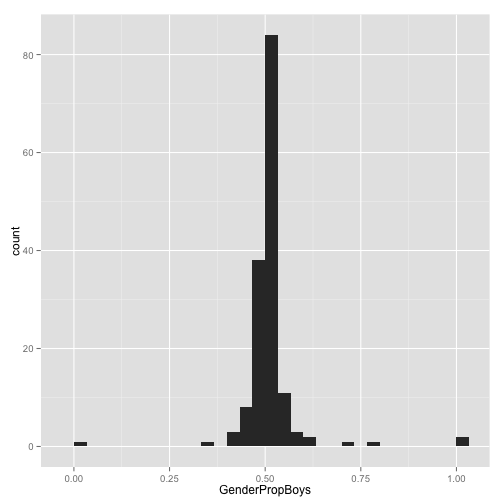
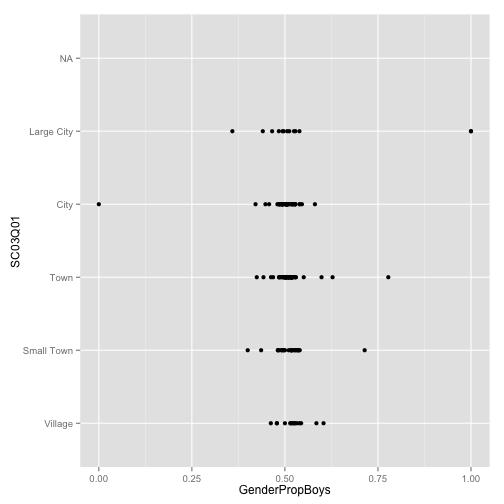
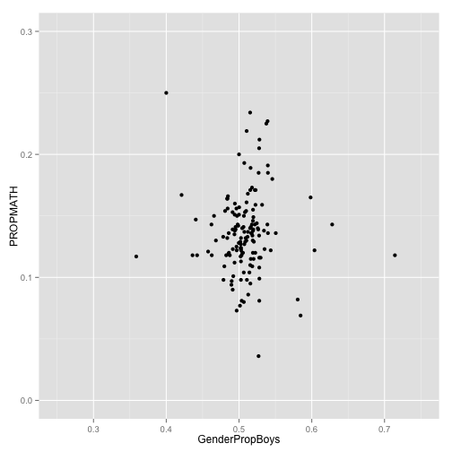

PISA
========================================================

Working from Ian's code to read in the data - it is beautiful!


```r
library(stringr)
library(ggplot2)
library(dplyr)
library(lubridate)
library(ggvis)
library(maps)
library(ggmap)
```


```r
setwd("..")
sets <- c("item", "parent", "school", "scoredItem", "student")

# function to build the file names
fn_build <- function(file_name) {
    
    template <- c("2012.rda", "2012dict.rda")
    
    file_name %>% vapply(str_join, template, template) %>% file.path(".", "data", 
        .)
}

# load the data
sets %>% fn_build %>% lapply(load, .GlobalEnv)
```

```
## [[1]]
## [1] "item2012"
## 
## [[2]]
## [1] "item2012dict"
## 
## [[3]]
## [1] "parent2012"
## 
## [[4]]
## [1] "parent2012dict"
## 
## [[5]]
## [1] "school2012"
## 
## [[6]]
## [1] "school2012dict"
## 
## [[7]]
## [1] "scoredItem2012"
## 
## [[8]]
## [1] "scoredItem2012dict"
## 
## [[9]]
## [1] "student2012"
## 
## [[10]]
## [1] "student2012dict"
```

```r

# clean rm(fn_build, sets)
```


```r
# function to convert to data-frames
fn_make_df <- function(named_vector) {
    data.frame(variable = attr(named_vector, "names"), description = named_vector, 
        row.names = NULL)
}

# there's a clever way to do this, but beyond me for naw
dict_item2012 <- fn_make_df(item2012dict)
dict_parent2012 <- fn_make_df(parent2012dict)
dict_school2012 <- fn_make_df(school2012dict)
dict_scoredItem2012 <- fn_make_df(scoredItem2012dict)
dict_student2012 <- fn_make_df(student2012dict)

# clean rm(fn_make_df) rm(item2012dict, parent2012dict, school2012dict,
# scoredItem2012dict, student2012dict)
```


Do some basic summaries, to see what's in the data.


```r
# Schools
dim(dict_school2012)
```

```
## [1] 291   2
```

```r
table(school2012$CNT)
```

```
## 
##                  Albania     United Arab Emirates                Argentina 
##                      204                      458                      226 
##                Australia                  Austria                  Belgium 
##                      775                      191                      287 
##                 Bulgaria                   Brazil                   Canada 
##                      188                      839                      885 
##              Switzerland                    Chile                 Colombia 
##                      411                      221                      352 
##               Costa Rica           Czech Republic                  Germany 
##                      193                      297                      230 
##                  Denmark                    Spain                  Estonia 
##                      341                      902                      206 
##                  Finland                   France           United Kingdom 
##                      311                      226                      507 
##                   Greece          Hong Kong-China                  Croatia 
##                      188                      148                      163 
##                  Hungary                Indonesia                  Ireland 
##                      204                      209                      183 
##                  Iceland                   Israel                    Italy 
##                      134                      172                     1194 
##                   Jordan                    Japan               Kazakhstan 
##                      233                      191                      218 
##                    Korea            Liechtenstein                Lithuania 
##                      156                       12                      216 
##               Luxembourg                   Latvia              Macao-China 
##                       42                      211                       45 
##                   Mexico               Montenegro                 Malaysia 
##                     1471                       51                      164 
##              Netherlands                   Norway              New Zealand 
##                      179                      197                      177 
##                     Peru                   Poland                 Portugal 
##                      240                      184                      195 
##                    Qatar           China-Shanghai Perm(Russian Federation) 
##                      157                      155                       63 
##                  Romania       Russian Federation                Singapore 
##                      178                      227                      172 
##                   Serbia          Slovak Republic                 Slovenia 
##                      153                      231                      338 
##                   Sweden           Chinese Taipei                 Thailand 
##                      209                      163                      239 
##                  Tunisia                   Turkey                  Uruguay 
##                      153                      170                      180 
## United States of America                  Vietnam 
##                      162                      162
```

```r
dim(dict_student2012)
```

```
## [1] 635   2
```

```r
length(table(student2012$STIDSTD))
```

```
## [1] 33806
```

```r
subset(student2012, STIDSTD == "09631")
```

```
##                         CNT SUBNATIO STRATUM     OECD
## 14374  United Arab Emirates  7840200 ARE0216 Non-OECD
## 31782             Australia  0360000 AUS0308     OECD
## 64897                Brazil  0760000 BRA0823 Non-OECD
## 84101                Canada  1240000 CAN0762     OECD
## 105645          Switzerland  7560000 CHE0661     OECD
## 155214                Spain  7241300 ESP1326     OECD
## 198748       United Kingdom  8262000 GBR2001     OECD
## 250221                Italy  3800000 ITA1501     OECD
## 325334               Mexico  4840000 MEX1440     OECD
## 398882                Qatar  6340000 QAT0001 Non-OECD
##                               NC SCHOOLID STIDSTD ST01Q01 ST02Q01 ST03Q01
## 14374      United Arab Emirates   0000382   09631       9       1      09
## 31782                  Australia  0000518   09631       9       1      11
## 64897                    Brazil   0000422   09631      10       1      09
## 84101                    Canada   0000393   09631      10       2      10
## 105645               Switzerland  0000358   09631       9      11      09
## 155214                     Spain  0000341   09631      10       1      07
## 198748 United Kingdom (Scotland)  0000386   09631      11       1      11
## 250221                     Italy  0000373   09631      10       1      05
## 325334                   Mexico   0000419   09631      10       5      05
## 398882                     Qatar  0000139   09631      10       3      06
##        ST03Q02 ST04Q01                     ST05Q01 ST06Q01   ST07Q01
## 14374     1996    Male  Yes, for one year or less        6      <NA>
## 31782     1996    Male Yes, for more than one year       6 No, never
## 64897     1996    Male Yes, for more than one year       5 No, never
## 84101     1996    Male  Yes, for one year or less        5 No, never
## 105645    1996    Male Yes, for more than one year       6 No, never
## 155214    1996  Female Yes, for more than one year       6 No, never
## 198748    1996  Female Yes, for more than one year       5 No, never
## 250221    1996  Female Yes, for more than one year       6 No, never
## 325334    1996  Female Yes, for more than one year       6 No, never
## 398882    1996  Female                        No         6 No, never
##          ST07Q02   ST07Q03              ST08Q01            ST09Q01
## 14374  Yes, once      <NA>               None               None  
## 31782  No, never No, never               None   One or two times  
## 64897  No, never No, never Five or more times               None  
## 84101  No, never No, never   One or two times   One or two times  
## 105645 No, never No, never   One or two times               None  
## 155214 No, never      <NA>               None   One or two times  
## 198748 No, never No, never               None               None  
## 250221 No, never No, never               None   One or two times  
## 325334 No, never No, never   One or two times   One or two times  
## 398882 No, never No, never               None               None  
##        ST115Q01 ST11Q01 ST11Q02 ST11Q03 ST11Q04 ST11Q05 ST11Q06
## 14374         1     Yes     Yes     Yes     Yes    <NA>    <NA>
## 31782         1     Yes     Yes      No     Yes      No      No
## 64897         1      No      No      No      No     Yes     Yes
## 84101         2     Yes     Yes      No      No      No      No
## 105645        1     Yes     Yes     Yes      No     Yes      No
## 155214        2     Yes     Yes     Yes    <NA>    <NA>    <NA>
## 198748        1     Yes     Yes     Yes      No      No      No
## 250221        1     Yes     Yes      No     Yes      No      No
## 325334        2     Yes     Yes     Yes     Yes      No     Yes
## 398882        1      No      No      No      No      No     Yes
##                                      ST13Q01 ST14Q01 ST14Q02 ST14Q03
## 14374                      <ISCED level 3A>      Yes    <NA>    <NA>
## 31782                      <ISCED level 3A>       No      No      No
## 64897                      <ISCED level 3A>      Yes     Yes      No
## 84101                      <ISCED level 3A>       No     Yes     Yes
## 105645                 <ISCED level 3B, 3C>       No      No     Yes
## 155214                     <ISCED level 3A>     <NA>     Yes    <NA>
## 198748                                  <NA>    <NA>    <NA>    <NA>
## 250221                     <ISCED level 3A>       No      No      No
## 325334                      <ISCED level 1>       No      No      No
## 398882 She did not complete <ISCED level 1>       No      No      No
##        ST14Q04                            ST15Q01               ST17Q01
## 14374     <NA> Other (e.g. home duties, retired)      <ISCED level 3A> 
## 31782       No       Working full-time <for pay>      <ISCED level 3A> 
## 64897     <NA>        Working part-time <for pay>     <ISCED level 3A> 
## 84101       No       Working full-time <for pay>      <ISCED level 3A> 
## 105645      No        Working part-time <for pay>     <ISCED level 3A> 
## 155214    <NA>        Working part-time <for pay> <ISCED level 3B, 3C> 
## 198748    <NA>        Working part-time <for pay>                  <NA>
## 250221      No       Working full-time <for pay>      <ISCED level 3A> 
## 325334    <NA> Other (e.g. home duties, retired)      <ISCED level 3A> 
## 398882      No Other (e.g. home duties, retired)       <ISCED level 2> 
##        ST18Q01 ST18Q02 ST18Q03 ST18Q04                      ST19Q01
## 14374      Yes    <NA>    <NA>    <NA> Working full-time <for pay> 
## 31782       No      No      No      No Working full-time <for pay> 
## 64897      Yes     Yes      No      No  Working part-time <for pay>
## 84101       No      No     Yes      No Working full-time <for pay> 
## 105645      No     Yes    <NA>    <NA> Working full-time <for pay> 
## 155214    <NA>    <NA>    <NA>     Yes Working full-time <for pay> 
## 198748    <NA>    <NA>    <NA>    <NA>  Working part-time <for pay>
## 250221      No      No      No      No Working full-time <for pay> 
## 325334      No      No     Yes    <NA> Working full-time <for pay> 
## 398882      No      No      No      No Working full-time <for pay> 
##                ST20Q01         ST20Q02         ST20Q03 ST21Q01
## 14374    Other country   Other country   Other country      15
## 31782  Country of test Country of test Country of test      NA
## 64897  Country of test Country of test Country of test      NA
## 84101  Country of test Country of test Country of test      NA
## 105645 Country of test Country of test   Other country      NA
## 155214 Country of test Country of test Country of test      NA
## 198748 Country of test Country of test   Other country      NA
## 250221 Country of test Country of test Country of test      NA
## 325334 Country of test Country of test Country of test      NA
## 398882 Country of test Country of test   Other country      NA
##                     ST25Q01 ST26Q01 ST26Q02 ST26Q03 ST26Q04 ST26Q05
## 14374  Language of the test     Yes     Yes      No     Yes     Yes
## 31782  Language of the test     Yes     Yes     Yes     Yes      No
## 64897  Language of the test     Yes     Yes     Yes     Yes      No
## 84101  Language of the test     Yes     Yes     Yes     Yes      No
## 105645 Language of the test     Yes     Yes     Yes     Yes      No
## 155214 Language of the test     Yes     Yes     Yes     Yes     Yes
## 198748 Language of the test     Yes      No      No      No      No
## 250221 Language of the test     Yes      No     Yes     Yes     Yes
## 325334 Language of the test     Yes      No      No     Yes     Yes
## 398882 Language of the test      No     Yes     Yes     Yes     Yes
##        ST26Q06 ST26Q07 ST26Q08 ST26Q09 ST26Q10 ST26Q11 ST26Q12 ST26Q13
## 14374      Yes      No     Yes      No     Yes      No     Yes      No
## 31782      Yes      No      No      No      No      No     Yes     Yes
## 64897      Yes     Yes     Yes     Yes      No     Yes     Yes     Yes
## 84101      Yes      No      No     Yes      No      No     Yes     Yes
## 105645     Yes      No      No     Yes      No      No     Yes     Yes
## 155214     Yes     Yes     Yes     Yes     Yes     Yes     Yes     Yes
## 198748     Yes      No      No      No      No      No      No      No
## 250221     Yes     Yes     Yes     Yes     Yes      No     Yes     Yes
## 325334     Yes     Yes     Yes     Yes      No     Yes     Yes      No
## 398882     Yes      No      No      No      No      No     Yes     Yes
##        ST26Q14 ST26Q15 ST26Q16 ST26Q17       ST27Q01       ST27Q02
## 14374      Yes 0784001 0784001 0784001 Three or more           Two
## 31782      Yes 0036002 0036001 0036002 Three or more Three or more
## 64897      Yes 0076001 0076001 0076001 Three or more           Two
## 84101      Yes 0124001 0124002 0124001           Two           One
## 105645     Yes 0756001 0756001 0756001 Three or more           Two
## 155214     Yes 0724002 0724001 0724001 Three or more           One
## 198748     Yes 0826201 0826201 0826202           Two Three or more
## 250221     Yes 0380002 0380002 0380001 Three or more Three or more
## 325334     Yes 0484001 0484001 0484001 Three or more Three or more
## 398882     Yes 0634001 0634001 0634002 Three or more Three or more
##              ST27Q03       ST27Q04       ST27Q05        ST28Q01
## 14374  Three or more           One Three or more  26-100 books 
## 31782  Three or more           Two           Two 101-200 books 
## 64897  Three or more Three or more           Two  26-100 books 
## 84101            Two Three or more           Two    0-10 books 
## 105645 Three or more           Two Three or more    0-10 books 
## 155214           Two           One           Two 101-200 books 
## 198748 Three or more           One           One    0-10 books 
## 250221           Two           Two           Two  26-100 books 
## 325334           Two           One Three or more  26-100 books 
## 398882 Three or more Three or more           Two    0-10 books 
##                  ST29Q01           ST29Q02           ST29Q03
## 14374               <NA>              <NA>              <NA>
## 31782              Agree             Agree             Agree
## 64897  Strongly disagree          Disagree          Disagree
## 84101  Strongly disagree Strongly disagree Strongly disagree
## 105645 Strongly disagree             Agree          Disagree
## 155214          Disagree          Disagree Strongly disagree
## 198748              <NA>              <NA>              <NA>
## 250221          Disagree             Agree Strongly disagree
## 325334 Strongly disagree Strongly disagree             Agree
## 398882 Strongly disagree Strongly disagree          Disagree
##                  ST29Q04           ST29Q05           ST29Q06
## 14374               <NA>              <NA>              <NA>
## 31782           Disagree             Agree          Disagree
## 64897           Disagree             Agree          Disagree
## 84101  Strongly disagree Strongly disagree          Disagree
## 105645          Disagree             Agree          Disagree
## 155214 Strongly disagree          Disagree             Agree
## 198748              <NA>              <NA>              <NA>
## 250221 Strongly disagree Strongly disagree Strongly disagree
## 325334 Strongly disagree             Agree             Agree
## 398882 Strongly disagree Strongly disagree             Agree
##                  ST29Q07           ST29Q08           ST35Q01
## 14374               <NA>              <NA>              <NA>
## 31782     Strongly agree    Strongly agree             Agree
## 64897           Disagree          Disagree Strongly disagree
## 84101  Strongly disagree Strongly disagree    Strongly agree
## 105645             Agree          Disagree          Disagree
## 155214          Disagree          Disagree             Agree
## 198748              <NA>              <NA>              <NA>
## 250221             Agree Strongly disagree Strongly disagree
## 325334 Strongly disagree          Disagree          Disagree
## 398882             Agree             Agree             Agree
##                  ST35Q02           ST35Q03        ST35Q04
## 14374               <NA>              <NA>           <NA>
## 31782     Strongly agree    Strongly agree Strongly agree
## 64897  Strongly disagree Strongly disagree Strongly agree
## 84101           Disagree Strongly disagree Strongly agree
## 105645             Agree Strongly disagree          Agree
## 155214          Disagree             Agree       Disagree
## 198748              <NA>              <NA>           <NA>
## 250221 Strongly disagree Strongly disagree Strongly agree
## 325334             Agree          Disagree          Agree
## 398882             Agree          Disagree Strongly agree
##                  ST35Q05           ST35Q06        ST37Q01
## 14374               <NA>              <NA>           <NA>
## 31782     Strongly agree    Strongly agree      Confident
## 64897  Strongly disagree Strongly disagree      Confident
## 84101     Strongly agree    Strongly agree Very confident
## 105645             Agree          Disagree Very confident
## 155214          Disagree              <NA>      Confident
## 198748              <NA>              <NA>           <NA>
## 250221    Strongly agree             Agree      Confident
## 325334             Agree          Disagree      Confident
## 398882    Strongly agree             Agree      Confident
##                   ST37Q02            ST37Q03            ST37Q04
## 14374                <NA>               <NA>               <NA>
## 31782  Not very confident          Confident     Very confident
## 64897      Very confident Not very confident          Confident
## 84101      Very confident     Very confident     Very confident
## 105645     Very confident     Very confident     Very confident
## 155214     Very confident     Very confident     Very confident
## 198748               <NA>               <NA>               <NA>
## 250221          Confident Not very confident          Confident
## 325334     Very confident Not very confident Not very confident
## 398882 Not very confident          Confident     Very confident
##                   ST37Q05              ST37Q06              ST37Q07
## 14374                <NA>                 <NA>                 <NA>
## 31782      Very confident                 <NA>            Confident
## 64897      Very confident   Not very confident            Confident
## 84101      Very confident            Confident       Very confident
## 105645     Very confident       Very confident       Very confident
## 155214     Very confident            Confident            Confident
## 198748               <NA>                 <NA>                 <NA>
## 250221          Confident Not at all confident       Very confident
## 325334 Not very confident            Confident   Not very confident
## 398882 Not very confident            Confident Not at all confident
##                   ST37Q08        ST42Q01        ST42Q02        ST42Q03
## 14374                <NA>          Agree          Agree          Agree
## 31782           Confident          Agree       Disagree          Agree
## 64897  Not very confident           <NA>           <NA>           <NA>
## 84101  Not very confident           <NA>           <NA>           <NA>
## 105645     Very confident       Disagree       Disagree          Agree
## 155214 Not very confident          Agree       Disagree       Disagree
## 198748               <NA> Strongly agree Strongly agree Strongly agree
## 250221 Not very confident Strongly agree Strongly agree Strongly agree
## 325334     Very confident Strongly agree Strongly agree          Agree
## 398882          Confident           <NA>           <NA>           <NA>
##               ST42Q04        ST42Q05  ST42Q06           ST42Q07
## 14374        Disagree Strongly agree Disagree Strongly disagree
## 31782           Agree          Agree Disagree          Disagree
## 64897            <NA>           <NA>     <NA>              <NA>
## 84101            <NA>           <NA>     <NA>              <NA>
## 105645          Agree       Disagree    Agree          Disagree
## 155214 Strongly agree       Disagree    Agree Strongly disagree
## 198748       Disagree          Agree Disagree          Disagree
## 250221       Disagree Strongly agree Disagree          Disagree
## 325334       Disagree       Disagree Disagree          Disagree
## 398882           <NA>           <NA>     <NA>              <NA>
##               ST42Q08           ST42Q09        ST42Q10        ST43Q01
## 14374        Disagree          Disagree          Agree           <NA>
## 31782           Agree          Disagree Strongly agree Strongly agree
## 64897            <NA>              <NA>           <NA>          Agree
## 84101            <NA>              <NA>           <NA> Strongly agree
## 105645       Disagree          Disagree       Disagree          Agree
## 155214       Disagree          Disagree          Agree Strongly agree
## 198748 Strongly agree          Disagree Strongly agree           <NA>
## 250221 Strongly agree Strongly disagree Strongly agree       Disagree
## 325334       Disagree Strongly disagree Strongly agree Strongly agree
## 398882           <NA>              <NA>           <NA> Strongly agree
##               ST43Q02           ST43Q03           ST43Q04        ST43Q05
## 14374            <NA>              <NA>              <NA>           <NA>
## 31782           Agree             Agree    Strongly agree Strongly agree
## 64897           Agree          Disagree Strongly disagree          Agree
## 84101  Strongly agree Strongly disagree    Strongly agree Strongly agree
## 105645          Agree Strongly disagree Strongly disagree          Agree
## 155214 Strongly agree          Disagree             Agree          Agree
## 198748           <NA>              <NA>              <NA>           <NA>
## 250221       Disagree          Disagree    Strongly agree       Disagree
## 325334 Strongly agree          Disagree          Disagree          Agree
## 398882 Strongly agree Strongly disagree             Agree Strongly agree
##                  ST43Q06           ST44Q01           ST44Q03
## 14374               <NA>              <NA>              <NA>
## 31782           Disagree   Slightly likely            Likely
## 64897           Disagree   Slightly likely     Very   Likely
## 84101  Strongly disagree Not at all likely            Likely
## 105645 Strongly disagree   Slightly likely Not at all likely
## 155214 Strongly disagree            Likely            Likely
## 198748              <NA>              <NA>              <NA>
## 250221    Strongly agree     Very   Likely     Very   Likely
## 325334          Disagree     Very   Likely   Slightly likely
## 398882          Disagree            Likely   Slightly likely
##                  ST44Q04           ST44Q05           ST44Q07
## 14374               <NA>              <NA>              <NA>
## 31782             Likely            Likely            Likely
## 64897  Not at all likely     Very   Likely     Very   Likely
## 84101             Likely Not at all likely     Very   Likely
## 105645   Slightly likely            Likely            Likely
## 155214   Slightly likely   Slightly likely            Likely
## 198748              <NA>              <NA>              <NA>
## 250221     Very   Likely     Very   Likely     Very   Likely
## 325334 Not at all likely            Likely   Slightly likely
## 398882 Not at all likely            Likely Not at all likely
##                  ST44Q08           ST46Q01           ST46Q02
## 14374               <NA>              <NA>              <NA>
## 31782      Very   Likely    Strongly agree    Strongly agree
## 64897  Not at all likely    Strongly agree    Strongly agree
## 84101      Very   Likely Strongly disagree Strongly disagree
## 105645            Likely             Agree             Agree
## 155214   Slightly likely             Agree             Agree
## 198748              <NA>              <NA>              <NA>
## 250221     Very   Likely          Disagree             Agree
## 325334 Not at all likely             Agree          Disagree
## 398882   Slightly likely    Strongly agree    Strongly agree
##               ST46Q03           ST46Q04           ST46Q05
## 14374            <NA>              <NA>              <NA>
## 31782           Agree             Agree             Agree
## 64897           Agree             Agree Strongly disagree
## 84101  Strongly agree Strongly disagree Strongly disagree
## 105645          Agree             Agree             Agree
## 155214          Agree             Agree          Disagree
## 198748           <NA>              <NA>              <NA>
## 250221       Disagree             Agree             Agree
## 325334       Disagree          Disagree          Disagree
## 398882       Disagree             Agree             Agree
##                  ST46Q06           ST46Q07           ST46Q08
## 14374               <NA>              <NA>              <NA>
## 31782     Strongly agree    Strongly agree    Strongly agree
## 64897     Strongly agree    Strongly agree    Strongly agree
## 84101  Strongly disagree Strongly disagree Strongly disagree
## 105645             Agree             Agree             Agree
## 155214             Agree             Agree             Agree
## 198748              <NA>              <NA>              <NA>
## 250221          Disagree             Agree          Disagree
## 325334    Strongly agree    Strongly agree    Strongly agree
## 398882    Strongly agree    Strongly agree    Strongly agree
##                  ST46Q09                            ST48Q01
## 14374               <NA>                               <NA>
## 31782     Strongly agree          Courses after school Math
## 64897     Strongly agree Courses after school Test Language
## 84101  Strongly disagree Courses after school Test Language
## 105645             Agree Courses after school Test Language
## 155214             Agree Courses after school Test Language
## 198748              <NA>                               <NA>
## 250221 Strongly disagree Courses after school Test Language
## 325334             Agree Courses after school Test Language
## 398882          Disagree Courses after school Test Language
##                         ST48Q02                    ST48Q03
## 14374                      <NA>                       <NA>
## 31782  Major in college Science          Study harder Math
## 64897  Major in college Science Study harder Test Language
## 84101     Major in college Math Study harder Test Language
## 105645    Major in college Math Study harder Test Language
## 155214    Major in college Math Study harder Test Language
## 198748                     <NA>                       <NA>
## 250221 Major in college Science Study harder Test Language
## 325334 Major in college Science          Study harder Math
## 398882 Major in college Science Study harder Test Language
##                        ST48Q04                   ST48Q05         ST49Q01
## 14374                     <NA>                      <NA>            <NA>
## 31782     Maximum classes Math Pursuing a career Science           Often
## 64897  Maximum classes Science Pursuing a career Science       Sometimes
## 84101  Maximum classes Science Pursuing a career Science Never or rarely
## 105645    Maximum classes Math    Pursuing a career Math           Often
## 155214    Maximum classes Math                      <NA>       Sometimes
## 198748                    <NA>                      <NA>            <NA>
## 250221                    <NA> Pursuing a career Science Never or rarely
## 325334 Maximum classes Science Pursuing a career Science           Often
## 398882 Maximum classes Science Pursuing a career Science Never or rarely
##                ST49Q02                 ST49Q03                 ST49Q04
## 14374             <NA>                    <NA>                    <NA>
## 31782        Sometimes                   Often         Never or rarely
## 64897        Sometimes         Never or rarely               Sometimes
## 84101  Never or rarely         Never or rarely         Never or rarely
## 105645           Often               Sometimes         Never or rarely
## 155214       Sometimes         Never or rarely         Never or rarely
## 198748            <NA>                    <NA>                    <NA>
## 250221 Never or rarely         Never or rarely         Never or rarely
## 325334       Sometimes               Sometimes         Never or rarely
## 398882           Often Always or almost always Always or almost always
##                ST49Q05         ST49Q06         ST49Q07         ST49Q09
## 14374             <NA>            <NA>            <NA>            <NA>
## 31782        Sometimes Never or rarely           Often Never or rarely
## 64897        Sometimes           Often       Sometimes Never or rarely
## 84101  Never or rarely       Sometimes       Sometimes Never or rarely
## 105645 Never or rarely Never or rarely Never or rarely Never or rarely
## 155214 Never or rarely Never or rarely       Sometimes Never or rarely
## 198748            <NA>            <NA>            <NA>            <NA>
## 250221 Never or rarely Never or rarely Never or rarely Never or rarely
## 325334 Never or rarely Never or rarely Never or rarely Never or rarely
## 398882           Often Never or rarely           Often Never or rarely
##                  ST53Q01               ST53Q02                    ST53Q03
## 14374  relating to known Improve understanding             learning goals
## 31782               <NA>                  <NA>                       <NA>
## 64897  relating to known              new ways Relating to other subjects
## 84101     Most important Improve understanding                in my sleep
## 105645              <NA>                  <NA>                       <NA>
## 155214              <NA>                  <NA>                       <NA>
## 198748              <NA>          check memory                       <NA>
## 250221              <NA>                  <NA>                       <NA>
## 325334              <NA>                  <NA>                       <NA>
## 398882    Most important Improve understanding Relating to other subjects
##                 ST53Q04
## 14374  more information
## 31782              <NA>
## 64897   Repeat examples
## 84101     everyday life
## 105645             <NA>
## 155214             <NA>
## 198748  Repeat examples
## 250221             <NA>
## 325334             <NA>
## 398882  Repeat examples
##                                                             ST55Q01
## 14374                                      Less than 2 hours a week
## 31782                                                          <NA>
## 64897  I do not attend <out-of-school time lessons> in this subject
## 84101  I do not attend <out-of-school time lessons> in this subject
## 105645                                                         <NA>
## 155214                                                         <NA>
## 198748 I do not attend <out-of-school time lessons> in this subject
## 250221                                                         <NA>
## 325334                                                         <NA>
## 398882 I do not attend <out-of-school time lessons> in this subject
##                                                             ST55Q02
## 14374                        2 or more but less than 4 hours a week
## 31782                                                          <NA>
## 64897  I do not attend <out-of-school time lessons> in this subject
## 84101  I do not attend <out-of-school time lessons> in this subject
## 105645                                                         <NA>
## 155214                                                         <NA>
## 198748 I do not attend <out-of-school time lessons> in this subject
## 250221                                                         <NA>
## 325334                                                         <NA>
## 398882 I do not attend <out-of-school time lessons> in this subject
##                                                             ST55Q03
## 14374  I do not attend <out-of-school time lessons> in this subject
## 31782                                                          <NA>
## 64897  I do not attend <out-of-school time lessons> in this subject
## 84101  I do not attend <out-of-school time lessons> in this subject
## 105645                                                         <NA>
## 155214                                                         <NA>
## 198748 I do not attend <out-of-school time lessons> in this subject
## 250221                                                         <NA>
## 325334                                                         <NA>
## 398882 I do not attend <out-of-school time lessons> in this subject
##                                                             ST55Q04
## 14374                        2 or more but less than 4 hours a week
## 31782                                                          <NA>
## 64897  I do not attend <out-of-school time lessons> in this subject
## 84101  I do not attend <out-of-school time lessons> in this subject
## 105645                                                         <NA>
## 155214                                                         <NA>
## 198748 I do not attend <out-of-school time lessons> in this subject
## 250221                                                         <NA>
## 325334                                                         <NA>
## 398882 I do not attend <out-of-school time lessons> in this subject
##        ST57Q01 ST57Q02 ST57Q03 ST57Q04 ST57Q05 ST57Q06    ST61Q01
## 14374        5       1       0       0       3       3  Sometimes
## 31782       NA      NA      NA      NA      NA      NA       <NA>
## 64897        1       0       3       0       0       3 Frequently
## 84101        0       0       0       0       0       0     Never 
## 105645      NA      NA      NA      NA      NA      NA       <NA>
## 155214      NA      NA      NA      NA      NA      NA       <NA>
## 198748       0       0       0       0       0       0     Never 
## 250221      NA      NA      NA      NA      NA      NA       <NA>
## 325334      NA      NA      NA      NA      NA      NA       <NA>
## 398882       5       5       5       5       5       5 Frequently
##           ST61Q02    ST61Q03    ST61Q04    ST61Q05    ST61Q06    ST61Q07
## 14374   Sometimes    Rarely   Sometimes Frequently    Rarely  Frequently
## 31782        <NA>       <NA>       <NA>       <NA>       <NA>       <NA>
## 64897  Frequently     Never     Rarely  Frequently    Rarely  Frequently
## 84101      Never      Never      Never      Never      Never      Never 
## 105645       <NA>       <NA>       <NA>       <NA>       <NA>       <NA>
## 155214       <NA>       <NA>       <NA>       <NA>       <NA>       <NA>
## 198748     Never      Never      Never   Sometimes     Never   Sometimes
## 250221       <NA>       <NA>       <NA>       <NA>       <NA>       <NA>
## 325334       <NA>       <NA>       <NA>       <NA>       <NA>       <NA>
## 398882 Frequently Frequently Frequently Frequently Frequently Frequently
##           ST61Q08    ST61Q09                 ST62Q01
## 14374     Rarely   Sometimes       Never heard of it
## 31782        <NA>       <NA>                    <NA>
## 64897     Rarely  Frequently       Never heard of it
## 84101      Never      Never  Heard of it a few times
## 105645       <NA>       <NA>                    <NA>
## 155214       <NA>       <NA>                    <NA>
## 198748     Never   Sometimes       Never heard of it
## 250221       <NA>       <NA>                    <NA>
## 325334       <NA>       <NA>                    <NA>
## 398882 Frequently Frequently       Never heard of it
##                                      ST62Q02
## 14374  Know it well,  understand the concept
## 31782                                   <NA>
## 64897  Know it well,  understand the concept
## 84101                Heard of it a few times
## 105645                                  <NA>
## 155214                                  <NA>
## 198748                     Never heard of it
## 250221                                  <NA>
## 325334                                  <NA>
## 398882                     Never heard of it
##                                      ST62Q03
## 14374                      Heard of it often
## 31782                                   <NA>
## 64897  Know it well,  understand the concept
## 84101              Heard of it once or twice
## 105645                                  <NA>
## 155214                                  <NA>
## 198748                     Never heard of it
## 250221                                  <NA>
## 325334                                  <NA>
## 398882                     Never heard of it
##                                      ST62Q04
## 14374                Heard of it a few times
## 31782                                   <NA>
## 64897  Know it well,  understand the concept
## 84101  Know it well,  understand the concept
## 105645                                  <NA>
## 155214                                  <NA>
## 198748                     Never heard of it
## 250221                                  <NA>
## 325334                                  <NA>
## 398882                     Never heard of it
##                                      ST62Q06
## 14374  Know it well,  understand the concept
## 31782                                   <NA>
## 64897  Know it well,  understand the concept
## 84101  Know it well,  understand the concept
## 105645                                  <NA>
## 155214                                  <NA>
## 198748                     Never heard of it
## 250221                                  <NA>
## 325334                                  <NA>
## 398882                     Never heard of it
##                                      ST62Q07
## 14374                      Heard of it often
## 31782                                   <NA>
## 64897  Know it well,  understand the concept
## 84101  Know it well,  understand the concept
## 105645                                  <NA>
## 155214                                  <NA>
## 198748                     Never heard of it
## 250221                                  <NA>
## 325334                                  <NA>
## 398882                     Never heard of it
##                                      ST62Q08
## 14374                      Heard of it often
## 31782                                   <NA>
## 64897  Know it well,  understand the concept
## 84101                      Heard of it often
## 105645                                  <NA>
## 155214                                  <NA>
## 198748                     Never heard of it
## 250221                                  <NA>
## 325334                                  <NA>
## 398882                     Never heard of it
##                                      ST62Q09
## 14374  Know it well,  understand the concept
## 31782                                   <NA>
## 64897  Know it well,  understand the concept
## 84101  Know it well,  understand the concept
## 105645                                  <NA>
## 155214                                  <NA>
## 198748                     Never heard of it
## 250221                                  <NA>
## 325334                                  <NA>
## 398882                     Never heard of it
##                                      ST62Q10
## 14374                      Heard of it often
## 31782                                   <NA>
## 64897  Know it well,  understand the concept
## 84101  Know it well,  understand the concept
## 105645                                  <NA>
## 155214                                  <NA>
## 198748                     Never heard of it
## 250221                                  <NA>
## 325334                                  <NA>
## 398882                     Never heard of it
##                                      ST62Q11
## 14374                      Never heard of it
## 31782                                   <NA>
## 64897  Know it well,  understand the concept
## 84101                      Never heard of it
## 105645                                  <NA>
## 155214                                  <NA>
## 198748                     Never heard of it
## 250221                                  <NA>
## 325334                                  <NA>
## 398882                     Never heard of it
##                                      ST62Q12
## 14374                      Heard of it often
## 31782                                   <NA>
## 64897  Know it well,  understand the concept
## 84101  Know it well,  understand the concept
## 105645                                  <NA>
## 155214                                  <NA>
## 198748                     Never heard of it
## 250221                                  <NA>
## 325334                                  <NA>
## 398882                     Never heard of it
##                                      ST62Q13
## 14374                Heard of it a few times
## 31782                                   <NA>
## 64897  Know it well,  understand the concept
## 84101                      Never heard of it
## 105645                                  <NA>
## 155214                                  <NA>
## 198748                     Never heard of it
## 250221                                  <NA>
## 325334                                  <NA>
## 398882                     Never heard of it
##                                      ST62Q15
## 14374                      Heard of it often
## 31782                                   <NA>
## 64897  Know it well,  understand the concept
## 84101  Know it well,  understand the concept
## 105645                                  <NA>
## 155214                                  <NA>
## 198748                     Never heard of it
## 250221                                  <NA>
## 325334                                  <NA>
## 398882                     Never heard of it
##                                      ST62Q16
## 14374  Know it well,  understand the concept
## 31782                                   <NA>
## 64897  Know it well,  understand the concept
## 84101  Know it well,  understand the concept
## 105645                                  <NA>
## 155214                                  <NA>
## 198748                     Never heard of it
## 250221                                  <NA>
## 325334                                  <NA>
## 398882                     Never heard of it
##                                      ST62Q17
## 14374  Know it well,  understand the concept
## 31782                                   <NA>
## 64897  Know it well,  understand the concept
## 84101  Know it well,  understand the concept
## 105645                                  <NA>
## 155214                                  <NA>
## 198748                     Never heard of it
## 250221                                  <NA>
## 325334                                  <NA>
## 398882             Heard of it once or twice
##                                      ST62Q19 ST69Q01 ST69Q02 ST69Q03
## 14374  Know it well,  understand the concept      45      45      45
## 31782                                   <NA>      NA      NA      NA
## 64897  Know it well,  understand the concept      50      50      50
## 84101  Know it well,  understand the concept      70      70      70
## 105645                                  <NA>      NA      NA      NA
## 155214                                  <NA>      NA      NA      NA
## 198748                     Never heard of it      50      50      NA
## 250221                                  <NA>      NA      NA      NA
## 325334                                  <NA>      NA      NA      NA
## 398882                     Never heard of it      55      55      55
##        ST70Q01 ST70Q02 ST70Q03 ST71Q01 ST72Q01    ST73Q01    ST73Q02
## 14374        6       6       0      40      NA Frequently  Sometimes
## 31782       NA      NA      NA      NA      NA       <NA>       <NA>
## 64897        4       6       3      34      31  Sometimes    Rarely 
## 84101        5       5       5      20      20 Frequently Frequently
## 105645      NA      NA      NA      NA      NA       <NA>       <NA>
## 155214      NA      NA      NA      NA      NA       <NA>       <NA>
## 198748       6       5       0      30      12 Frequently  Sometimes
## 250221      NA      NA      NA      NA      NA       <NA>       <NA>
## 325334      NA      NA      NA      NA      NA       <NA>       <NA>
## 398882       3       5       3      32      NA Frequently Frequently
##           ST74Q01    ST74Q02    ST75Q01    ST75Q02   ST76Q01   ST76Q02
## 14374   Sometimes Frequently    Rarely   Sometimes Sometimes Sometimes
## 31782        <NA>       <NA>       <NA>       <NA>      <NA>      <NA>
## 64897   Sometimes  Sometimes Frequently Frequently Sometimes Sometimes
## 84101   Sometimes Frequently    Rarely  Frequently   Rarely  Sometimes
## 105645       <NA>       <NA>       <NA>       <NA>      <NA>      <NA>
## 155214       <NA>       <NA>       <NA>       <NA>      <NA>      <NA>
## 198748  Sometimes    Rarely     Rarely     Rarely  Sometimes Sometimes
## 250221       <NA>       <NA>       <NA>       <NA>      <NA>      <NA>
## 325334       <NA>       <NA>       <NA>       <NA>      <NA>      <NA>
## 398882 Frequently Frequently Frequently Frequently Sometimes Sometimes
##             ST77Q01      ST77Q02              ST77Q04              ST77Q05
## 14374  Most Lessons Some Lessons         Some Lessons         Some Lessons
## 31782  Most Lessons Some Lessons         Some Lessons Never or Hardly Ever
## 64897          <NA>         <NA>                 <NA>                 <NA>
## 84101          <NA>         <NA>                 <NA>                 <NA>
## 105645 Every Lesson Most Lessons         Some Lessons         Every Lesson
## 155214 Some Lessons Some Lessons         Most Lessons         Most Lessons
## 198748 Most Lessons Every Lesson         Every Lesson         Every Lesson
## 250221 Some Lessons Most Lessons Never or Hardly Ever Never or Hardly Ever
## 325334 Every Lesson Some Lessons         Most Lessons         Most Lessons
## 398882         <NA>         <NA>                 <NA>                 <NA>
##                     ST77Q06      ST79Q01              ST79Q02
## 14374          Every Lesson Every Lesson         Most Lessons
## 31782  Never or Hardly Ever Some Lessons Never or Hardly Ever
## 64897                  <NA>         <NA>                 <NA>
## 84101                  <NA>         <NA>                 <NA>
## 105645         Every Lesson Most Lessons         Some Lessons
## 155214         Every Lesson Every Lesson         Some Lessons
## 198748         Every Lesson Most Lessons         Every Lesson
## 250221         Most Lessons Most Lessons         Some Lessons
## 325334         Every Lesson Every Lesson         Some Lessons
## 398882                 <NA>         <NA>                 <NA>
##                     ST79Q03              ST79Q04              ST79Q05
## 14374          Some Lessons         Some Lessons         Most Lessons
## 31782  Never or Hardly Ever         Some Lessons Never or Hardly Ever
## 64897                  <NA>                 <NA>                 <NA>
## 84101                  <NA>                 <NA>                 <NA>
## 105645         Some Lessons Never or Hardly Ever Never or Hardly Ever
## 155214         Some Lessons Never or Hardly Ever         Some Lessons
## 198748 Never or Hardly Ever Never or Hardly Ever Never or Hardly Ever
## 250221 Never or Hardly Ever Never or Hardly Ever         Every Lesson
## 325334 Never or Hardly Ever         Some Lessons Never or Hardly Ever
## 398882                 <NA>                 <NA>                 <NA>
##                     ST79Q06              ST79Q07              ST79Q08
## 14374          Some Lessons         Most Lessons         Some Lessons
## 31782  Never or Hardly Ever Never or Hardly Ever Never or Hardly Ever
## 64897                  <NA>                 <NA>                 <NA>
## 84101                  <NA>                 <NA>                 <NA>
## 105645         Every Lesson Never or Hardly Ever         Most Lessons
## 155214         Every Lesson Never or Hardly Ever         Some Lessons
## 198748 Never or Hardly Ever Never or Hardly Ever         Most Lessons
## 250221         Some Lessons Never or Hardly Ever Never or Hardly Ever
## 325334         Most Lessons         Every Lesson         Some Lessons
## 398882                 <NA>                 <NA>                 <NA>
##                     ST79Q10              ST79Q11              ST79Q12
## 14374          Most Lessons         Some Lessons Never or Hardly Ever
## 31782  Never or Hardly Ever Never or Hardly Ever         Some Lessons
## 64897                  <NA>                 <NA>                 <NA>
## 84101                  <NA>                 <NA>                 <NA>
## 105645 Never or Hardly Ever         Some Lessons         Every Lesson
## 155214 Never or Hardly Ever Never or Hardly Ever Never or Hardly Ever
## 198748 Never or Hardly Ever Never or Hardly Ever         Most Lessons
## 250221         Some Lessons         Most Lessons         Most Lessons
## 325334 Never or Hardly Ever Never or Hardly Ever         Some Lessons
## 398882                 <NA>                 <NA>                 <NA>
##             ST79Q15              ST79Q17                 ST80Q01
## 14374  Most Lessons         Some Lessons                   Often
## 31782  Some Lessons Never or Hardly Ever               Sometimes
## 64897          <NA>                 <NA>                    <NA>
## 84101          <NA>                 <NA>                    <NA>
## 105645 Every Lesson Never or Hardly Ever                   Often
## 155214 Some Lessons         Some Lessons Always or almost always
## 198748 Some Lessons Never or Hardly Ever                   Often
## 250221 Every Lesson         Some Lessons               Sometimes
## 325334 Most Lessons         Most Lessons               Sometimes
## 398882         <NA>                 <NA>                    <NA>
##                        ST80Q04                 ST80Q05
## 14374                    Often               Sometimes
## 31782          Never or rarely         Never or rarely
## 64897                     <NA>                    <NA>
## 84101                     <NA>                    <NA>
## 105645                   Often Always or almost always
## 155214               Sometimes         Never or rarely
## 198748                   Often         Never or rarely
## 250221 Always or almost always               Sometimes
## 325334                   Often         Never or rarely
## 398882                    <NA>                    <NA>
##                        ST80Q06                 ST80Q07
## 14374                Sometimes                   Often
## 31782          Never or rarely         Never or rarely
## 64897                     <NA>                    <NA>
## 84101                     <NA>                    <NA>
## 105645               Sometimes                   Often
## 155214         Never or rarely               Sometimes
## 198748         Never or rarely               Sometimes
## 250221 Always or almost always               Sometimes
## 325334         Never or rarely Always or almost always
## 398882                    <NA>                    <NA>
##                        ST80Q08                 ST80Q09         ST80Q10
## 14374                Sometimes Always or almost always           Often
## 31782                Sometimes                   Often Never or rarely
## 64897                     <NA>                    <NA>            <NA>
## 84101                     <NA>                    <NA>            <NA>
## 105645 Always or almost always                   Often           Often
## 155214               Sometimes Always or almost always       Sometimes
## 198748               Sometimes               Sometimes           Often
## 250221               Sometimes         Never or rarely           Often
## 325334                   Often Always or almost always           Often
## 398882                    <NA>                    <NA>            <NA>
##                        ST80Q11              ST81Q01              ST81Q02
## 14374                    Often         Most Lessons         Most Lessons
## 31782          Never or rarely         Every Lesson         Every Lesson
## 64897                     <NA>                 <NA>                 <NA>
## 84101                     <NA>                 <NA>                 <NA>
## 105645         Never or rarely Never or Hardly Ever Never or Hardly Ever
## 155214                   Often Never or Hardly Ever Never or Hardly Ever
## 198748                   Often         Every Lesson         Most Lessons
## 250221                   Often         Some Lessons         Most Lessons
## 325334 Always or almost always         Some Lessons Never or Hardly Ever
## 398882                    <NA>                 <NA>                 <NA>
##                     ST81Q03              ST81Q04              ST81Q05
## 14374          Some Lessons         Some Lessons         Some Lessons
## 31782          Every Lesson         Every Lesson         Every Lesson
## 64897                  <NA>                 <NA>                 <NA>
## 84101                  <NA>                 <NA>                 <NA>
## 105645         Some Lessons Never or Hardly Ever         Some Lessons
## 155214 Never or Hardly Ever Never or Hardly Ever Never or Hardly Ever
## 198748         Most Lessons         Most Lessons         Most Lessons
## 250221         Every Lesson         Every Lesson         Some Lessons
## 325334 Never or Hardly Ever Never or Hardly Ever         Some Lessons
## 398882                 <NA>                 <NA>                 <NA>
##               ST82Q01        ST82Q02           ST82Q03  ST83Q01
## 14374           Agree          Agree             Agree    Agree
## 31782           Agree          Agree          Disagree Disagree
## 64897            <NA>           <NA>              <NA>     <NA>
## 84101            <NA>           <NA>              <NA>     <NA>
## 105645 Strongly agree       Disagree             Agree    Agree
## 155214          Agree       Disagree Strongly disagree    Agree
## 198748       Disagree       Disagree    Strongly agree Disagree
## 250221 Strongly agree Strongly agree Strongly disagree    Agree
## 325334 Strongly agree          Agree Strongly disagree    Agree
## 398882           <NA>           <NA>              <NA>     <NA>
##               ST83Q02        ST83Q03           ST83Q04  ST84Q01
## 14374        Disagree          Agree             Agree Disagree
## 31782        Disagree       Disagree Strongly disagree Disagree
## 64897            <NA>           <NA>              <NA>     <NA>
## 84101            <NA>           <NA>              <NA>     <NA>
## 105645 Strongly agree       Disagree             Agree    Agree
## 155214       Disagree          Agree             Agree Disagree
## 198748 Strongly agree Strongly agree    Strongly agree    Agree
## 250221       Disagree       Disagree          Disagree Disagree
## 325334          Agree Strongly agree    Strongly agree Disagree
## 398882           <NA>           <NA>              <NA>     <NA>
##               ST84Q02           ST84Q03           ST85Q01
## 14374           Agree             Agree             Agree
## 31782           Agree Strongly disagree          Disagree
## 64897            <NA>              <NA>              <NA>
## 84101            <NA>              <NA>              <NA>
## 105645          Agree Strongly disagree             Agree
## 155214          Agree Strongly disagree             Agree
## 198748 Strongly agree Strongly disagree             Agree
## 250221 Strongly agree          Disagree Strongly disagree
## 325334 Strongly agree Strongly disagree          Disagree
## 398882           <NA>              <NA>              <NA>
##                  ST85Q02        ST85Q03           ST85Q04  ST86Q01
## 14374              Agree           <NA>              <NA>     <NA>
## 31782           Disagree          Agree             Agree    Agree
## 64897               <NA>           <NA>              <NA>     <NA>
## 84101               <NA>           <NA>              <NA>     <NA>
## 105645             Agree Strongly agree          Disagree    Agree
## 155214             Agree       Disagree Strongly disagree Disagree
## 198748             Agree          Agree          Disagree    Agree
## 250221 Strongly disagree          Agree             Agree    Agree
## 325334             Agree          Agree          Disagree Disagree
## 398882              <NA>           <NA>              <NA>     <NA>
##         ST86Q02  ST86Q03        ST86Q04        ST86Q05           ST87Q01
## 14374      <NA>     <NA>           <NA>           <NA>              <NA>
## 31782     Agree Disagree       Disagree          Agree              <NA>
## 64897      <NA>     <NA>           <NA>           <NA>              <NA>
## 84101      <NA>     <NA>           <NA>           <NA>              <NA>
## 105645    Agree    Agree          Agree          Agree Strongly disagree
## 155214    Agree Disagree       Disagree          Agree          Disagree
## 198748    Agree    Agree Strongly agree          Agree          Disagree
## 250221 Disagree Disagree       Disagree          Agree          Disagree
## 325334    Agree    Agree       Disagree Strongly agree Strongly disagree
## 398882     <NA>     <NA>           <NA>           <NA>              <NA>
##         ST87Q02           ST87Q03           ST87Q04  ST87Q05
## 14374      <NA>              <NA>              <NA>     <NA>
## 31782      <NA>              <NA>              <NA>     <NA>
## 64897      <NA>              <NA>              <NA>     <NA>
## 84101      <NA>              <NA>              <NA>     <NA>
## 105645    Agree    Strongly agree Strongly disagree    Agree
## 155214 Disagree             Agree          Disagree Disagree
## 198748 Disagree          Disagree          Disagree Disagree
## 250221    Agree Strongly disagree          Disagree    Agree
## 325334    Agree             Agree Strongly disagree    Agree
## 398882     <NA>              <NA>              <NA>     <NA>
##                  ST87Q06        ST87Q07  ST87Q08  ST87Q09
## 14374               <NA>           <NA>     <NA>     <NA>
## 31782               <NA>           <NA>     <NA>     <NA>
## 64897               <NA>           <NA>     <NA>     <NA>
## 84101               <NA>           <NA>     <NA>     <NA>
## 105645 Strongly disagree          Agree    Agree    Agree
## 155214          Disagree          Agree    Agree    Agree
## 198748          Disagree          Agree Disagree Disagree
## 250221          Disagree          Agree Disagree Disagree
## 325334 Strongly disagree Strongly agree Disagree    Agree
## 398882              <NA>           <NA>     <NA>     <NA>
##                  ST88Q01           ST88Q02  ST88Q03 ST88Q04        ST89Q02
## 14374               <NA>              <NA>     <NA>    <NA>           <NA>
## 31782               <NA>              <NA>     <NA>    <NA> Strongly agree
## 64897               <NA>              <NA>     <NA>    <NA>           <NA>
## 84101               <NA>              <NA>     <NA>    <NA>           <NA>
## 105645          Disagree Strongly disagree    Agree   Agree          Agree
## 155214          Disagree          Disagree Disagree   Agree Strongly agree
## 198748          Disagree          Disagree    Agree   Agree          Agree
## 250221             Agree          Disagree Disagree    <NA> Strongly agree
## 325334 Strongly disagree Strongly disagree    Agree   Agree          Agree
## 398882              <NA>              <NA>     <NA>    <NA>           <NA>
##               ST89Q03        ST89Q04        ST89Q05        ST91Q01
## 14374            <NA>           <NA>           <NA>           <NA>
## 31782  Strongly agree Strongly agree Strongly agree Strongly agree
## 64897            <NA>           <NA>           <NA>           <NA>
## 84101            <NA>           <NA>           <NA>           <NA>
## 105645          Agree Strongly agree Strongly agree Strongly agree
## 155214 Strongly agree Strongly agree Strongly agree          Agree
## 198748          Agree          Agree          Agree Strongly agree
## 250221 Strongly agree Strongly agree Strongly agree Strongly agree
## 325334 Strongly agree          Agree Strongly agree Strongly agree
## 398882           <NA>           <NA>           <NA>           <NA>
##               ST91Q02           ST91Q03           ST91Q04        ST91Q05
## 14374            <NA>              <NA>              <NA>           <NA>
## 31782        Disagree             Agree             Agree Strongly agree
## 64897            <NA>              <NA>              <NA>           <NA>
## 84101            <NA>              <NA>              <NA>           <NA>
## 105645          Agree Strongly disagree Strongly disagree          Agree
## 155214          Agree          Disagree          Disagree          Agree
## 198748 Strongly agree          Disagree    Strongly agree Strongly agree
## 250221 Strongly agree          Disagree          Disagree Strongly agree
## 325334 Strongly agree          Disagree Strongly disagree          Agree
## 398882           <NA>              <NA>              <NA>           <NA>
##                  ST91Q06            ST93Q01           ST93Q03
## 14374               <NA>               <NA>              <NA>
## 31782           Disagree   Somewhat like me  Somewhat like me
## 64897               <NA> Not at all like me Very much like me
## 84101               <NA>   Not much like me  Somewhat like me
## 105645 Strongly disagree   Not much like me  Somewhat like me
## 155214 Strongly disagree   Not much like me  Somewhat like me
## 198748    Strongly agree               <NA>              <NA>
## 250221 Strongly disagree  Very much like me Very much like me
## 325334 Strongly disagree   Somewhat like me Very much like me
## 398882              <NA>     Mostly like me Very much like me
##                  ST93Q04           ST93Q06            ST93Q07
## 14374               <NA>              <NA>               <NA>
## 31782     Mostly like me  Somewhat like me   Somewhat like me
## 64897  Very much like me  Somewhat like me     Mostly like me
## 84101   Somewhat like me    Mostly like me     Mostly like me
## 105645    Mostly like me  Somewhat like me   Not much like me
## 155214    Mostly like me  Somewhat like me   Somewhat like me
## 198748              <NA>              <NA>               <NA>
## 250221    Mostly like me  Not much like me Not at all like me
## 325334  Somewhat like me  Not much like me     Mostly like me
## 398882 Very much like me Very much like me     Mostly like me
##                  ST94Q05            ST94Q06            ST94Q09
## 14374               <NA>               <NA>               <NA>
## 31782     Mostly like me     Mostly like me     Mostly like me
## 64897     Mostly like me     Mostly like me     Mostly like me
## 84101  Very much like me  Very much like me   Somewhat like me
## 105645    Mostly like me     Mostly like me   Somewhat like me
## 155214    Mostly like me   Somewhat like me   Somewhat like me
## 198748              <NA>               <NA>               <NA>
## 250221  Somewhat like me Not at all like me  Very much like me
## 325334  Somewhat like me     Mostly like me     Mostly like me
## 398882  Somewhat like me     Mostly like me Not at all like me
##                  ST94Q10            ST94Q14                ST96Q01
## 14374               <NA>               <NA>                   <NA>
## 31782     Mostly like me     Mostly like me       probably do this
## 64897     Mostly like me   Somewhat like me definitely not do this
## 84101  Very much like me   Somewhat like me definitely not do this
## 105645    Mostly like me   Somewhat like me   probably not do this
## 155214  Somewhat like me   Somewhat like me       probably do this
## 198748              <NA>               <NA>                   <NA>
## 250221  Not much like me Not at all like me     definitely do this
## 325334    Mostly like me   Not much like me definitely not do this
## 398882  Somewhat like me Not at all like me       probably do this
##                   ST96Q02                ST96Q03                ST96Q05
## 14374                <NA>                   <NA>                   <NA>
## 31782    probably do this       probably do this       probably do this
## 64897  definitely do this   probably not do this definitely not do this
## 84101  definitely do this definitely not do this definitely not do this
## 105645 definitely do this     definitely do this       probably do this
## 155214   probably do this definitely not do this definitely not do this
## 198748               <NA>                   <NA>                   <NA>
## 250221 definitely do this     definitely do this     definitely do this
## 325334 definitely do this   probably not do this       probably do this
## 398882   probably do this       probably do this       probably do this
##        ST101Q01 ST101Q02 ST101Q03 ST101Q05 ST104Q01 ST104Q04 ST104Q05
## 14374        NA       NA       NA       NA       NA       NA       NA
## 31782         2        2        2        3        2        3        2
## 64897         1        3        3        1        1        4        1
## 84101         1        1        4        2        2        4        4
## 105645        1        2        3        2        2        4        2
## 155214        2        2        4        3        2        3        4
## 198748       NA       NA       NA       NA       NA       NA       NA
## 250221        1        1        2        1        1        3        1
## 325334        1        1        3        2        2        4        1
## 398882        1        1        1        1        1        1        1
##        ST104Q06                    IC01Q01           IC01Q02
## 14374        NA                       <NA>              <NA>
## 31782         1          Yes, and I use it Yes, and I use it
## 64897         1                       <NA>              <NA>
## 84101         3                       <NA>              <NA>
## 105645        2 Yes, but I don\x92t use it Yes, and I use it
## 155214        2          Yes, and I use it Yes, and I use it
## 198748       NA                       <NA>              <NA>
## 250221        1          Yes, and I use it Yes, and I use it
## 325334        2          Yes, and I use it Yes, and I use it
## 398882        1                       <NA>              <NA>
##                           IC01Q03           IC01Q04
## 14374                        <NA>              <NA>
## 31782                          No Yes, and I use it
## 64897                        <NA>              <NA>
## 84101                        <NA>              <NA>
## 105645          Yes, and I use it Yes, and I use it
## 155214                         No Yes, and I use it
## 198748                       <NA>              <NA>
## 250221 Yes, but I don\x92t use it Yes, and I use it
## 325334                         No Yes, and I use it
## 398882                       <NA>              <NA>
##                           IC01Q05                    IC01Q06
## 14374                        <NA>                       <NA>
## 31782           Yes, and I use it Yes, but I don\x92t use it
## 64897                        <NA>                       <NA>
## 84101                        <NA>                       <NA>
## 105645          Yes, and I use it                         No
## 155214                         No          Yes, and I use it
## 198748                       <NA>                       <NA>
## 250221 Yes, but I don\x92t use it          Yes, and I use it
## 325334 Yes, but I don\x92t use it                         No
## 398882                       <NA>                       <NA>
##                  IC01Q07           IC01Q08           IC01Q09
## 14374               <NA>              <NA>              <NA>
## 31782                 No Yes, and I use it Yes, and I use it
## 64897               <NA>              <NA>              <NA>
## 84101               <NA>              <NA>              <NA>
## 105645 Yes, and I use it Yes, and I use it Yes, and I use it
## 155214                No Yes, and I use it Yes, and I use it
## 198748              <NA>              <NA>              <NA>
## 250221 Yes, and I use it Yes, and I use it Yes, and I use it
## 325334 Yes, and I use it Yes, and I use it Yes, and I use it
## 398882              <NA>              <NA>              <NA>
##                  IC01Q10                    IC01Q11
## 14374               <NA>                       <NA>
## 31782  Yes, and I use it                         No
## 64897               <NA>                       <NA>
## 84101               <NA>                       <NA>
## 105645 Yes, and I use it                         No
## 155214 Yes, and I use it                         No
## 198748              <NA>                       <NA>
## 250221 Yes, and I use it Yes, but I don\x92t use it
## 325334 Yes, and I use it                         No
## 398882              <NA>                       <NA>
##                           IC02Q01                    IC02Q02
## 14374                        <NA>                       <NA>
## 31782           Yes, and I use it                         No
## 64897                        <NA>                       <NA>
## 84101                        <NA>                       <NA>
## 105645 Yes, but I don\x92t use it Yes, but I don\x92t use it
## 155214          Yes, and I use it                         No
## 198748                       <NA>                       <NA>
## 250221          Yes, and I use it                         No
## 325334          Yes, and I use it Yes, but I don\x92t use it
## 398882                       <NA>                       <NA>
##                  IC02Q03           IC02Q04                    IC02Q05
## 14374               <NA>              <NA>                       <NA>
## 31782  Yes, and I use it Yes, and I use it          Yes, and I use it
## 64897               <NA>              <NA>                       <NA>
## 84101               <NA>              <NA>                       <NA>
## 105645                No Yes, and I use it Yes, but I don\x92t use it
## 155214                No Yes, and I use it Yes, but I don\x92t use it
## 198748              <NA>              <NA>                       <NA>
## 250221                No                No                         No
## 325334                No Yes, and I use it          Yes, and I use it
## 398882              <NA>              <NA>                       <NA>
##                           IC02Q06                    IC02Q07
## 14374                        <NA>                       <NA>
## 31782                          No                         No
## 64897                        <NA>                       <NA>
## 84101                        <NA>                       <NA>
## 105645 Yes, but I don\x92t use it Yes, but I don\x92t use it
## 155214                         No                         No
## 198748                       <NA>                       <NA>
## 250221                         No                         No
## 325334 Yes, but I don\x92t use it          Yes, and I use it
## 398882                       <NA>                       <NA>
##                       IC03Q01                IC04Q01 IC05Q01 IC06Q01
## 14374                    <NA>                   <NA>      97      97
## 31782  13 years old  or older          7-9 years old      04      04
## 64897                    <NA>                   <NA>      97      97
## 84101                    <NA>                   <NA>      97      97
## 105645          7-9 years old        10-12 years old      02      03
## 155214          7-9 years old        10-12 years old      03      05
## 198748                   <NA>                   <NA>      97      97
## 250221        10-12 years old 13 years old  or older      01      04
## 325334          7-9 years old          7-9 years old      04      06
## 398882                   <NA>                   <NA>      97      97
##        IC07Q01               IC08Q01               IC08Q02
## 14374       97                  <NA>                  <NA>
## 31782       04             Every day             Every day
## 64897       97                  <NA>                  <NA>
## 84101       97                  <NA>                  <NA>
## 105645      04  Never or hardly ever  Never or hardly ever
## 155214      06 Once or twice a month  Never or hardly ever
## 198748      97                  <NA>                  <NA>
## 250221      05  Never or hardly ever Once or twice a month
## 325334      07  Once or twice a week  Never or hardly ever
## 398882      97                  <NA>                  <NA>
##                      IC08Q03               IC08Q04              IC08Q05
## 14374                   <NA>                  <NA>                 <NA>
## 31782   Once or twice a week  Never or hardly ever            Every day
## 64897                   <NA>                  <NA>                 <NA>
## 84101                   <NA>                  <NA>                 <NA>
## 105645      Almost every day Once or twice a month     Almost every day
## 155214  Never or hardly ever      Almost every day            Every day
## 198748                  <NA>                  <NA>                 <NA>
## 250221 Once or twice a month  Once or twice a week Once or twice a week
## 325334      Almost every day      Almost every day            Every day
## 398882                  <NA>                  <NA>                 <NA>
##                     IC08Q06              IC08Q07               IC08Q08
## 14374                  <NA>                 <NA>                  <NA>
## 31782             Every day            Every day Once or twice a month
## 64897                  <NA>                 <NA>                  <NA>
## 84101                  <NA>                 <NA>                  <NA>
## 105645     Almost every day     Almost every day      Almost every day
## 155214            Every day            Every day             Every day
## 198748                 <NA>                 <NA>                  <NA>
## 250221 Once or twice a week Never or hardly ever  Never or hardly ever
## 325334            Every day     Almost every day      Almost every day
## 398882                 <NA>                 <NA>                  <NA>
##                      IC08Q09              IC08Q11               IC09Q01
## 14374                   <NA>                 <NA>                  <NA>
## 31782  Once or twice a month Never or hardly ever      Almost every day
## 64897                   <NA>                 <NA>                  <NA>
## 84101                   <NA>                 <NA>                  <NA>
## 105645      Almost every day Never or hardly ever      Almost every day
## 155214  Once or twice a week Never or hardly ever Once or twice a month
## 198748                  <NA>                 <NA>                  <NA>
## 250221  Never or hardly ever Never or hardly ever Once or twice a month
## 325334      Almost every day Never or hardly ever      Almost every day
## 398882                  <NA>                 <NA>                  <NA>
##                      IC09Q02               IC09Q03               IC09Q04
## 14374                   <NA>                  <NA>                  <NA>
## 31782       Almost every day  Never or hardly ever  Never or hardly ever
## 64897                   <NA>                  <NA>                  <NA>
## 84101                   <NA>                  <NA>                  <NA>
## 105645  Once or twice a week  Once or twice a week  Once or twice a week
## 155214      Almost every day Once or twice a month  Never or hardly ever
## 198748                  <NA>                  <NA>                  <NA>
## 250221 Once or twice a month Once or twice a month Once or twice a month
## 325334      Almost every day  Once or twice a week      Almost every day
## 398882                  <NA>                  <NA>                  <NA>
##                     IC09Q05              IC09Q06               IC09Q07
## 14374                  <NA>                 <NA>                  <NA>
## 31782  Never or hardly ever     Almost every day      Almost every day
## 64897                  <NA>                 <NA>                  <NA>
## 84101                  <NA>                 <NA>                  <NA>
## 105645 Once or twice a week Once or twice a week  Once or twice a week
## 155214 Never or hardly ever Never or hardly ever  Once or twice a week
## 198748                 <NA>                 <NA>                  <NA>
## 250221 Never or hardly ever Never or hardly ever Once or twice a month
## 325334            Every day     Almost every day  Once or twice a week
## 398882                 <NA>                 <NA>                  <NA>
##                     IC10Q01               IC10Q02               IC10Q03
## 14374                  <NA>                  <NA>                  <NA>
## 31782  Never or hardly ever Once or twice a month  Once or twice a week
## 64897                  <NA>                  <NA>                  <NA>
## 84101                  <NA>                  <NA>                  <NA>
## 105645 Never or hardly ever Once or twice a month  Once or twice a week
## 155214 Never or hardly ever  Never or hardly ever Once or twice a month
## 198748                 <NA>                  <NA>                  <NA>
## 250221 Never or hardly ever  Never or hardly ever  Never or hardly ever
## 325334 Never or hardly ever Once or twice a month      Almost every day
## 398882                 <NA>                  <NA>                  <NA>
##                      IC10Q04               IC10Q05               IC10Q06
## 14374                   <NA>                  <NA>                  <NA>
## 31782  Once or twice a month Once or twice a month Once or twice a month
## 64897                   <NA>                  <NA>                  <NA>
## 84101                   <NA>                  <NA>                  <NA>
## 105645 Once or twice a month  Never or hardly ever  Never or hardly ever
## 155214  Never or hardly ever  Never or hardly ever  Never or hardly ever
## 198748                  <NA>                  <NA>                  <NA>
## 250221  Never or hardly ever Once or twice a month  Never or hardly ever
## 325334  Once or twice a week  Once or twice a week Once or twice a month
## 398882                  <NA>                  <NA>                  <NA>
##                      IC10Q07              IC10Q08               IC10Q09
## 14374                   <NA>                 <NA>                  <NA>
## 31782  Once or twice a month     Almost every day Once or twice a month
## 64897                   <NA>                 <NA>                  <NA>
## 84101                   <NA>                 <NA>                  <NA>
## 105645 Once or twice a month Never or hardly ever  Never or hardly ever
## 155214 Once or twice a month Once or twice a week Once or twice a month
## 198748                  <NA>                 <NA>                  <NA>
## 250221 Once or twice a month Never or hardly ever Once or twice a month
## 325334  Once or twice a week Once or twice a week Once or twice a month
## 398882                  <NA>                 <NA>                  <NA>
##                                             IC11Q01
## 14374                                          <NA>
## 31782                        Yes, students did this
## 64897                                          <NA>
## 84101                                          <NA>
## 105645 Yes, but only the teacher demonstrated this 
## 155214                                           No
## 198748                                         <NA>
## 250221                       Yes, students did this
## 325334                                           No
## 398882                                         <NA>
##                                             IC11Q02
## 14374                                          <NA>
## 31782                        Yes, students did this
## 64897                                          <NA>
## 84101                                          <NA>
## 105645 Yes, but only the teacher demonstrated this 
## 155214                                           No
## 198748                                         <NA>
## 250221                       Yes, students did this
## 325334                                           No
## 398882                                         <NA>
##                                             IC11Q03
## 14374                                          <NA>
## 31782                        Yes, students did this
## 64897                                          <NA>
## 84101                                          <NA>
## 105645 Yes, but only the teacher demonstrated this 
## 155214                                           No
## 198748                                         <NA>
## 250221                       Yes, students did this
## 325334                                           No
## 398882                                         <NA>
##                                             IC11Q04                IC11Q05
## 14374                                          <NA>                   <NA>
## 31782                        Yes, students did this Yes, students did this
## 64897                                          <NA>                   <NA>
## 84101                                          <NA>                   <NA>
## 105645 Yes, but only the teacher demonstrated this                      No
## 155214                                           No                     No
## 198748                                         <NA>                   <NA>
## 250221                       Yes, students did this Yes, students did this
## 325334                       Yes, students did this                     No
## 398882                                         <NA>                   <NA>
##                                             IC11Q06
## 14374                                          <NA>
## 31782                        Yes, students did this
## 64897                                          <NA>
## 84101                                          <NA>
## 105645                       Yes, students did this
## 155214                                           No
## 198748                                         <NA>
## 250221 Yes, but only the teacher demonstrated this 
## 325334                       Yes, students did this
## 398882                                         <NA>
##                                             IC11Q07        IC22Q01
## 14374                                          <NA>           <NA>
## 31782                        Yes, students did this          Agree
## 64897                                          <NA>           <NA>
## 84101                                          <NA>           <NA>
## 105645 Yes, but only the teacher demonstrated this           Agree
## 155214                                           No Strongly agree
## 198748                                         <NA>           <NA>
## 250221 Yes, but only the teacher demonstrated this  Strongly agree
## 325334                                           No Strongly agree
## 398882                                         <NA>           <NA>
##               IC22Q02        IC22Q04           IC22Q06           IC22Q07
## 14374            <NA>           <NA>              <NA>              <NA>
## 31782        Disagree          Agree          Disagree             Agree
## 64897            <NA>           <NA>              <NA>              <NA>
## 84101            <NA>           <NA>              <NA>              <NA>
## 105645          Agree Strongly agree          Disagree          Disagree
## 155214 Strongly agree Strongly agree          Disagree          Disagree
## 198748           <NA>           <NA>              <NA>              <NA>
## 250221       Disagree Strongly agree          Disagree    Strongly agree
## 325334 Strongly agree Strongly agree Strongly disagree Strongly disagree
## 398882           <NA>           <NA>              <NA>              <NA>
##                  IC22Q08     EC01Q01     EC02Q01   EC03Q01   EC03Q02
## 14374               <NA>        <NA>        <NA>      <NA>      <NA>
## 31782              Agree No, never   No, never   No, never No, never
## 64897               <NA>        <NA>        <NA>      <NA>      <NA>
## 84101               <NA> No, never   No, never   No, never No, never
## 105645          Disagree        <NA>        <NA>      <NA>      <NA>
## 155214 Strongly disagree        <NA>        <NA>      <NA>      <NA>
## 198748              <NA>        <NA>        <NA>      <NA>      <NA>
## 250221    Strongly agree No, never   No, never   No, never No, never
## 325334          Disagree        <NA>        <NA>      <NA>      <NA>
## 398882              <NA>        <NA>        <NA>      <NA>      <NA>
##          EC03Q03   EC03Q04   EC03Q05   EC03Q06   EC03Q07   EC03Q08
## 14374       <NA>      <NA>      <NA>      <NA>      <NA>      <NA>
## 31782  No, never No, never No, never No, never No, never No, never
## 64897       <NA>      <NA>      <NA>      <NA>      <NA>      <NA>
## 84101        Yes No, never No, never       Yes       Yes No, never
## 105645      <NA>      <NA>      <NA>      <NA>      <NA>      <NA>
## 155214      <NA>      <NA>      <NA>      <NA>      <NA>      <NA>
## 198748      <NA>      <NA>      <NA>      <NA>      <NA>      <NA>
## 250221 No, never No, never No, never       Yes No, never No, never
## 325334      <NA>      <NA>      <NA>      <NA>      <NA>      <NA>
## 398882      <NA>      <NA>      <NA>      <NA>      <NA>      <NA>
##          EC03Q09   EC03Q10 EC04Q01A EC04Q01B EC04Q01C EC04Q02A EC04Q02B
## 14374       <NA>      <NA>       NA       NA       NA       NA       NA
## 31782  No, never No, never        2        1        2        2        1
## 64897       <NA>      <NA>       NA       NA       NA       NA       NA
## 84101  No, never       Yes        1        2        2        1        2
## 105645      <NA>      <NA>       NA       NA       NA       NA       NA
## 155214      <NA>      <NA>       NA       NA       NA       NA       NA
## 198748      <NA>      <NA>       NA       NA       NA       NA       NA
## 250221 No, never No, never        1        2        2        1        2
## 325334      <NA>      <NA>       NA       NA       NA       NA       NA
## 398882      <NA>      <NA>       NA       NA       NA       NA       NA
##        EC04Q02C EC04Q03A EC04Q03B EC04Q03C EC04Q04A EC04Q04B EC04Q04C
## 14374        NA       NA       NA       NA       NA       NA       NA
## 31782         2        2        1        2        2        1        2
## 64897        NA       NA       NA       NA       NA       NA       NA
## 84101         2        1        2        2        1        2        2
## 105645       NA       NA       NA       NA       NA       NA       NA
## 155214       NA       NA       NA       NA       NA       NA       NA
## 198748       NA       NA       NA       NA       NA       NA       NA
## 250221        2        2        1        2        2        2        1
## 325334       NA       NA       NA       NA       NA       NA       NA
## 398882       NA       NA       NA       NA       NA       NA       NA
##        EC04Q05A EC04Q05B EC04Q05C EC04Q06A EC04Q06B EC04Q06C
## 14374        NA       NA       NA       NA       NA       NA
## 31782         2        1        2        2        1        2
## 64897        NA       NA       NA       NA       NA       NA
## 84101         1        2        2        1        2        2
## 105645       NA       NA       NA       NA       NA       NA
## 155214       NA       NA       NA       NA       NA       NA
## 198748       NA       NA       NA       NA       NA       NA
## 250221        2        2        1        2        2        1
## 325334       NA       NA       NA       NA       NA       NA
## 398882       NA       NA       NA       NA       NA       NA
##                                                             EC05Q01
## 14374                                                          <NA>
## 31782                                                          <NA>
## 64897                                                          <NA>
## 84101  <test language> or <other official national language(s) or d
## 105645                                                         <NA>
## 155214                                                         <NA>
## 198748                                                         <NA>
## 250221 <test language> or <other official national language(s) or d
## 325334                                                         <NA>
## 398882                                                         <NA>
##        EC06Q01 EC07Q01 EC07Q02 EC07Q03 EC07Q04 EC07Q05 EC08Q01 EC08Q02
## 14374     <NA>    <NA>    <NA>    <NA>    <NA>    <NA>    <NA>    <NA>
## 31782     <NA>    <NA>    <NA>    <NA>    <NA>    <NA>    <NA>    <NA>
## 64897     <NA>    <NA>    <NA>    <NA>    <NA>    <NA>    <NA>    <NA>
## 84101     <NA>    <NA>    <NA>    <NA>    <NA>    <NA>    <NA>    <NA>
## 105645    <NA>    <NA>    <NA>    <NA>    <NA>    <NA>    <NA>    <NA>
## 155214    <NA>    <NA>    <NA>    <NA>    <NA>    <NA>    <NA>    <NA>
## 198748    <NA>    <NA>    <NA>    <NA>    <NA>    <NA>    <NA>    <NA>
## 250221    <NA>    <NA>    <NA>    <NA>    <NA>    <NA>    <NA>    <NA>
## 325334    <NA>    <NA>    <NA>    <NA>    <NA>    <NA>    <NA>    <NA>
## 398882    <NA>    <NA>    <NA>    <NA>    <NA>    <NA>    <NA>    <NA>
##        EC08Q03 EC08Q04   EC09Q03 EC10Q01   EC11Q02   EC11Q03 EC12Q01
## 14374     <NA>    <NA>      <NA>    <NA>      <NA>      <NA>    <NA>
## 31782     <NA>    <NA>      <NA>    <NA>      <NA>      <NA>    <NA>
## 64897     <NA>    <NA>      <NA>    <NA>      <NA>      <NA>    <NA>
## 84101     <NA>    <NA> No, never    <NA> No, never No, never    <NA>
## 105645    <NA>    <NA>      <NA>    <NA>      <NA>      <NA>    <NA>
## 155214    <NA>    <NA>      <NA>    <NA>      <NA>      <NA>    <NA>
## 198748    <NA>    <NA>      <NA>    <NA>      <NA>      <NA>    <NA>
## 250221    <NA>    <NA> No, never    <NA> No, never No, never    <NA>
## 325334    <NA>    <NA>      <NA>    <NA>      <NA>      <NA>    <NA>
## 398882    <NA>    <NA>      <NA>    <NA>      <NA>      <NA>    <NA>
##        ST22Q01 ST23Q01 ST23Q02 ST23Q03 ST23Q04 ST23Q05 ST23Q06 ST23Q07
## 14374     <NA>    <NA>    <NA>    <NA>    <NA>    <NA>    <NA>    <NA>
## 31782     <NA>    <NA>    <NA>    <NA>    <NA>    <NA>    <NA>    <NA>
## 64897     <NA>    <NA>    <NA>    <NA>    <NA>    <NA>    <NA>    <NA>
## 84101     <NA>    <NA>    <NA>    <NA>    <NA>    <NA>    <NA>    <NA>
## 105645    <NA>    <NA>    <NA>    <NA>    <NA>    <NA>    <NA>    <NA>
## 155214    <NA>    <NA>    <NA>    <NA>    <NA>    <NA>    <NA>    <NA>
## 198748    <NA>    <NA>    <NA>    <NA>    <NA>    <NA>    <NA>    <NA>
## 250221    <NA>    <NA>    <NA>    <NA>    <NA>    <NA>    <NA>    <NA>
## 325334    <NA>    <NA>    <NA>    <NA>    <NA>    <NA>    <NA>    <NA>
## 398882    <NA>    <NA>    <NA>    <NA>    <NA>    <NA>    <NA>    <NA>
##        ST23Q08 ST24Q01 ST24Q02 ST24Q03                 CLCUSE1 CLCUSE301
## 14374     <NA>    <NA>    <NA>    <NA> A Scientific calculator        7 
## 31782     <NA>    <NA>    <NA>    <NA> A Scientific calculator        9 
## 64897     <NA>    <NA>    <NA>    <NA>     A Simple calculator        8 
## 84101     <NA>    <NA>    <NA>    <NA>     A Simple calculator        5 
## 105645    <NA>    <NA>    <NA>    <NA>     A Simple calculator        9 
## 155214    <NA>    <NA>    <NA>    <NA> A Scientific calculator        8 
## 198748    <NA>    <NA>    <NA>    <NA>                    <NA>        99
## 250221    <NA>    <NA>    <NA>    <NA>     A Simple calculator        8 
## 325334    <NA>    <NA>    <NA>    <NA> A Scientific calculator        10
## 398882    <NA>    <NA>    <NA>    <NA>                    <NA>        5 
##        CLCUSE302 DEFFORT    QUESTID     BOOKID                     EASY
## 14374         10      3  StQ Form C booklet 11   Easier set of booklets
## 31782         10      1  StQ Form B  booklet 1 Standard set of booklets
## 64897         10      2  StQ Form A booklet 24   Easier set of booklets
## 84101         6       1  StQ Form A booklet 11 Standard set of booklets
## 105645        10      1  StQ Form B  booklet 9 Standard set of booklets
## 155214        10      2  StQ Form B  booklet 8 Standard set of booklets
## 198748        99      99 StQ Form C booklet 11 Standard set of booklets
## 250221        10      2  StQ Form B  booklet 3 Standard set of booklets
## 325334        10      0  StQ Form B booklet 11   Easier set of booklets
## 398882        6       1  StQ Form A  booklet 6 Standard set of booklets
##          AGE GRADE
## 14374  15.67    -1
## 31782  15.83    -1
## 64897  15.67    -1
## 84101  15.58     0
## 105645 15.58     0
## 155214 15.83     0
## 198748 15.33     0
## 250221 15.83     0
## 325334 15.83     0
## 398882 15.83     0
##                                                               PROGN ANXMAT
## 14374             United Arab Emirates: Secondary education (lower)   0.79
## 31782                   Australia: Lower secondary general academic   1.02
## 64897                             Brazil: Upper secondary education     NA
## 84101  Canada: Grades 10  - 12 (Quebec: Secondary 4 and 5, Newfound     NA
## 105645                Switzerland: Secondary education, First stage  -0.20
## 155214                        Spain: Compulsory Secondary Education   0.06
## 198748       Scotland: Standard Grades or Access 3 or Intermediates   1.89
## 250221 Italy: Scientific, Classical, Social Science, Scientific-tec   2.55
## 325334             Mexico: General Baccalaureate or Upper Secondary   0.79
## 398882                              Qatar: Upper Secondary Reformed     NA
##        ATSCHL ATTLNACT BELONG BFMJ2 BMMJ1  CLSMAN
## 14374      NA       NA     NA 71.39 85.41 -0.3134
## 31782      NA   1.2115     NA 67.11 71.45 -1.0878
## 64897      NA       NA     NA 48.10 86.72      NA
## 84101      NA       NA     NA 57.03 85.41      NA
## 105645   0.24   0.0873   0.56 73.91 50.90  0.3255
## 155214  -0.64   1.2115  -0.74 30.78 43.33 -0.0784
## 198748  -0.24  -0.9394  -1.18 37.34 30.90 -0.0784
## 250221  -1.06   1.2115  -1.05 55.25 76.49 -1.6718
## 325334   0.77   0.0873   0.32 62.13 21.24 -0.4499
## 398882     NA       NA     NA 46.76    NA      NA
##                                       COBN_F                    COBN_M
## 14374                  Another Country (ARE)     Another Country (ARE)
## 31782                              Australia                 Australia
## 64897                                Brazil                    Brazil 
## 84101                                Canada                    Canada 
## 105645 One of the former Yugoslav republics                Switzerland
## 155214                       Andalusia (ESP)             Madrid (ESP) 
## 198748         Other European country (QSC)  United Kingdom (Scotland)
## 250221                                 Italy                     Italy
## 325334                               Mexico                    Mexico 
## 398882                 Another country (QAT)                     Qatar
##                           COBN_S  COGACT CULTDIST CULTPOS DISCLIMA  ENTUSE
## 14374      Another Country (ARE)  0.1015       NA   -0.48    -0.53      NA
## 31782                  Australia -1.8656       NA   -1.51    -2.48  0.3616
## 64897                    Brazil       NA       NA    1.27       NA      NA
## 84101                    Canada       NA       NA   -0.48       NA      NA
## 105645               Switzerland  0.2435       NA   -0.48     0.81 -0.0919
## 155214             Madrid (ESP)  -0.4593       NA    1.27     1.85  0.1788
## 198748 United Kingdom (Scotland) -0.6041       NA   -1.51    -1.20      NA
## 250221                     Italy -0.1777       NA    1.27    -1.04 -1.1702
## 325334                   Mexico   0.1015       NA    1.27     0.81  0.4546
## 398882                     Qatar      NA       NA   -1.51       NA      NA
##         ESCS EXAPPLM EXPUREM FAILMAT  FAMCON FAMCONC FAMSTRUC
## 14374   0.98 -0.0681  0.1674      NA  0.8215    0.32        2
## 31782   0.25      NA      NA  0.6400      NA      NA        2
## 64897   1.32 -0.0681  0.7955  0.1524  1.7020   -2.06        3
## 84101   0.99 -2.9868 -2.7334  0.1524  1.0398    0.50        2
## 105645  1.05      NA      NA -0.3017      NA      NA        2
## 155214  0.40      NA      NA -0.0760      NA      NA        2
## 198748 -0.90 -2.9868 -0.6635      NA -4.5723   -2.26        2
## 250221  0.62      NA      NA  3.9067      NA      NA        2
## 325334  0.40      NA      NA -0.5300      NA      NA        2
## 398882 -0.88  3.2039  0.7955 -0.7670 -3.1991   -1.13        3
##                   FISCED HEDRES HERITCUL            HISCED HISEI HOMEPOS
## 14374        ISCED 5A, 6  -0.69       NA       ISCED 5A, 6 85.41    0.07
## 31782  ISCED 3A, ISCED 4  -1.29       NA ISCED 3A, ISCED 4 71.45   -0.04
## 64897        ISCED 5A, 6  -0.69       NA       ISCED 5A, 6 86.72    0.87
## 84101           ISCED 5B  -1.29       NA       ISCED 5A, 6 85.41   -0.72
## 105645       ISCED 5A, 6  -1.29       NA       ISCED 5A, 6 73.91   -0.03
## 155214 ISCED 3A, ISCED 4   1.12       NA       ISCED 5A, 6 43.33    0.40
## 198748              <NA>  -2.92       NA              <NA> 37.34   -1.64
## 250221 ISCED 3A, ISCED 4   0.04       NA ISCED 3A, ISCED 4 76.49    0.31
## 325334          ISCED 5B  -0.69       NA          ISCED 5B 62.13    0.19
## 398882           ISCED 2  -1.29       NA           ISCED 2 46.76   -0.15
##         HOMSCH HOSTCUL ICTATTNEG ICTATTPOS ICTHOME ICTRES  ICTSCH
## 14374       NA      NA        NA        NA      NA   1.15      NA
## 31782   0.6173      NA    0.7005   -1.0568 -0.0872   0.24  0.5423
## 64897       NA      NA        NA        NA      NA   0.24      NA
## 84101       NA      NA        NA        NA      NA  -0.40      NA
## 105645  0.9078      NA   -0.1489    0.0279  0.4160   0.24  0.2340
## 155214  0.0526      NA   -0.7394    1.3045 -0.3025   0.24 -0.4166
## 198748      NA      NA        NA        NA      NA   0.24      NA
## 250221 -0.2549      NA    1.3219    0.0279  1.0551   0.24 -1.4611
## 325334  1.4212      NA   -1.3202    1.3045 -0.0872   0.24  1.1832
## 398882      NA      NA        NA        NA      NA   1.15      NA
##                   IMMIG INFOCAR INFOJOB1 INFOJOB2 INSTMOT INTMAT ISCEDD
## 14374  First-Generation      NA       NA       NA      NA     NA      A
## 31782            Native -2.3074       NA       NA    0.80   0.30      A
## 64897            Native      NA       NA       NA   -0.90  -0.66      A
## 84101            Native -0.0586       NA       NA   -2.30  -1.27      M
## 105645           Native      NA       NA       NA   -0.39  -0.66      A
## 155214           Native      NA       NA       NA   -1.12  -0.66      A
## 198748           Native      NA       NA       NA      NA     NA      C
## 250221           Native -1.3496   0.7499   0.3799   -1.12  -1.27      A
## 325334           Native      NA       NA       NA   -1.33  -0.34      A
## 398882           Native      NA       NA       NA   -1.12  -0.66      A
##               ISCEDL  ISCEDO LANGCOMM         LANGN LANGRPPD LMINS  MATBEH
## 14374  ISCED level 2 General       NA       English       NA   270      NA
## 31782  ISCED level 2 General       NA       English       NA    NA  0.9618
## 64897  ISCED level 3 General       NA   Portuguese        NA   200  0.8110
## 84101  ISCED level 3 Modular       NA       English       NA   350 -0.4567
## 105645 ISCED level 2 General       NA Swiss German        NA    NA  0.4486
## 155214 ISCED level 2 General       NA       Spanish       NA    NA -0.0721
## 198748 ISCED level 3 General       NA       English       NA   300      NA
## 250221 ISCED level 3 General       NA       Italian       NA    NA -2.1402
## 325334 ISCED level 3 General       NA       Spanish       NA    NA  0.2171
## 398882 ISCED level 3 General       NA       Arabic        NA   165  1.4702
##        MATHEFF MATINTFC MATWKETH            MISCED MMINS   MTSUP
## 14374       NA       NA       NA       ISCED 5A, 6   270 -0.6577
## 31782    -0.06   0.1775   1.4298 ISCED 3A, ISCED 4    NA -1.6333
## 64897    -0.33  -1.5329   1.0166       ISCED 5A, 6   300      NA
## 84101     0.78  -0.7332  -2.1963       ISCED 5A, 6   350      NA
## 105645    2.27   0.1775   0.2882          ISCED 5B    NA -0.2395
## 155214    0.34  -0.1091   0.1099       ISCED 5A, 6    NA -0.6577
## 198748      NA       NA       NA              <NA>   250  0.6709
## 250221   -0.63  -1.4365  -0.7235 ISCED 3A, ISCED 4    NA -1.1894
## 325334   -0.48  -0.7332   0.1099           ISCED 1    NA  0.6709
## 398882   -0.63  -1.5329   0.8307              None   275      NA
##                                                           OCOD1
## 14374                  University and higher education teachers
## 31782               Primary school and early childhood teachers
## 64897                                                   Lawyers
## 84101                  University and higher education teachers
## 105645   Fitness and recreation instructors and program leaders
## 155214                                    General office clerks
## 198748                               Cashiers and ticket clerks
## 250221                                  Primary school teachers
## 325334                   Sewing, embroidery and related workers
## 398882 Social beneficiary (unemployed, retired, sickness, etc.)
##                                            OCOD2  OPENPS OUTHOURS PARED
## 14374               Sales and marketing managers      NA       12  16.0
## 31782        Government tax and excise officials  0.4639       NA  12.0
## 64897            Bank tellers and related clerks  0.2542        7  16.0
## 84101           Commercial sales representatives  0.6880        0  17.0
## 105645 Business and administration professionals  0.0521       NA  17.5
## 155214     Motor vehicle mechanics and repairers -0.3443       NA  16.5
## 198748  Electrical and electronic trades workers      NA        0    NA
## 250221        Accounting associate professionals -1.1580       NA  13.0
## 325334                        Office supervisors -0.1465       NA  14.0
## 398882     Travel attendants and travel stewards -1.1580       30   9.0
##         PERSEV                   REPEAT SCMAT SMINS STUDREL SUBNORM
## 14374       NA       Repeated a <grade> -0.76     0      NA      NA
## 31782  -0.1475 Did not repeat a <grade> -0.06    NA   -0.79  2.8039
## 64897   0.2586 Did not repeat a <grade>    NA   150      NA -2.3212
## 84101   0.2586 Did not repeat a <grade>    NA   350      NA  1.0265
## 105645 -0.1475 Did not repeat a <grade>  0.18    NA   -0.02 -0.7176
## 155214  0.0511 Did not repeat a <grade>  0.18    NA   -1.04 -0.6264
## 198748      NA Did not repeat a <grade> -0.76    NA    0.45      NA
## 250221 -1.6047 Did not repeat a <grade> -1.01    NA   -1.04 -0.7176
## 325334 -0.7236 Did not repeat a <grade> -1.01    NA   -0.48 -0.3852
## 398882  0.0511 Did not repeat a <grade>    NA   165      NA  1.0265
##        TCHBEHFA TCHBEHSO TCHBEHTD TEACHSUP    TESTLANG TIMEINT USEMATH
## 14374   -0.2859   0.9374  -0.0798    -0.47     English      NA      NA
## 31782   -1.4597  -0.5809  -2.0643    -1.28     English      39  2.8011
## 64897        NA       NA       NA       NA Portuguese       NA      NA
## 84101        NA       NA       NA       NA     English      NA      NA
## 105645  -0.2859  -0.5809   0.4297     0.34     German       21  1.0032
## 155214  -0.9632  -0.5809  -0.0798    -0.28     Spanish      75 -0.7749
## 198748  -0.9632  -1.5999  -0.3204     0.97     English      NA      NA
## 250221   0.7644  -0.5809  -0.5612    -1.06     Italian      39  1.8215
## 325334  -0.5945   0.4855  -0.0798     0.11     Spanish     124  0.5798
## 398882       NA       NA       NA       NA     Arabic       NA      NA
##         USESCH WEALTH ANCATSCHL ANCATTLNACT ANCBELONG ANCCLSMAN ANCCOGACT
## 14374       NA   0.67        NA          NA        NA   -0.7817   -0.4009
## 31782   0.8386   0.72        NA      2.0009        NA    0.0505   -0.1278
## 64897       NA   1.21        NA          NA        NA        NA        NA
## 84101       NA  -0.12        NA          NA        NA        NA        NA
## 105645  0.2181   1.18    0.0526      0.0309    0.3202    0.1346    0.3058
## 155214  0.2181  -0.36    0.4410      2.0009    0.4662    0.6690    0.3408
## 198748      NA  -0.54   -0.1954     -0.5937   -0.3869   -0.0983   -0.0219
## 250221 -0.1388   0.05   -0.4378      0.4908   -0.2532   -0.6486    0.0442
## 325334  1.0594   0.15    0.4410      0.0309    0.3202    0.1346    0.3769
## 398882      NA   1.36        NA          NA        NA        NA        NA
##        ANCINSTMOT ANCINTMAT ANCMATWKETH ANCMTSUP ANCSCMAT ANCSTUDREL
## 14374          NA        NA          NA  -1.1265  -2.0134         NA
## 31782      1.6411    0.9257      1.9412  -0.3007   0.5570     0.3536
## 64897          NA        NA          NA       NA       NA         NA
## 84101          NA        NA          NA       NA       NA         NA
## 105645    -0.0953   -0.0197      0.0753  -0.0243   0.1478    -0.1113
## 155214    -0.0321    0.1826      0.9341   0.4052   0.6513     0.1593
## 198748         NA        NA          NA   0.2669  -0.0807     0.0111
## 250221    -0.2795   -1.2991     -0.1519  -0.5121  -0.8399    -0.3303
## 325334    -0.2168    0.1826      0.3976   0.4052   0.0358     0.1593
## 398882         NA        NA          NA       NA       NA         NA
##        ANCSUBNORM PV1MATH PV2MATH PV3MATH PV4MATH PV5MATH PV1MACC PV2MACC
## 14374          NA   513.2   475.0   484.4   482.0   458.6   543.6   535.0
## 31782      2.6407   478.5   458.3   480.1   498.8   507.3   480.8   448.1
## 64897          NA   497.1   467.5   442.6   464.4   469.1   422.3   438.7
## 84101          NA   542.1   556.1   524.9   493.0   551.4   546.0   561.5
## 105645    -0.0718   609.2   595.2   603.0   620.1   639.6   659.8   665.3
## 155214     0.5266   507.4   526.1   512.9   482.5   577.5   579.1   534.7
## 198748         NA   379.3   391.0   363.7   360.6   426.8   402.6   324.7
## 250221    -0.0718   364.2   422.7   431.2   400.1   428.1   411.8   404.0
## 325334     0.3871   447.7   448.5   445.4   459.4   457.9   462.5   482.0
## 398882         NA   348.3   328.1   299.3   263.4   332.8   331.2   244.0
##        PV3MACC PV4MACC PV5MACC PV1MACQ PV2MACQ PV3MACQ PV4MACQ PV5MACQ
## 14374    496.8   521.0   519.4   524.1   551.3   510.8   499.9   499.9
## 31782    527.6   491.0   483.2   474.6   478.5   559.5   494.9   483.2
## 64897    423.9   481.5   472.2   472.2   457.4   461.3   471.4   464.4
## 84101    489.1   539.7   507.0   499.2   519.5   502.3   553.0   474.3
## 105645   657.5   594.4   629.5   670.0   669.2   658.3   584.3   627.1
## 155214   579.8   588.4   569.7   568.9   561.2   580.6   595.4   578.3
## 198748   373.0   425.2   356.7   407.3   324.0   373.0   429.1   345.8
## 250221   411.8   422.7   439.0   362.7   364.2   381.4   385.3   420.3
## 325334   430.6   493.7   488.2   485.1   514.7   445.4   528.0   503.0
## 398882   343.7   300.1   274.3   308.6   232.3   323.4   313.3   307.1
##        PV1MACS PV2MACS PV3MACS PV4MACS PV5MACS PV1MACU PV2MACU PV3MACU
## 14374    419.7   461.8   416.6   461.8   429.8   474.2   499.2   450.1
## 31782    494.1   457.5   528.4   479.3   491.0   491.0   518.2   585.2
## 64897    478.4   480.0   489.3   500.2   525.2   467.5   510.4   473.0
## 84101    544.4   560.8   529.6   571.7   529.6   557.6   550.6   507.0
## 105645   664.5   657.5   663.0   645.8   595.2   656.7   646.6   661.4
## 155214   558.0   548.7   626.6   615.7   561.9   526.9   486.4   514.4
## 198748   384.7   289.7   361.4   403.4   320.1   401.1   345.0   389.4
## 250221   359.6   358.8   399.3   397.7   438.2   432.0   418.0   411.8
## 325334   433.7   459.4   401.0   468.8   440.0   496.0   474.2   443.1
## 398882   385.0   277.5   373.3   356.9   366.3   308.6   299.3   318.0
##        PV4MACU PV5MACU PV1MAPE PV2MAPE PV3MAPE PV4MAPE PV5MAPE PV1MAPF
## 14374    467.2   449.3   517.1   485.1   531.9   527.2   482.0   480.5
## 31782    545.5   496.4   477.7   492.5   441.1   463.7   481.6   456.7
## 64897    478.4   486.2   490.9   490.1   478.4   486.2   504.9   441.0
## 84101    545.2   488.3   482.1   518.7   545.2   499.2   529.6   545.2
## 105645   558.6   638.0   622.5   651.3   616.2   660.6   650.5   627.1
## 155214   528.4   524.5   526.1   554.1   572.8   554.1   572.1   481.7
## 198748   422.1   373.0   377.7   381.6   354.3   320.9   349.7   373.8
## 250221   438.2   439.0   402.4   409.4   367.4   409.4   411.0   374.4
## 325334   484.4   488.2   436.1   445.4   443.1   445.4   495.3   346.5
## 398882   332.0   315.6   317.2   303.9   325.0   326.5   290.7   317.2
##        PV2MAPF PV3MAPF PV4MAPF PV5MAPF PV1MAPI PV2MAPI PV3MAPI PV4MAPI
## 14374    401.0   461.8   411.9   415.0   425.9   387.8   448.5   395.6
## 31782    501.1   455.1   453.6   438.8   549.4   596.9   537.7   559.5
## 64897    487.8   460.5   469.9   509.6   486.2   491.7   472.2   510.4
## 84101    569.3   603.6   533.5   568.6   506.2   550.6   532.7   493.8
## 105645   642.7   621.7   649.7   657.5   597.5   592.9   582.0   579.6
## 155214   561.9   524.5   561.9   493.4   537.8   512.9   518.3   512.9
## 198748   391.0   367.6   337.2   366.0   419.8   401.1   387.8   393.3
## 250221   377.5   335.4   385.3   386.8   449.9   424.2   399.3   467.8
## 325334   357.4   365.2   339.5   411.1   448.5   452.4   481.2   476.6
## 398882   268.9   323.4   274.3   275.9   340.6   342.9   385.7   346.0
##        PV5MAPI PV1READ PV2READ PV3READ PV4READ PV5READ PV1SCIE PV2SCIE
## 14374    409.6   494.0   490.8   476.3   421.8   448.3   518.2   515.4
## 31782    568.1   504.4   509.2   464.3   557.3   514.8   542.7   514.8
## 64897    534.5   458.1   494.1   441.2   431.6   510.2   583.5   552.7
## 84101    527.3   509.1   492.3   517.2   481.9   532.4   511.7   501.4
## 105645   589.7   545.5   554.4   555.2   549.6   552.0   545.3   600.3
## 155214   503.5   613.1   627.4   591.7   539.3   606.0   580.9   602.3
## 198748   388.6   431.4   413.1   429.8   390.1   473.5   387.7   436.2
## 250221   447.6   437.0   497.3   479.8   457.6   545.8   424.1   433.5
## 325334   498.4   514.9   487.9   504.5   471.2   456.9   446.4   409.1
## 398882   300.8   360.0   359.2   328.2   289.3   402.9   342.0   385.8
##        PV3SCIE PV4SCIE PV5SCIE W_FSTUWT W_FSTR1 W_FSTR2 W_FSTR3 W_FSTR4
## 14374    472.5   469.7   469.7    1.050   1.815   0.314   1.833  0.3112
## 31782    454.2   584.7   500.8   27.523  13.674  14.027  13.834 14.0272
## 64897    519.2   511.7   549.9   62.571  39.587  39.587  39.587 87.5119
## 84101    501.4   450.1   530.3    4.270   2.135   2.135   2.135  2.1350
## 105645   594.7   612.4   627.3   13.032   8.150   8.150   8.150  8.1504
## 155214   583.7   552.0   635.0   31.779  15.890  47.669  15.890 15.8896
## 198748   396.1   367.2   467.9   21.652  11.597  11.597  11.597 31.2094
## 250221   427.9   379.4   468.0    9.733  14.600   4.867   4.867  4.8665
## 325334   463.2   411.9   403.5   42.147  63.220  21.073  21.073 21.0732
## 398882   276.7   356.9   443.6    1.000   1.500   0.500   0.500  1.5000
##        W_FSTR5 W_FSTR6 W_FSTR7 W_FSTR8 W_FSTR9 W_FSTR10 W_FSTR11 W_FSTR12
## 14374   0.3151   1.747   1.768  0.3112   0.300   0.3001   0.3115    1.837
## 31782  13.6962  40.679  41.516 13.5562  41.609  41.4894  13.6735   13.689
## 64897  87.5119  87.512  87.512 39.5875  87.512  39.5875  87.5119   39.587
## 84101   6.7222   6.405   2.064  6.7222   6.405   2.0644   2.1350    6.722
## 105645  8.1504  18.086  18.086  8.1504  18.086  18.0858   8.1504    8.150
## 155214 15.8896  15.890  47.669 47.6687  15.890  47.6687  47.6687   15.890
## 198748 29.7249  11.407  31.209 29.7249  11.407  11.5974  31.2094   29.725
## 250221  4.8665  14.600   4.867 14.5996   4.867  14.5996  14.5996   14.600
## 325334 63.2197  21.073  63.220 21.0732  63.220  63.2197  63.2197   63.220
## 398882  1.5000   0.500   0.500  0.5000   0.500   1.5000   0.5000    1.500
##        W_FSTR13 W_FSTR14 W_FSTR15 W_FSTR16 W_FSTR17 W_FSTR18 W_FSTR19
## 14374    0.3028    1.747   0.3033    1.766    1.811    1.749    1.838
## 31782   41.0788   41.102  41.1017   41.489   13.864   42.101   13.689
## 64897   39.5875   39.587  39.5875   87.512   87.512   39.587   87.512
## 84101    6.4049    6.405   6.4049    2.064    6.722    2.064    6.722
## 105645  18.0858   18.086  18.0858   18.086    8.150   18.086    8.150
## 155214  15.8896   47.669  47.6687   47.669   47.669   15.890   47.669
## 198748  29.7249   29.725  11.4069   31.209   11.407   31.209   11.407
## 250221  14.5996    4.867   4.8665   14.600    4.867    4.867   14.600
## 325334  21.0732   21.073  63.2197   21.073   21.073   63.220   63.220
## 398882   0.5000    1.500   1.5000    1.500    1.500    0.500    0.500
##        W_FSTR20 W_FSTR21 W_FSTR22 W_FSTR23 W_FSTR24 W_FSTR25 W_FSTR26
## 14374     0.303   0.3115    1.830    0.314    1.811    1.837   0.2998
## 31782    41.032  13.6735   14.027   13.834   14.027   13.696  40.6792
## 64897    87.512  39.5875   39.587   39.587   87.512   87.512  87.5119
## 84101     2.064   2.1350    2.135    2.135    2.135    6.722   6.4049
## 105645   18.086   8.1504    8.150    8.150    8.150    8.150  18.0858
## 155214   15.890  47.6687   15.890   47.669   47.669   47.669  47.6687
## 198748   11.597  11.5974   11.597   11.597   31.209   29.725  11.4069
## 250221   14.600   4.8665   14.600   14.600   14.600   14.600   4.8665
## 325334   21.073  63.2197   21.073   21.073   21.073   63.220  21.0732
## 398882    1.500   0.5000    1.500    1.500    0.500    0.500   1.5000
##        W_FSTR27 W_FSTR28 W_FSTR29 W_FSTR30 W_FSTR31 W_FSTR32 W_FSTR33
## 14374    0.3031    1.811    1.748    1.748    1.815   0.3146    1.765
## 31782   41.5158   13.556   41.609   41.489   13.674  13.6886   41.079
## 64897   87.5119   39.587   87.512   39.587   87.512  39.5875   39.587
## 84101    2.0644    6.722    6.405    2.064    2.135   6.7222    6.405
## 105645  18.0858    8.150   18.086   18.086    8.150   8.1504   18.086
## 155214  15.8896   15.890   47.669   15.890   15.890  47.6687   47.669
## 198748  31.2094   29.725   11.407   11.597   31.209  29.7249   29.725
## 250221  14.5996    4.867   14.600    4.867    4.867   4.8665    4.867
## 325334  63.2197   21.073   63.220   63.220   63.220  63.2197   21.073
## 398882   1.5000    1.500    1.500    0.500    1.500   0.5000    1.500
##        W_FSTR34 W_FSTR35 W_FSTR36 W_FSTR37 W_FSTR38 W_FSTR39 W_FSTR40
## 14374    0.2996    1.768    0.303   0.3108    0.300   0.3149    1.764
## 31782   41.1017   41.102   41.489  13.8640   42.101  13.6886   41.032
## 64897   39.5875   39.587   87.512  87.5119   39.587  87.5119   87.512
## 84101    6.4049    6.405    2.064   6.7222    2.064   6.7222    2.064
## 105645  18.0858   18.086   18.086   8.1504   18.086   8.1504   18.086
## 155214  15.8896   15.890   15.890  15.8896   47.669  15.8896   47.669
## 198748  29.7249   11.407   31.209  11.4069   31.209  11.4069   11.597
## 250221  14.5996   14.600    4.867  14.5996   14.600   4.8665    4.867
## 325334  21.0732   63.220   21.073  21.0732   63.220  63.2197   21.073
## 398882   0.5000    0.500    0.500   0.5000    1.500   1.5000    0.500
##        W_FSTR41 W_FSTR42 W_FSTR43 W_FSTR44 W_FSTR45 W_FSTR46 W_FSTR47
## 14374     1.748   0.3037    1.772   0.3005   0.3034    1.822    1.838
## 31782    41.609  40.6792   41.079  40.6792  41.4894   14.027   13.689
## 64897    39.587  39.5875   39.587  87.5119  87.5119   87.512   87.512
## 84101     6.405   6.4049    6.405   6.4049   2.0644    2.135    6.722
## 105645    8.150   8.1504    8.150   8.1504   8.1504   18.086   18.086
## 155214   15.890  47.6687   15.890  15.8896  15.8896   15.890   47.669
## 198748   11.597  11.5974   11.597  31.2094  29.7249   11.407   31.209
## 250221    4.867  14.5996   14.600  14.5996  14.5996    4.867   14.600
## 325334   21.073  63.2197   63.220  63.2197  21.0732   63.220   21.073
## 398882    1.500   0.5000    0.500   1.5000   1.5000    0.500    0.500
##        W_FSTR48 W_FSTR49 W_FSTR50 W_FSTR51 W_FSTR52 W_FSTR53 W_FSTR54
## 14374    0.3005   0.3118   0.3121    0.300    1.768   0.3159    1.822
## 31782   42.1012  13.6735  13.6962   41.609   41.516  13.8335   13.825
## 64897   39.5875  87.5119  39.5875   87.512   39.587  39.5875   39.587
## 84101    2.0644   2.1350   6.7222    6.405    2.064   2.1350    2.135
## 105645   8.1504  18.0858  18.0858    8.150    8.150  18.0858   18.086
## 155214  47.6687  15.8896  47.6687   47.669   15.890  15.8896   47.669
## 198748  29.7249  11.4069  11.5974   31.209   29.725  29.7249   29.725
## 250221   4.8665  14.5996   4.8665    4.867    4.867   4.8665   14.600
## 325334  63.2197  21.0732  21.0732   21.073   21.073  63.2197   63.220
## 398882   0.5000   0.5000   1.5000    0.500    1.500   0.5000    1.500
##        W_FSTR55 W_FSTR56 W_FSTR57 W_FSTR58 W_FSTR59 W_FSTR60 W_FSTR61
## 14374    0.3153    1.843    1.750    1.818    1.769   0.3162    0.300
## 31782   13.8248   13.696   41.032   13.556   41.516  13.8640   41.609
## 64897   39.5875   87.512   87.512   39.587   87.512  87.5119   39.587
## 84101    2.1350    6.722    2.064    6.722    2.064   6.7222    6.405
## 105645  18.0858   18.086    8.150   18.086    8.150  18.0858    8.150
## 155214  47.6687   47.669   47.669   15.890   47.669  15.8896   47.669
## 198748  11.4069   31.209   11.407   31.209   11.407  11.5974   11.597
## 250221  14.5996    4.867   14.600   14.600    4.867   4.8665   14.600
## 325334  21.0732   63.220   63.220   21.073   21.073  63.2197   21.073
## 398882   1.5000    1.500    1.500    0.500    0.500   1.5000    0.500
##        W_FSTR62 W_FSTR63 W_FSTR64 W_FSTR65 W_FSTR66 W_FSTR67 W_FSTR68
## 14374     1.770   0.3037    1.750    1.768   0.3126   0.3148    1.750
## 31782    40.679  41.0788   40.679   41.489  14.0272  13.6886   42.101
## 64897    39.587  39.5875   87.512   87.512  87.5119  87.5119   39.587
## 84101     6.405   6.4049    6.405    2.064   2.1350   6.7222    2.064
## 105645    8.150   8.1504    8.150    8.150  18.0858  18.0858    8.150
## 155214   15.890  47.6687   47.669   47.669  47.6687  15.8896   15.890
## 198748   11.597  11.5974   31.209   29.725  11.4069  31.2094   29.725
## 250221    4.867   4.8665    4.867    4.867  14.5996   4.8665   14.600
## 325334   63.220  63.2197   63.220   21.073  63.2197  21.0732   63.220
## 398882    1.500   1.5000    0.500    0.500   1.5000   1.5000    1.500
##        W_FSTR69 W_FSTR70 W_FSTR71 W_FSTR72 W_FSTR73 W_FSTR74 W_FSTR75
## 14374     1.815    1.816    1.748   0.3032    1.841   0.3121    1.838
## 31782    13.674   13.696   41.609  41.5158   13.834  13.8248   13.825
## 64897    87.512   39.587   87.512  39.5875   39.587  39.5875   39.587
## 84101     2.135    6.722    6.405   2.0644    2.135   2.1350    2.135
## 105645   18.086   18.086    8.150   8.1504   18.086  18.0858   18.086
## 155214   47.669   15.890   15.890  47.6687   47.669  15.8896   15.890
## 198748   11.407   11.597   31.209  29.7249   29.725  29.7249   11.407
## 250221    4.867   14.600   14.600  14.5996   14.600   4.8665    4.867
## 325334   21.073   21.073   21.073  21.0732   63.220  63.2197   21.073
## 398882    1.500    0.500    1.500   0.5000    1.500   0.5000    0.500
##        W_FSTR76 W_FSTR77 W_FSTR78 W_FSTR79 W_FSTR80 WVARSTRR VAR_UNIT
## 14374    0.3162   0.3003   0.3118   0.3033    1.840       44        1
## 31782   13.6962  41.0325  13.5562  41.5158   13.864       14        2
## 64897   87.5119  87.5119  39.5875  87.5119   87.512       60        3
## 84101    6.7222   2.0644   6.7222   2.0644    6.722       48        2
## 105645  18.0858   8.1504  18.0858   8.1504   18.086       67        3
## 155214  15.8896  15.8896  47.6687  15.8896   47.669       62        2
## 198748  31.2094  11.4069  31.2094  11.4069   11.597       46        2
## 250221  14.5996   4.8665   4.8665  14.5996   14.600       51        1
## 325334  63.2197  63.2197  21.0732  21.0732   63.220       78        1
## 398882   0.5000   0.5000   1.5000   1.5000    0.500       24        1
##        SENWGT_STU VER_STU
## 14374      0.0258 22NOV13
## 31782      0.1098 22NOV13
## 64897      0.0265 22NOV13
## 84101      0.0123 22NOV13
## 105645     0.1628 22NOV13
## 155214     0.0850 22NOV13
## 198748     0.0315 22NOV13
## 250221     0.0187 22NOV13
## 325334     0.0318 22NOV13
## 398882     0.0909 22NOV13
```

```r
dict_student2012[, 2]
```

```
##   [1] Country code 3-character                                                                
##   [2] Adjudicated sub-region code 7-digit code (3-digit country code + region ID + stratum ID)
##   [3] Stratum ID 7-character (cnt + region ID + original stratum ID)                          
##   [4] OECD country                                                                            
##   [5] National Centre 6-digit Code                                                            
##   [6] School ID 7-digit (region ID + stratum ID + 3-digit school ID)                          
##   [7] Student ID                                                                              
##   [8] International Grade                                                                     
##   [9] National Study Programme                                                                
##  [10] Birth - Month                                                                           
##  [11] Birth -Year                                                                             
##  [12] Gender                                                                                  
##  [13] Attend <ISCED 0>                                                                        
##  [14] Age at <ISCED 1>                                                                        
##  [15] Repeat - <ISCED 1>                                                                      
##  [16] Repeat - <ISCED 2>                                                                      
##  [17] Repeat - <ISCED 3>                                                                      
##  [18] Truancy - Late for School                                                               
##  [19] Truancy - Skip whole school day                                                         
##  [20] Truancy - Skip classes within school day                                                
##  [21] At Home - Mother                                                                        
##  [22] At Home - Father                                                                        
##  [23] At Home - Brothers                                                                      
##  [24] At Home - Sisters                                                                       
##  [25] At Home - Grandparents                                                                  
##  [26] At Home - Others                                                                        
##  [27] Mother<Highest Schooling>                                                               
##  [28] Mother Qualifications - <ISCED level 6>                                                 
##  [29] Mother Qualifications - <ISCED level 5A>                                                
##  [30] Mother Qualifications - <ISCED level 5B>                                                
##  [31] Mother Qualifications - <ISCED level 4>                                                 
##  [32] Mother Current Job Status                                                               
##  [33] Father<Highest Schooling>                                                               
##  [34] Father Qualifications - <ISCED level 6>                                                 
##  [35] Father Qualifications - <ISCED level 5A>                                                
##  [36] Father Qualifications - <ISCED level 5B>                                                
##  [37] Father Qualifications - <ISCED level 4>                                                 
##  [38] Father Current Job Status                                                               
##  [39] Country of Birth International - Self                                                   
##  [40] Country of Birth International - Mother                                                 
##  [41] Country of Birth International - Father                                                 
##  [42] Age of arrival in <country of test>                                                     
##  [43] International Language at Home                                                          
##  [44] Possessions - desk                                                                      
##  [45] Possessions - own room                                                                  
##  [46] Possessions - study place                                                               
##  [47] Possessions - computer                                                                  
##  [48] Possessions - software                                                                  
##  [49] Possessions - Internet                                                                  
##  [50] Possessions - literature                                                                
##  [51] Possessions - poetry                                                                    
##  [52] Possessions - art                                                                       
##  [53] Possessions - textbooks                                                                 
##  [54] Possessions - <technical reference books>                                               
##  [55] Possessions - dictionary                                                                
##  [56] Possessions - dishwasher                                                                
##  [57] Possessions - <DVD>                                                                     
##  [58] Possessions - <Country item 1>                                                          
##  [59] Possessions - <Country item 2>                                                          
##  [60] Possessions - <Country item 3>                                                          
##  [61] How many - cellular phones                                                              
##  [62] How many - televisions                                                                  
##  [63] How many - computers                                                                    
##  [64] How many - cars                                                                         
##  [65] How many - rooms bath or shower                                                         
##  [66] How many books at home                                                                  
##  [67] Math Interest - Enjoy Reading                                                           
##  [68] Instrumental Motivation - Worthwhile for Work                                           
##  [69] Math Interest - Look Forward to Lessons                                                 
##  [70] Math Interest - Enjoy Maths                                                             
##  [71] Instrumental Motivation - Worthwhile for Career Chances                                 
##  [72] Math Interest - Interested                                                              
##  [73] Instrumental Motivation - Important for Future Study                                    
##  [74] Instrumental Motivation - Helps to Get a Job                                            
##  [75] Subjective Norms -Friends Do Well in Mathematics                                        
##  [76] Subjective Norms -Friends Work Hard on Mathematics                                      
##  [77] Subjective Norms - Friends Enjoy Mathematics Tests                                      
##  [78] Subjective Norms - Parents Believe Studying Mathematics Is Important                    
##  [79] Subjective Norms - Parents Believe Mathematics Is Important for Career                  
##  [80] Subjective Norms - Parents Like Mathematics                                             
##  [81] Math Self-Efficacy - Using a <Train Timetable>                                          
##  [82] Math Self-Efficacy - Calculating TV Discount                                            
##  [83] Math Self-Efficacy - Calculating Square Metres of Tiles                                 
##  [84] Math Self-Efficacy - Understanding Graphs in Newspapers                                 
##  [85] Math Self-Efficacy - Solving Equation 1                                                 
##  [86] Math Self-Efficacy - Distance to Scale                                                  
##  [87] Math Self-Efficacy - Solving Equation 2                                                 
##  [88] Math Self-Efficacy - Calculate Petrol Consumption Rate                                  
##  [89] Math Anxiety - Worry That It Will Be Difficult                                          
##  [90] Math Self-Concept - Not Good at Maths                                                   
##  [91] Math Anxiety - Get Very Tense                                                           
##  [92] Math Self-Concept- Get Good <Grades>                                                    
##  [93] Math Anxiety - Get Very Nervous                                                         
##  [94] Math Self-Concept - Learn Quickly                                                       
##  [95] Math Self-Concept - One of Best Subjects                                                
##  [96] Math Anxiety - Feel Helpless                                                            
##  [97] Math Self-Concept - Understand Difficult Work                                           
##  [98] Math Anxiety - Worry About Getting Poor <Grades>                                        
##  [99] Perceived Control - Can Succeed with Enough Effort                                      
## [100] Perceived Control - Doing Well is Completely Up to Me                                   
## [101] Perceived Control - Family Demands and Problems                                         
## [102] Perceived Control - Different Teachers                                                  
## [103] Perceived Control - If I Wanted I Could Perform Well                                    
## [104] Perceived Control - Perform Poorly Regardless                                           
## [105] Attributions to Failure - Not Good at Maths Problems                                    
## [106] Attributions to Failure - Teacher Did Not Explain Well                                  
## [107] Attributions to Failure - Bad Guesses                                                   
## [108] Attributions to Failure - Material Too Hard                                             
## [109] Attributions to Failure - Teacher Didnt Get Students Interested                         
## [110] Attributions to Failure - Unlucky                                                       
## [111] Math Work Ethic - Homework Completed in Time                                            
## [112] Math Work Ethic - Work Hard on Homework                                                 
## [113] Math Work Ethic - Prepared for Exams                                                    
## [114] Math Work Ethic - Study Hard for Quizzes                                                
## [115] Math Work Ethic - Study Until I Understand Everything                                   
## [116] Math Work Ethic - Pay Attention in Classes                                              
## [117] Math Work Ethic - Listen in Classes                                                     
## [118] Math Work Ethic - Avoid Distractions When Studying                                      
## [119] Math Work Ethic - Keep Work Organized                                                   
## [120] Math Intentions - Mathematics vs. Language Courses After School                         
## [121] Math Intentions - Mathematics vs. Science Related Major in College                      
## [122] Math Intentions - Study Harder in Mathematics vs. Language Classes                      
## [123] Math Intentions - Take Maximum Number of Mathematics vs. Science Classes                
## [124] Math Intentions - Pursuing a Career That Involves Mathematics vs. Science               
## [125] Math Behaviour - Talk about Maths with Friends                                          
## [126] Math Behaviour - Help Friends with Maths                                                
## [127] Math Behaviour - <Extracurricular> Activity                                             
## [128] Math Behaviour - Participate in Competitions                                            
## [129] Math Behaviour - Study More Than 2 Extra Hours a Day                                    
## [130] Math Behaviour - Play Chess                                                             
## [131] Math Behaviour - Computer programming                                                   
## [132] Math Behaviour - Participate in Math Club                                               
## [133] Learning Strategies- Important Parts vs. Existing Knowledge vs. Learn by Heart          
## [134] Learning Strategies- Improve Understanding vs. New Ways vs. Memory                      
## [135] Learning Strategies - Other Subjects vs. Learning Goals vs. Rehearse Problems           
## [136] Learning Strategies - Repeat Examples vs. Everyday Applications vs. More Information    
## [137] Out of school lessons - <test lang>                                                     
## [138] Out of school lessons - <maths>                                                         
## [139] Out of school lessons - <science>                                                       
## [140] Out of school lessons - other                                                           
## [141] Out-of-School Study Time - Homework                                                     
## [142] Out-of-School Study Time - Guided Homework                                              
## [143] Out-of-School Study Time - Personal Tutor                                               
## [144] Out-of-School Study Time - Commercial Company                                           
## [145] Out-of-School Study Time - With Parent                                                  
## [146] Out-of-School Study Time - Computer                                                     
## [147] Experience with Applied Maths Tasks - Use <Train Timetable>                             
## [148] Experience with Applied Maths Tasks - Calculate Price including Tax                     
## [149] Experience with Applied Maths Tasks - Calculate Square Metres                           
## [150] Experience with Applied Maths Tasks - Understand Scientific Tables                      
## [151] Experience with Pure Maths Tasks - Solve Equation 1                                     
## [152] Experience with Applied Maths Tasks - Use a Map to Calculate Distance                   
## [153] Experience with Pure Maths Tasks - Solve Equation 2                                     
## [154] Experience with Applied Maths Tasks - Calculate Power Consumption Rate                  
## [155] Experience with Applied Maths Tasks - Solve Equation 3                                  
## [156] Familiarity with Math Concepts - Exponential Function                                   
## [157] Familiarity with Math Concepts - Divisor                                                
## [158] Familiarity with Math Concepts - Quadratic Function                                     
## [159] Overclaiming - Proper Number                                                            
## [160] Familiarity with Math Concepts - Linear Equation                                        
## [161] Familiarity with Math Concepts - Vectors                                                
## [162] Familiarity with Math Concepts - Complex Number                                         
## [163] Familiarity with Math Concepts - Rational Number                                        
## [164] Familiarity with Math Concepts - Radicals                                               
## [165] Overclaiming - Subjunctive Scaling                                                      
## [166] Familiarity with Math Concepts - Polygon                                                
## [167] Overclaiming - Declarative Fraction                                                     
## [168] Familiarity with Math Concepts - Congruent Figure                                       
## [169] Familiarity with Math Concepts - Cosine                                                 
## [170] Familiarity with Math Concepts - Arithmetic Mean                                        
## [171] Familiarity with Math Concepts - Probability                                            
## [172] Min in <class period> - <test lang>                                                     
## [173] Min in <class period> - <Maths>                                                         
## [174] Min in <class period> - <Science>                                                       
## [175] No of <class period> p/wk - <test lang>                                                 
## [176] No of <class period> p/wk - <Maths>                                                     
## [177] No of <class period> p/wk - <Science>                                                   
## [178] No of ALL <class period> a week                                                         
## [179] Class Size - No of Students in <Test Language> Class                                    
## [180] OTL - Algebraic Word Problem in Math Lesson                                             
## [181] OTL - Algebraic Word Problem in Tests                                                   
## [182] OTL - Procedural Task in Math Lesson                                                    
## [183] OTL - Procedural Task in Tests                                                          
## [184] OTL - Pure Math Reasoning in Math Lesson                                                
## [185] OTL - Pure Math Reasoning in Tests                                                      
## [186] OTL - Applied Math Reasoning in Math Lesson                                             
## [187] OTL - Applied Math Reasoning in Tests                                                   
## [188] Math Teaching - Teacher shows interest                                                  
## [189] Math Teaching - Extra help                                                              
## [190] Math Teaching - Teacher helps                                                           
## [191] Math Teaching - Teacher continues                                                       
## [192] Math Teaching - Express opinions                                                        
## [193] Teacher-Directed Instruction - Sets Clear Goals                                         
## [194] Teacher-Directed Instruction - Encourages Thinking and Reasoning                        
## [195] Student Orientation - Differentiates Between Students When Giving Tasks                 
## [196] Student Orientation - Assigns Complex Projects                                          
## [197] Formative Assessment - Gives Feedback                                                   
## [198] Teacher-Directed Instruction - Checks Understanding                                     
## [199] Student Orientation - Has Students Work in Small Groups                                 
## [200] Teacher-Directed Instruction - Summarizes Previous Lessons                              
## [201] Student Orientation - Plans Classroom Activities                                        
## [202] Formative Assessment - Gives Feedback on Strengths and Weaknesses                       
## [203] Formative Assessment - Informs about Expectations                                       
## [204] Teacher-Directed Instruction - Informs about Learning Goals                             
## [205] Formative Assessment - Tells How to Get Better                                          
## [206] Cognitive Activation - Teacher Encourages to Reflect Problems                           
## [207] Cognitive Activation - Gives Problems that Require to Think                             
## [208] Cognitive Activation - Asks to Use Own Procedures                                       
## [209] Cognitive Activation - Presents Problems with No Obvious Solutions                      
## [210] Cognitive Activation - Presents Problems in Different Contexts                          
## [211] Cognitive Activation - Helps Learn from Mistakes                                        
## [212] Cognitive Activation - Asks for Explanations                                            
## [213] Cognitive Activation - Apply What We Learned                                            
## [214] Cognitive Activation - Problems with Multiple Solutions                                 
## [215] Disciplinary Climate - Students Don\x92t Listen                                         
## [216] Disciplinary Climate - Noise and Disorder                                               
## [217] Disciplinary Climate - Teacher Has to Wait Until its Quiet                              
## [218] Disciplinary Climate - Students Don\x92t Work Well                                      
## [219] Disciplinary Climate - Students Start Working Late                                      
## [220] Vignette Teacher Support -Homework Every Other Day/Back in Time                         
## [221] Vignette Teacher Support - Homework Once a Week/Back in Time                            
## [222] Vignette Teacher Support - Homework Once a Week/Not Back in Time                        
## [223] Teacher Support - Lets Us Know We Have to Work Hard                                     
## [224] Teacher Support - Provides Extra Help When Needed                                       
## [225] Teacher Support - Helps Students with Learning                                          
## [226] Teacher Support - Gives Opportunity to Express Opinions                                 
## [227] Vignette Classroom Management - Students Frequently Interrupt/Teacher Arrives Early     
## [228] Vignette Classroom Management - Students Are Calm/Teacher Arrives on Time               
## [229] Vignette Classroom Management - Students Frequently Interrupt/Teacher Arrives Late      
## [230] Classroom Management - Students Listen                                                  
## [231] Classroom Management - Teacher Keeps Class Orderly                                      
## [232] Classroom Management - Teacher Starts On Time                                           
## [233] Classroom Management - Wait Long to <Quiet Down>                                        
## [234] Student-Teacher Relation - Get Along with Teachers                                      
## [235] Student-Teacher Relation - Teachers Are Interested                                      
## [236] Student-Teacher Relation - Teachers Listen to Students                                  
## [237] Student-Teacher Relation - Teachers Help Students                                       
## [238] Student-Teacher Relation - Teachers Treat Students Fair                                 
## [239] Sense of Belonging - Feel Like Outsider                                                 
## [240] Sense of Belonging - Make Friends Easily                                                
## [241] Sense of Belonging - Belong at School                                                   
## [242] Sense of Belonging - Feel Awkward at School                                             
## [243] Sense of Belonging - Liked by Other Students                                            
## [244] Sense of Belonging - Feel Lonely at School                                              
## [245] Sense of Belonging - Feel Happy at School                                               
## [246] Sense of Belonging - Things Are Ideal at School                                         
## [247] Sense of Belonging - Satisfied at School                                                
## [248] Attitude towards School - Does Little to Prepare Me for Life                            
## [249] Attitude towards School - Waste of Time                                                 
## [250] Attitude towards School - Gave Me Confidence                                            
## [251] Attitude towards School- Useful for Job                                                 
## [252] Attitude toward School - Helps to Get a Job                                             
## [253] Attitude toward School - Prepare for College                                            
## [254] Attitude toward School - Enjoy Good Grades                                              
## [255] Attitude toward School - Trying Hard is Important                                       
## [256] Perceived Control - Can Succeed with Enough Effort                                      
## [257] Perceived Control - My Choice Whether I Will Be Good                                    
## [258] Perceived Control - Problems Prevent from Putting Effort into School                    
## [259] Perceived Control - Different Teachers Would Make Me Try Harder                         
## [260] Perceived Control - Could Perform Well if I Wanted                                      
## [261] Perceived Control - Perform Poor Regardless                                             
## [262] Perseverance - Give up easily                                                           
## [263] Perseverance - Put off difficult problems                                               
## [264] Perseverance - Remain interested                                                        
## [265] Perseverance - Continue to perfection                                                   
## [266] Perseverance - Exceed expectations                                                      
## [267] Openness for Problem Solving - Can Handle a Lot of Information                          
## [268] Openness for Problem Solving - Quick to Understand                                      
## [269] Openness for Problem Solving - Seek Explanations                                        
## [270] Openness for Problem Solving - Can Link Facts                                           
## [271] Openness for Problem Solving - Like to Solve Complex Problems                           
## [272] Problem Text Message - Press every button                                               
## [273] Problem Text Message - Trace steps                                                      
## [274] Problem Text Message - Manual                                                           
## [275] Problem Text Message - Ask a friend                                                     
## [276] Problem Route Selection - Read brochure                                                 
## [277] Problem Route Selection - Study map                                                     
## [278] Problem Route Selection - Leave it to brother                                           
## [279] Problem Route Selection - Just drive                                                    
## [280] Problem Ticket Machine - Similarities                                                   
## [281] Problem Ticket Machine - Try buttons                                                    
## [282] Problem Ticket Machine - Ask for help                                                   
## [283] Problem Ticket Machine - Find ticket office                                             
## [284] At Home - Desktop Computer                                                              
## [285] At Home - Portable laptop                                                               
## [286] At Home - Tablet computer                                                               
## [287] At Home - Internet connection                                                           
## [288] At Home - Video games console                                                           
## [289] At Home - Cell phone w/o Internet                                                       
## [290] At Home - Cell phone with Internet                                                      
## [291] At Home - Mp3/Mp4 player                                                                
## [292] At Home - Printer                                                                       
## [293] At Home - USB (memory) stick                                                            
## [294] At Home - Ebook reader                                                                  
## [295] At school - Desktop Computer                                                            
## [296] At school - Portable laptop                                                             
## [297] At school - Tablet computer                                                             
## [298] At school - Internet connection                                                         
## [299] At school - Printer                                                                     
## [300] At school - USB (memory) stick                                                          
## [301] At school - Ebook reader                                                                
## [302] First use of computers                                                                  
## [303] First access to Internet                                                                
## [304] Internet at School                                                                      
## [305] Internet out-of-school - Weekday                                                        
## [306] Internet out-of-school - Weekend                                                        
## [307] Out-of-school 8 - One player games.                                                     
## [308] Out-of-school 8 - ColLabourative games.                                                 
## [309] Out-of-school 8 - Use email                                                             
## [310] Out-of-school 8 - Chat on line                                                          
## [311] Out-of-school 8 - Social networks                                                       
## [312] Out-of-school 8 - Browse the Internet for fun                                           
## [313] Out-of-school 8 - Read news                                                             
## [314] Out-of-school 8 - Obtain practical information from the Internet                        
## [315] Out-of-school 8 - Download music                                                        
## [316] Out-of-school 8 - Upload content                                                        
## [317] Out-of-school 9 - Internet for school                                                   
## [318] Out-of-school 9 - Email students                                                        
## [319] Out-of-school 9 - Email teachers                                                        
## [320] Out-of-school 9 - Download from School                                                  
## [321] Out-of-school 9 - Announcements                                                         
## [322] Out-of-school 9 - Homework                                                              
## [323] Out-of-school 9 - Share school material                                                 
## [324] At School - Chat on line                                                                
## [325] At School - Email                                                                       
## [326] At School - Browse for schoolwork                                                       
## [327] At School - Download from website                                                       
## [328] At School - Post on website                                                             
## [329] At School - Simulations                                                                 
## [330] At School - Practice and drilling                                                       
## [331] At School - Homework                                                                    
## [332] At School - Group work                                                                  
## [333] Maths lessons - Draw graph                                                              
## [334] Maths lessons - Calculation with numbers                                                
## [335] Maths lessons - Geometric figures                                                       
## [336] Maths lessons - Spreadsheet                                                             
## [337] Maths lessons - Algebra                                                                 
## [338] Maths lessons - Histograms                                                              
## [339] Maths lessons - Change in graphs                                                        
## [340] Attitudes - Useful for schoolwork                                                       
## [341] Attitudes - Homework more fun                                                           
## [342] Attitudes - Source of information                                                       
## [343] Attitudes - Troublesome                                                                 
## [344] Attitudes - Not suitable for schoolwork                                                 
## [345] Attitudes - Too unreliable                                                              
## [346] Miss 2 months of <ISCED 1>                                                              
## [347] Miss 2 months of <ISCED 2>                                                              
## [348] Future Orientation - Internship                                                         
## [349] Future Orientation - Work-site visits                                                   
## [350] Future Orientation - Job fair                                                           
## [351] Future Orientation - Career advisor at school                                           
## [352] Future Orientation - Career advisor outside school                                      
## [353] Future Orientation - Questionnaire                                                      
## [354] Future Orientation - Internet search                                                    
## [355] Future Orientation - Tour<ISCED 3-5> institution                                        
## [356] Future Orientation - web search <ISCED 3-5> prog                                        
## [357] Future Orientation - <country specific item>                                            
## [358] Acquired skills - Find job info - Yes, at school                                        
## [359] Acquired skills - Find job info - Yes, out of school                                    
## [360] Acquired skills - Find job info - No, never                                             
## [361] Acquired skills - Search for job - Yes, at school                                       
## [362] Acquired skills - Search for job - Yes, out of school                                   
## [363] Acquired skills - Search for job - No, never                                            
## [364] Acquired skills - Write resume - Yes, at school                                         
## [365] Acquired skills - Write resume - Yes, out of school                                     
## [366] Acquired skills - Write resume - No, never                                              
## [367] Acquired skills - Job interview - Yes, at school                                        
## [368] Acquired skills - Job interview - Yes, out of school                                    
## [369] Acquired skills - Job interview - No, never                                             
## [370] Acquired skills - ISCED 3-5 programs - Yes, at school                                   
## [371] Acquired skills - ISCED 3-5 programs - Yes, out of school                               
## [372] Acquired skills - ISCED 3-5 programs - No, never                                        
## [373] Acquired skills - Student financing - Yes, at school                                    
## [374] Acquired skills - Student financing - Yes, out of school                                
## [375] Acquired skills - Student financing - No, never                                         
## [376] First language learned                                                                  
## [377] Age started learning <test language>                                                    
## [378] Language spoken - Mother                                                                
## [379] Language spoken - Father                                                                
## [380] Language spoken - Siblings                                                              
## [381] Language spoken - Best friend                                                           
## [382] Language spoken - Schoolmates                                                           
## [383] Activities language - Reading                                                           
## [384] Activities language - Watching TV                                                       
## [385] Activities language - Internet surfing                                                  
## [386] Activities language - Writing emails                                                    
## [387] Types of support <test language> - remedial lessons                                     
## [388] Amount of support <test language>                                                       
## [389] Attend lessons <heritage language> - focused                                            
## [390] Attend lessons <heritage language> - school subjects                                    
## [391] Instruction in <heritage language>                                                      
## [392] Acculturation - Mother Immigrant (Filter)                                               
## [393] Acculturation - Enjoy <Host Culture> Friends                                            
## [394] Acculturation - Enjoy <Heritage Culture> Friends                                        
## [395] Acculturation - Enjoy <Host Culture> Celebrations                                       
## [396] Acculturation - Enjoy <Heritage Culture> Celebrations                                   
## [397] Acculturation - Spend Time with <Host Culture> Friends                                  
## [398] Acculturation - Spend Time with <Heritage Culture> Friends                              
## [399] Acculturation - Participate in <Host Culture> Celebrations                              
## [400] Acculturation - Participate in <Heritage Culture> Celebrations                          
## [401] Acculturation - Perceived Host-Heritage Cultural Differences - Values                   
## [402] Acculturation - Perceived Host-Heritage Cultural Differences - Mother Treatment         
## [403] Acculturation - Perceived Host-Heritage Cultural Differences - Teacher Treatment        
## [404] Calculator Use                                                                          
## [405] Effort-real 1                                                                           
## [406] Effort-real 2                                                                           
## [407] Difference in Effort                                                                    
## [408] Student Questionnaire Form                                                              
## [409] Booklet ID                                                                              
## [410] Standard or simplified set of booklets                                                  
## [411] Age of student                                                                          
## [412] Grade compared to modal grade in country                                                
## [413] Unique national study programme code                                                    
## [414] Mathematics Anxiety                                                                     
## [415] Attitude towards School: Learning Outcomes                                              
## [416] Attitude towards School: Learning Activities                                            
## [417] Sense of Belonging to School                                                            
## [418] Father SQ ISEI                                                                          
## [419] Mother SQ ISEI                                                                          
## [420] Mathematics Teacher's Classroom Management                                              
## [421] Country of Birth National Categories- Father                                            
## [422] Country of Birth National Categories- Mother                                            
## [423] Country of Birth National Categories- Self                                              
## [424] Cognitive Activation in Mathematics Lessons                                             
## [425] Cultural Distance between Host and Heritage Culture                                     
## [426] Cultural Possessions                                                                    
## [427] Disciplinary Climate                                                                    
## [428] ICT Entertainment Use                                                                   
## [429] Index of economic, social and cultural status                                           
## [430] Experience with Applied Mathematics Tasks at School                                     
## [431] Experience with Pure Mathematics Tasks at School                                        
## [432] Attributions to Failure in Mathematics                                                  
## [433] Familiarity with Mathematical Concepts                                                  
## [434] Familiarity with Mathematical Concepts (Signal Detection  Adjusted)                     
## [435] Family Structure                                                                        
## [436] Educational level of father (ISCED)                                                     
## [437] Home educational resources                                                              
## [438] Acculturation: Heritage Culture Oriented  Strategies                                    
## [439] Highest educational level of parents                                                    
## [440] Highest parental occupational status                                                    
## [441] Home Possessions                                                                        
## [442] ICT Use at Home for School-related Tasks                                                
## [443] Acculturation: Host Culture Oriented Strategies                                         
## [444] Attitudes Towards Computers: Limitations of the Computer as a Tool for School Learning  
## [445] Attitudes Towards Computers: Computer as a Tool for School Learning                     
## [446] ICT Availability at Home                                                                
## [447] ICT resources                                                                           
## [448] ICT Availability at School                                                              
## [449] Immigration status                                                                      
## [450] Information about Careers                                                               
## [451] Information about the Labour Market provided by the School                              
## [452] Information about the Labour Market provided outside of School                          
## [453] Instrumental Motivation for Mathematics                                                 
## [454] Mathematics Interest                                                                    
## [455] ISCED designation                                                                       
## [456] ISCED level                                                                             
## [457] ISCED orientation                                                                       
## [458] Preference for Heritage Language in Conversations with Family and Friends               
## [459] Language at home (3-digit code)                                                         
## [460] Preference for Heritage Language in Language Reception and Production                   
## [461] Learning time (minutes per week)  - <test language>                                     
## [462] Mathematics Behaviour                                                                   
## [463] Mathematics Self-Efficacy                                                               
## [464] Mathematics Intentions                                                                  
## [465] Mathematics Work Ethic                                                                  
## [466] Educational level of mother (ISCED)                                                     
## [467] Learning time (minutes per week)- <Mathematics>                                         
## [468] Mathematics Teacher's Support                                                           
## [469] ISCO-08 Occupation code - Mother                                                        
## [470] ISCO-08 Occupation code - Father                                                        
## [471] Openness for Problem Solving                                                            
## [472] Out-of-School Study Time                                                                
## [473] Highest parental education in years                                                     
## [474] Perseverance                                                                            
## [475] Grade Repetition                                                                        
## [476] Mathematics Self-Concept                                                                
## [477] Learning time (minutes per week) - <Science>                                            
## [478] Teacher Student Relations                                                               
## [479] Subjective Norms in Mathematics                                                         
## [480] Teacher Behaviour: Formative Assessment                                                 
## [481] Teacher Behaviour: Student Orientation                                                  
## [482] Teacher Behaviour: Teacher-directed Instruction                                         
## [483] Teacher Support                                                                         
## [484] Language of the test                                                                    
## [485] Time of computer use (mins)                                                             
## [486] Use of ICT in Mathematic Lessons                                                        
## [487] Use of ICT at School                                                                    
## [488] Wealth                                                                                  
## [489] Attitude towards School: Learning Outcomes (Anchored)                                   
## [490] Attitude towards School: Learning Activities (Anchored)                                 
## [491] Sense of Belonging to School (Anchored)                                                 
## [492] Mathematics Teacher's Classroom Management (Anchored)                                   
## [493] Cognitive Activation in Mathematics Lessons (Anchored)                                  
## [494] Instrumental Motivation for Mathematics (Anchored)                                      
## [495] Mathematics Interest (Anchored)                                                         
## [496] Mathematics Work Ethic (Anchored)                                                       
## [497] Mathematics Teacher's Support (Anchored)                                                
## [498] Mathematics Self-Concept (Anchored)                                                     
## [499] Teacher Student Relations (Anchored)                                                    
## [500] Subjective Norms in Mathematics (Anchored)                                              
## [501] Plausible value 1 in mathematics                                                        
## [502] Plausible value 2 in mathematics                                                        
## [503] Plausible value 3 in mathematics                                                        
## [504] Plausible value 4 in mathematics                                                        
## [505] Plausible value 5 in mathematics                                                        
## [506] Plausible value 1 in content subscale of math - Change and Relationships                
## [507] Plausible value 2 in content subscale of math - Change and Relationships                
## [508] Plausible value 3 in content subscale of math - Change and Relationships                
## [509] Plausible value 4 in content subscale of math - Change and Relationships                
## [510] Plausible value 5 in content subscale of math - Change and Relationships                
## [511] Plausible value 1 in content subscale of math - Quantity                                
## [512] Plausible value 2 in content subscale of math - Quantity                                
## [513] Plausible value 3 in content subscale of math - Quantity                                
## [514] Plausible value 4 in content subscale of math - Quantity                                
## [515] Plausible value 5 in content subscale of math - Quantity                                
## [516] Plausible value 1 in content subscale of math - Space and Shape                         
## [517] Plausible value 2 in content subscale of math - Space and Shape                         
## [518] Plausible value 3 in content subscale of math - Space and Shape                         
## [519] Plausible value 4 in content subscale of math - Space and Shape                         
## [520] Plausible value 5 in content subscale of math - Space and Shape                         
## [521] Plausible value 1 in content subscale of math - Uncertainty and Data                    
## [522] Plausible value 2 in content subscale of math - Uncertainty and Data                    
## [523] Plausible value 3 in content subscale of math - Uncertainty and Data                    
## [524] Plausible value 4 in content subscale of math - Uncertainty and Data                    
## [525] Plausible value 5 in content subscale of math - Uncertainty and Data                    
## [526] Plausible value 1 in process subscale of math - Employ                                  
## [527] Plausible value 2 in process subscale of math - Employ                                  
## [528] Plausible value 3 in process subscale of math - Employ                                  
## [529] Plausible value 4 in process subscale of math - Employ                                  
## [530] Plausible value 5 in process subscale of math - Employ                                  
## [531] Plausible value 1 in process subscale of math - Formulate                               
## [532] Plausible value 2 in process subscale of math - Formulate                               
## [533] Plausible value 3 in process subscale of math - Formulate                               
## [534] Plausible value 4 in process subscale of math - Formulate                               
## [535] Plausible value 5 in process subscale of math - Formulate                               
## [536] Plausible value 1 in process subscale of math - Interpret                               
## [537] Plausible value 2 in process subscale of math - Interpret                               
## [538] Plausible value 3 in process subscale of math - Interpret                               
## [539] Plausible value 4 in process subscale of math - Interpret                               
## [540] Plausible value 5 in process subscale of math - Interpret                               
## [541] Plausible value 1 in reading                                                            
## [542] Plausible value 2 in reading                                                            
## [543] Plausible value 3 in reading                                                            
## [544] Plausible value 4 in reading                                                            
## [545] Plausible value 5 in reading                                                            
## [546] Plausible value 1 in science                                                            
## [547] Plausible value 2 in science                                                            
## [548] Plausible value 3 in science                                                            
## [549] Plausible value 4 in science                                                            
## [550] Plausible value 5 in science                                                            
## [551] FINAL STUDENT WEIGHT                                                                    
## [552] FINAL STUDENT REPLICATE BRR-FAY WEIGHT1                                                 
## [553] FINAL STUDENT REPLICATE BRR-FAY WEIGHT2                                                 
## [554] FINAL STUDENT REPLICATE BRR-FAY WEIGHT3                                                 
## [555] FINAL STUDENT REPLICATE BRR-FAY WEIGHT4                                                 
## [556] FINAL STUDENT REPLICATE BRR-FAY WEIGHT5                                                 
## [557] FINAL STUDENT REPLICATE BRR-FAY WEIGHT6                                                 
## [558] FINAL STUDENT REPLICATE BRR-FAY WEIGHT7                                                 
## [559] FINAL STUDENT REPLICATE BRR-FAY WEIGHT8                                                 
## [560] FINAL STUDENT REPLICATE BRR-FAY WEIGHT9                                                 
## [561] FINAL STUDENT REPLICATE BRR-FAY WEIGHT10                                                
## [562] FINAL STUDENT REPLICATE BRR-FAY WEIGHT11                                                
## [563] FINAL STUDENT REPLICATE BRR-FAY WEIGHT12                                                
## [564] FINAL STUDENT REPLICATE BRR-FAY WEIGHT13                                                
## [565] FINAL STUDENT REPLICATE BRR-FAY WEIGHT14                                                
## [566] FINAL STUDENT REPLICATE BRR-FAY WEIGHT15                                                
## [567] FINAL STUDENT REPLICATE BRR-FAY WEIGHT16                                                
## [568] FINAL STUDENT REPLICATE BRR-FAY WEIGHT17                                                
## [569] FINAL STUDENT REPLICATE BRR-FAY WEIGHT18                                                
## [570] FINAL STUDENT REPLICATE BRR-FAY WEIGHT19                                                
## [571] FINAL STUDENT REPLICATE BRR-FAY WEIGHT20                                                
## [572] FINAL STUDENT REPLICATE BRR-FAY WEIGHT21                                                
## [573] FINAL STUDENT REPLICATE BRR-FAY WEIGHT22                                                
## [574] FINAL STUDENT REPLICATE BRR-FAY WEIGHT23                                                
## [575] FINAL STUDENT REPLICATE BRR-FAY WEIGHT24                                                
## [576] FINAL STUDENT REPLICATE BRR-FAY WEIGHT25                                                
## [577] FINAL STUDENT REPLICATE BRR-FAY WEIGHT26                                                
## [578] FINAL STUDENT REPLICATE BRR-FAY WEIGHT27                                                
## [579] FINAL STUDENT REPLICATE BRR-FAY WEIGHT28                                                
## [580] FINAL STUDENT REPLICATE BRR-FAY WEIGHT29                                                
## [581] FINAL STUDENT REPLICATE BRR-FAY WEIGHT30                                                
## [582] FINAL STUDENT REPLICATE BRR-FAY WEIGHT31                                                
## [583] FINAL STUDENT REPLICATE BRR-FAY WEIGHT32                                                
## [584] FINAL STUDENT REPLICATE BRR-FAY WEIGHT33                                                
## [585] FINAL STUDENT REPLICATE BRR-FAY WEIGHT34                                                
## [586] FINAL STUDENT REPLICATE BRR-FAY WEIGHT35                                                
## [587] FINAL STUDENT REPLICATE BRR-FAY WEIGHT36                                                
## [588] FINAL STUDENT REPLICATE BRR-FAY WEIGHT37                                                
## [589] FINAL STUDENT REPLICATE BRR-FAY WEIGHT38                                                
## [590] FINAL STUDENT REPLICATE BRR-FAY WEIGHT39                                                
## [591] FINAL STUDENT REPLICATE BRR-FAY WEIGHT40                                                
## [592] FINAL STUDENT REPLICATE BRR-FAY WEIGHT41                                                
## [593] FINAL STUDENT REPLICATE BRR-FAY WEIGHT42                                                
## [594] FINAL STUDENT REPLICATE BRR-FAY WEIGHT43                                                
## [595] FINAL STUDENT REPLICATE BRR-FAY WEIGHT44                                                
## [596] FINAL STUDENT REPLICATE BRR-FAY WEIGHT45                                                
## [597] FINAL STUDENT REPLICATE BRR-FAY WEIGHT46                                                
## [598] FINAL STUDENT REPLICATE BRR-FAY WEIGHT47                                                
## [599] FINAL STUDENT REPLICATE BRR-FAY WEIGHT48                                                
## [600] FINAL STUDENT REPLICATE BRR-FAY WEIGHT49                                                
## [601] FINAL STUDENT REPLICATE BRR-FAY WEIGHT50                                                
## [602] FINAL STUDENT REPLICATE BRR-FAY WEIGHT51                                                
## [603] FINAL STUDENT REPLICATE BRR-FAY WEIGHT52                                                
## [604] FINAL STUDENT REPLICATE BRR-FAY WEIGHT53                                                
## [605] FINAL STUDENT REPLICATE BRR-FAY WEIGHT54                                                
## [606] FINAL STUDENT REPLICATE BRR-FAY WEIGHT55                                                
## [607] FINAL STUDENT REPLICATE BRR-FAY WEIGHT56                                                
## [608] FINAL STUDENT REPLICATE BRR-FAY WEIGHT57                                                
## [609] FINAL STUDENT REPLICATE BRR-FAY WEIGHT58                                                
## [610] FINAL STUDENT REPLICATE BRR-FAY WEIGHT59                                                
## [611] FINAL STUDENT REPLICATE BRR-FAY WEIGHT60                                                
## [612] FINAL STUDENT REPLICATE BRR-FAY WEIGHT61                                                
## [613] FINAL STUDENT REPLICATE BRR-FAY WEIGHT62                                                
## [614] FINAL STUDENT REPLICATE BRR-FAY WEIGHT63                                                
## [615] FINAL STUDENT REPLICATE BRR-FAY WEIGHT64                                                
## [616] FINAL STUDENT REPLICATE BRR-FAY WEIGHT65                                                
## [617] FINAL STUDENT REPLICATE BRR-FAY WEIGHT66                                                
## [618] FINAL STUDENT REPLICATE BRR-FAY WEIGHT67                                                
## [619] FINAL STUDENT REPLICATE BRR-FAY WEIGHT68                                                
## [620] FINAL STUDENT REPLICATE BRR-FAY WEIGHT69                                                
## [621] FINAL STUDENT REPLICATE BRR-FAY WEIGHT70                                                
## [622] FINAL STUDENT REPLICATE BRR-FAY WEIGHT71                                                
## [623] FINAL STUDENT REPLICATE BRR-FAY WEIGHT72                                                
## [624] FINAL STUDENT REPLICATE BRR-FAY WEIGHT73                                                
## [625] FINAL STUDENT REPLICATE BRR-FAY WEIGHT74                                                
## [626] FINAL STUDENT REPLICATE BRR-FAY WEIGHT75                                                
## [627] FINAL STUDENT REPLICATE BRR-FAY WEIGHT76                                                
## [628] FINAL STUDENT REPLICATE BRR-FAY WEIGHT77                                                
## [629] FINAL STUDENT REPLICATE BRR-FAY WEIGHT78                                                
## [630] FINAL STUDENT REPLICATE BRR-FAY WEIGHT79                                                
## [631] FINAL STUDENT REPLICATE BRR-FAY WEIGHT80                                                
## [632] RANDOMIZED FINAL VARIANCE STRATUM (1-80)                                                
## [633] RANDOMLY ASSIGNED VARIANCE UNIT                                                         
## [634] Senate weight - sum of weight within the country is 1000                                
## [635] Date of the database creation                                                           
## 634 Levels: Acculturation - Enjoy <Heritage Culture> Celebrations ...
```

```r
table(student2012$ST04Q01)
```

```
## 
## Female   Male 
## 245064 240426
```

```r
length(scoredItem2012dict)
```

```
## [1] 216
```

```r
length(item2012dict)
```

```
## [1] 264
```

```r
length(parent2012dict)
```

```
## [1] 143
```


Dizzyingly many variables! (GGobi won't help) Need to map out a plan of attack, questions of interest, and variables to create.

- It will be good to include map information, so we can make maps

- Variables need to be re-organized, many columns represent one level of a categorical variable

- What questions would we have about the data?

- Which variable has the score?

Now create a few variables, to provide examples, and make a few pictures.


```r
school.usa <- subset(school2012, CNT == "United States of America")
dim(school.usa)
```

```
## [1] 162 291
```

```r
school.usa$GenderPropBoys <- school.usa[, 15]/(school.usa[, 15] + school.usa[, 
    16])
summary(school.usa$GenderPropBoys)
```

```
##    Min. 1st Qu.  Median    Mean 3rd Qu.    Max.    NA's 
##   0.000   0.494   0.508   0.513   0.522   1.000       7
```

```r
qplot(GenderPropBoys, data = school.usa)
```

```
## stat_bin: binwidth defaulted to range/30. Use 'binwidth = x' to adjust this.
```

 

```r
table(school.usa$SC03Q01)
```

```
## 
##    Village Small Town       Town       City Large City 
##         16         24         58         47         14
```

```r
qplot(GenderPropBoys, SC03Q01, data = school.usa)
```

```
## Warning: Removed 7 rows containing missing values (geom_point).
```

 

```r
summarise(group_by(school.usa, SC03Q01), median(GenderPropBoys, na.rm = T))
```

```
## Source: local data frame [6 x 2]
## 
##      SC03Q01 median(GenderPropBoys, na.rm = T)
## 1    Village                            0.5224
## 2 Small Town                            0.5163
## 3       Town                            0.5098
## 4       City                            0.5027
## 5 Large City                            0.5062
## 6         NA                                NA
```

```r
qplot(GenderPropBoys, PROPMATH, data = school.usa, ylim = c(0, 0.3), xlim = c(0.25, 
    0.75))  # Ignore extremese
```

```
## Warning: Removed 17 rows containing missing values (geom_point).
```

 

```r
table(school.usa$SC01Q01)
```

```
## 
##  Public Private 
##     143      16
```

```r
summary(school.usa[, 290])
```

```
##    Min. 1st Qu.  Median    Mean 3rd Qu.    Max. 
##    0.71    1.62    2.80    6.17    5.86   62.50
```


Merge data with maps, so it can be plotted on a map. Interesting set of countries in the study - or more what countries are not included! This indicates some inequities.


```r
student2012.sub <- student2012[, c(1, 12)]
student2012.gender <- summarise(group_by(student2012.sub, CNT), PropBoys = length(ST04Q01[ST04Q01 == 
    "Male"])/length(ST04Q01))
student2012.gender$CNT <- factor(student2012.gender$CNT, levels = levels(student2012.gender$CNT)[order(student2012.gender$PropBoys)])
qplot(CNT, PropBoys, data = student2012.gender) + coord_flip()
```

 

```r
map.CNT <- map()$names
```

 

```r
world <- map_data("world")
student2012.gender$CNT <- as.character(student2012.gender$CNT)
student2012.gender$CNT[student2012.gender$CNT == "United States of America"] <- "USA"
student2012.gender.map <- merge(student2012.gender, world, by.x = "CNT", by.y = "region")
qplot(long, lat, data = student2012.gender.map, group = group, order = order, 
    geom = "polygon", fill = PropBoys) + coord_map()
```

 

