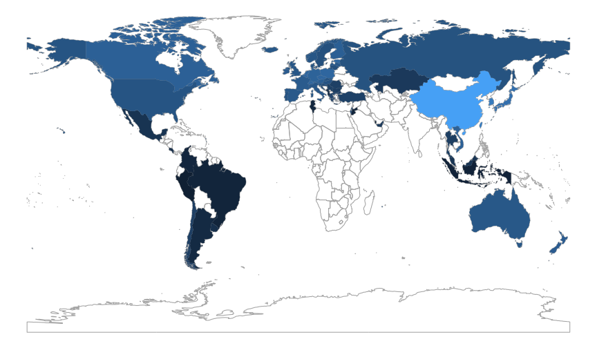
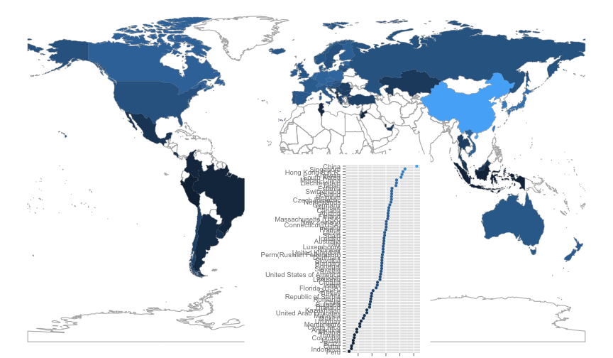
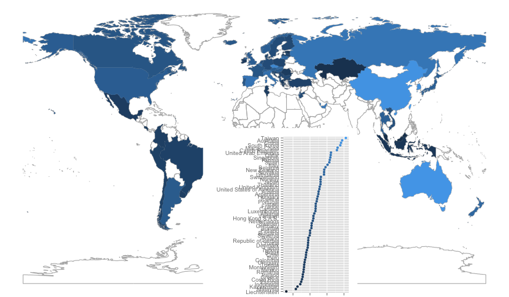

Exploring gender and scores
========================================================


```r
library(stringr)
library(reshape2)
library(ggplot2)
library(dplyr)
library(lubridate)
library(ggvis)
library(maps)
library(ggmap)
library(rworldmap)
library(grid)
library(scales)
```


```
## [[1]]
## [1] "item2012"
## 
## [[2]]
## [1] "item2012dict"
## 
## [[3]]
## [1] "parent2012"
## 
## [[4]]
## [1] "parent2012dict"
## 
## [[5]]
## [1] "school2012"
## 
## [[6]]
## [1] "school2012dict"
## 
## [[7]]
## [1] "scoredItem2012"
## 
## [[8]]
## [1] "scoredItem2012dict"
## 
## [[9]]
## [1] "student2012"
## 
## [[10]]
## [1] "student2012dict"
```


```

```r
student2012.sub <- student2012[, c(1, 12, 501, 541, 546, 634)]
colnames(student2012.sub)[1] <- "name"
student2012.sub$PV1MATH <- as.numeric(student2012.sub$PV1MATH)
student2012.sub$PV1READ <- as.numeric(student2012.sub$PV1READ)
student2012.sub$PV1SCIE <- as.numeric(student2012.sub$PV1SCIE)
student2012.sub$SENWGT_STU <- as.numeric(student2012.sub$SENWGT_STU)
student2012.sub.summary.gap <- summarise(group_by(student2012.sub, name), mathgap = mean(PV1MATH[ST04Q01 == 
    "Male"], na.rm = T) - mean(PV1MATH[ST04Q01 == "Female"], na.rm = T), wmathgap = weighted.mean(PV1MATH[ST04Q01 == 
    "Male"], w = SENWGT_STU[ST04Q01 == "Male"], na.rm = T) - weighted.mean(PV1MATH[ST04Q01 == 
    "Female"], w = SENWGT_STU[ST04Q01 == "Female"], na.rm = T), mtest.stat = t.test(PV1MATH[ST04Q01 == 
    "Male"], PV1MATH[ST04Q01 == "Female"])$statistic, mp.value = t.test(PV1MATH[ST04Q01 == 
    "Male"], PV1MATH[ST04Q01 == "Female"])$p.value, readgap = mean(PV1READ[ST04Q01 == 
    "Male"], na.rm = T) - mean(PV1READ[ST04Q01 == "Female"], na.rm = T), rtest.stat = t.test(PV1READ[ST04Q01 == 
    "Male"], PV1READ[ST04Q01 == "Female"])$statistic, rp.value = t.test(PV1READ[ST04Q01 == 
    "Male"], PV1READ[ST04Q01 == "Female"])$p.value, sciencegap = mean(PV1SCIE[ST04Q01 == 
    "Male"], na.rm = T) - mean(PV1SCIE[ST04Q01 == "Female"], na.rm = T), stest.stat = t.test(PV1SCIE[ST04Q01 == 
    "Male"], PV1SCIE[ST04Q01 == "Female"])$statistic, sp.value = t.test(PV1SCIE[ST04Q01 == 
    "Male"], PV1SCIE[ST04Q01 == "Female"])$p.value, minmale = min(PV1MATH[ST04Q01 == 
    "Male"], na.rm = T), minfemale = min(PV1MATH[ST04Q01 == "Female"], na.rm = T), 
    maxmale = max(PV1MATH[ST04Q01 == "Male"], na.rm = T), maxfemale = max(PV1MATH[ST04Q01 == 
        "Female"], na.rm = T), propmale = length(PV1MATH[ST04Q01 == "Male"])/length(PV1MATH), 
    propfemale = length(PV1MATH[ST04Q01 == "Female"])/length(PV1MATH))
qplot(mathgap, wmathgap, data = student2012.sub.summary.gap, xlab = "Mean", 
    ylab = "Weighted Mean", xlim = c(-30, 30), ylim = c(-30, 30)) + geom_abline(slope = 1) + 
    theme(aspect.ratio = 1)
```

 

```r
student2012.sub.summary.gap$msig <- ifelse(student2012.sub.summary.gap$mp.value > 
    0.05, "none", TRUE)
student2012.sub.summary.gap$msig[student2012.sub.summary.gap$msig == TRUE & 
    student2012.sub.summary.gap$mtest.stat > 0] <- "male"
student2012.sub.summary.gap$msig[student2012.sub.summary.gap$msig == TRUE & 
    student2012.sub.summary.gap$mtest.stat < 0] <- "female"
student2012.sub.summary.gap$name <- factor(student2012.sub.summary.gap$name, 
    levels = student2012.sub.summary.gap$name[order(student2012.sub.summary.gap$mathgap)])
qplot(name, mathgap, data = student2012.sub.summary.gap, size = propmale, color = msig) + 
    xlab("") + scale_colour_manual("Significant", values = c(male = "skyblue", 
    female = "pink", none = "lightgreen")) + scale_y_continuous("Math Score Gap", 
    breaks = seq(-30, 30, 5)) + scale_size("Prop male") + geom_hline(yintercept = 0, 
    colour = "grey80") + coord_flip() + theme_bw() + theme(legend.position = "bottom")
```

 

```r
# Test colors qplot(name, mathgap, data=student2012.sub.summary.gap,
# size=propmale, color=msig) + xlab('') + scale_colour_manual('Significant',
# values=c('male'=dichromat('skyblue'), 'female'=dichromat('pink'),
# 'none'=dichromat('lightgreen'))) + scale_y_continuous('Math Score Gap',
# breaks=seq(-30, 30, 5)) + scale_size('Prop male') +
# geom_hline(yintercept=0, colour='grey80') + coord_flip() + theme_bw() +
# theme(legend.position='bottom') ggsave('gendermathgap.pdf', width=7,
# height=14)
student2012.sub.summary.gap$name <- factor(student2012.sub.summary.gap$name, 
    levels = student2012.sub.summary.gap$name[order(student2012.sub.summary.gap$maxmale)])
qplot(name, maxmale, data = student2012.sub.summary.gap, color = I("skyblue")) + 
    xlab("") + geom_point(aes(y = maxfemale), colour = "pink") + scale_y_continuous("High Math") + 
    coord_flip() + theme_bw()
```

 

```r
# ggsave('gendermathtop.pdf', width=3.5, height=7)
student2012.sub.summary.gap$name <- factor(student2012.sub.summary.gap$name, 
    levels = student2012.sub.summary.gap$name[order(student2012.sub.summary.gap$minfemale)])
qplot(name, minmale, data = student2012.sub.summary.gap, color = I("skyblue")) + 
    xlab("") + geom_point(aes(y = minfemale), colour = "pink") + scale_y_continuous("Low Math") + 
    coord_flip() + theme_bw()
```

 

```r
# ggsave('gendermathbottom.pdf', width=3.5, height=7)
student2012.sub.summary.gap$rsig <- ifelse(student2012.sub.summary.gap$rp.value > 
    0.05, "none", TRUE)
student2012.sub.summary.gap$rsig[student2012.sub.summary.gap$rsig == TRUE & 
    student2012.sub.summary.gap$rtest.stat > 0] <- "male"
student2012.sub.summary.gap$rsig[student2012.sub.summary.gap$rsig == TRUE & 
    student2012.sub.summary.gap$rtest.stat < 0] <- "female"
student2012.sub.summary.gap$name <- factor(student2012.sub.summary.gap$name, 
    levels = student2012.sub.summary.gap$name[order(student2012.sub.summary.gap$readgap)])
qplot(name, readgap, data = student2012.sub.summary.gap, size = propmale, color = rsig) + 
    xlab("") + scale_colour_manual("Significant", values = c(male = "skyblue", 
    female = "pink", none = "lightgreen")) + scale_y_continuous("Reading Score Gap") + 
    scale_size("Prop male") + geom_hline(yintercept = 0, colour = "grey80") + 
    coord_flip() + theme_bw() + theme(legend.position = "none")
```

 

```r
# ggsave('genderreadgap.pdf', width=5, height=8)
student2012.sub.summary.gap$ssig <- ifelse(student2012.sub.summary.gap$sp.value > 
    0.05, "none", TRUE)
student2012.sub.summary.gap$ssig[student2012.sub.summary.gap$ssig == TRUE & 
    student2012.sub.summary.gap$stest.stat > 0] <- "male"
student2012.sub.summary.gap$ssig[student2012.sub.summary.gap$ssig == TRUE & 
    student2012.sub.summary.gap$stest.stat < 0] <- "female"
student2012.sub.summary.gap$name <- factor(student2012.sub.summary.gap$name, 
    levels = student2012.sub.summary.gap$name[order(student2012.sub.summary.gap$sciencegap)])
qplot(name, sciencegap, data = student2012.sub.summary.gap, size = propmale, 
    color = ssig) + xlab("") + scale_colour_manual("Significant", values = c(male = "skyblue", 
    female = "pink", none = "lightgreen")) + scale_y_continuous("Science Score Gap") + 
    scale_size("Prop male") + geom_hline(yintercept = 0, colour = "grey80") + 
    coord_flip() + theme_bw()
```

 

```r
# ggsave('gendergap.pdf', width=10, height=14)
```


```r
# Extract map polygons for modern world
world <- getMap(resolution = "low")
library(plyr)
world.polys <- extractPolygons(world)
detach("package:plyr")
# Now add data
student2012.sub.summary.gap$name <- as.character(student2012.sub.summary.gap$name)
student2012.sub.summary.gap$name[student2012.sub.summary.gap$name == "Serbia"] <- "Republic of Serbia"
student2012.sub.summary.gap$name[student2012.sub.summary.gap$name == "Korea"] <- "South Korea"
student2012.sub.summary.gap$name[student2012.sub.summary.gap$name == "Chinese Taipei"] <- "Taiwan"
student2012.sub.summary.gap$name[student2012.sub.summary.gap$name == "Slovak Republic"] <- "Slovakia"
student2012.sub.summary.gap$name[student2012.sub.summary.gap$name == "Russian Federation"] <- "Russia"
student2012.sub.summary.gap$name[student2012.sub.summary.gap$name == "Perm(Russian Federation)"] <- "Russia"
student2012.sub.summary.gap$name[student2012.sub.summary.gap$name == "Hong Kong-China"] <- "Hong Kong S.A.R."
student2012.sub.summary.gap$name[student2012.sub.summary.gap$name == "China-Shanghai"] <- "China"
student2012.sub.summary.gap$name[student2012.sub.summary.gap$name == "China-Macau"] <- "China"
student2012.sub.summary.gap$name[student2012.sub.summary.gap$name == "Connecticut (USA)"] <- "United States of America"
student2012.sub.summary.gap$name[student2012.sub.summary.gap$name == "Florida (USA)"] <- "United States of America"
student2012.sub.summary.gap$name[student2012.sub.summary.gap$name == "Massachusetts (USA)"] <- "United States of America"

student2012.sub.map <- left_join(student2012.sub.summary.gap, world.polys)
ggplot(data = world.polys) + geom_path(aes(x = X1, y = X2, order = order, group = group), 
    colour = I("grey90")) + geom_polygon(data = student2012.sub.map, aes(x = X1, 
    y = X2, order = order, group = group, fill = msig)) + scale_fill_manual("Significant", 
    values = c(male = "skyblue", female = "pink", none = "lightgreen")) + new_theme_empty + 
    theme(legend.position = "none")
```

 

```r
# ggsave('gendermathmap.pdf', width=12, height=7)
ggplot(data = world.polys) + geom_path(aes(x = X1, y = X2, order = order, group = group), 
    colour = I("grey90")) + geom_polygon(data = student2012.sub.map, aes(x = X1, 
    y = X2, order = order, group = group, fill = rsig)) + scale_fill_manual("Significant", 
    values = c(male = "skyblue", female = "pink", none = "lightgreen")) + new_theme_empty + 
    theme(legend.position = "none")
```

 

```r
# ggsave('genderreadmap.pdf', width=12, height=7)
ggplot(data = world.polys) + geom_path(aes(x = X1, y = X2, order = order, group = group), 
    colour = I("grey90")) + geom_polygon(data = student2012.sub.map, aes(x = X1, 
    y = X2, order = order, group = group, fill = ssig)) + scale_fill_manual("Significant", 
    values = c(male = "skyblue", female = "pink", none = "lightgreen")) + new_theme_empty + 
    theme(legend.position = "none")
```

 

```r
# ggsave('gendermap.pdf', width=12, height=8) ggplot(data=world.polys) +
# geom_path(aes(x=X1, y=X2, order=order, group=group), colour=I('grey90')) +
# geom_polygon(data=student2012.sub.map, aes(x=X1, y=X2, order=order,
# group=group, fill=rsig)) + scale_fill_manual('Significant',
# values=c('male'=dichromat('skyblue'), 'female'=dichromat('pink'),
# 'none'=dichromat('lightgreen'))) + new_theme_empty +
# theme(legend.position='none')
```

