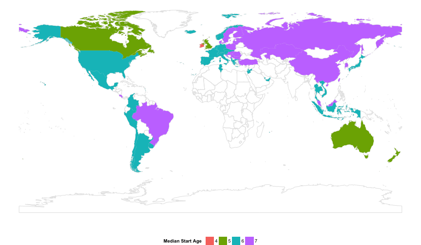

Exploring gender and scores
========================================================


```r
library(stringr)
library(reshape2)
library(ggplot2)
library(dplyr)
library(lubridate)
library(ggvis)
library(maps)
library(ggmap)
library(rworldmap)
library(grid)
library(scales)
```


```
## [[1]]
## [1] "item2012"
## 
## [[2]]
## [1] "item2012dict"
## 
## [[3]]
## [1] "parent2012"
## 
## [[4]]
## [1] "parent2012dict"
## 
## [[5]]
## [1] "school2012"
## 
## [[6]]
## [1] "school2012dict"
## 
## [[7]]
## [1] "scoredItem2012"
## 
## [[8]]
## [1] "scoredItem2012dict"
## 
## [[9]]
## [1] "student2012"
## 
## [[10]]
## [1] "student2012dict"
```


```

```r
student2012.sub <- student2012[, c(1, 6, 12, 14, 501, 541, 546, 634)]
colnames(student2012.sub)[1] <- "name"
# Now add data
student2012.sub$name <- as.character(student2012.sub$name)
student2012.sub$name[student2012.sub$name == "Serbia"] <- "Republic of Serbia"
student2012.sub$name[student2012.sub$name == "Korea"] <- "South Korea"
student2012.sub$name[student2012.sub$name == "Chinese Taipei"] <- "Taiwan"
student2012.sub$name[student2012.sub$name == "Slovak Republic"] <- "Slovakia"
student2012.sub$name[student2012.sub$name == "Russian Federation"] <- "Russia"
student2012.sub$name[student2012.sub$name == "Perm(Russian Federation)"] <- "Russia"
student2012.sub$name[student2012.sub$name == "Hong Kong-China"] <- "Hong Kong S.A.R."
student2012.sub$name[student2012.sub$name == "China-Shanghai"] <- "China"
student2012.sub$name[student2012.sub$name == "China-Macau"] <- "China"
student2012.sub$name[student2012.sub$name == "Connecticut (USA)"] <- "United States of America"
student2012.sub$name[student2012.sub$name == "Florida (USA)"] <- "United States of America"
student2012.sub$name[student2012.sub$name == "Massachusetts (USA)"] <- "United States of America"
student2012.sub$ST06Q01 <- as.numeric(student2012.sub$ST06Q01)
student2012.sub$PV1MATH <- as.numeric(student2012.sub$PV1MATH)
student2012.sub$PV1READ <- as.numeric(student2012.sub$PV1READ)
student2012.sub$PV1SCIE <- as.numeric(student2012.sub$PV1SCIE)
student2012.sub$SENWGT_STU <- as.numeric(student2012.sub$SENWGT_STU)
student2012.sub.age <- summarise(group_by(student2012.sub, name), math4 = mean(PV1MATH[ST06Q01 == 
    4], na.rm = T), math5 = mean(PV1MATH[ST06Q01 == 5], na.rm = T), math6 = mean(PV1MATH[ST06Q01 == 
    6], na.rm = T), math7 = mean(PV1MATH[ST06Q01 == 7], na.rm = T), math8 = mean(PV1MATH[ST06Q01 > 
    7], na.rm = T))
student2012.sub.age.m <- melt(student2012.sub.age)
student2012.sub.age.m$variable <- substr(student2012.sub.age.m$variable, 5, 
    5)
student2012.sub.age.m$variable <- as.numeric(student2012.sub.age.m$variable)
qplot(variable, value, data = student2012.sub.age.m, xlab = "Age at start", 
    ylab = "Math Score", geom = c("point", "smooth"), se = F, group = name) + 
    facet_wrap(~name, ncol = 8) + theme_bw()
```

 

```r
# ggsave('school-start.pdf', width=14, height=14)
student2012.sub.age <- summarise(group_by(student2012.sub, name), read4 = mean(PV1READ[ST06Q01 == 
    4], na.rm = T), read5 = mean(PV1READ[ST06Q01 == 5], na.rm = T), read6 = mean(PV1READ[ST06Q01 == 
    6], na.rm = T), read7 = mean(PV1READ[ST06Q01 == 7], na.rm = T), read8 = mean(PV1READ[ST06Q01 > 
    7], na.rm = T))
student2012.sub.age.m <- melt(student2012.sub.age)
student2012.sub.age.m$variable <- substr(student2012.sub.age.m$variable, 5, 
    5)
student2012.sub.age.m$variable <- as.numeric(student2012.sub.age.m$variable)
qplot(variable, value, data = student2012.sub.age.m, xlab = "Age at start", 
    ylab = "Reading Score", geom = c("point", "smooth"), se = F, group = name) + 
    facet_wrap(~name, ncol = 8) + theme_bw()
```

 

```r
student2012.sub.age <- summarise(group_by(student2012.sub, name), scie4 = mean(PV1SCIE[ST06Q01 == 
    4], na.rm = T), scie5 = mean(PV1SCIE[ST06Q01 == 5], na.rm = T), scie6 = mean(PV1SCIE[ST06Q01 == 
    6], na.rm = T), scie7 = mean(PV1SCIE[ST06Q01 == 7], na.rm = T), scie8 = mean(PV1SCIE[ST06Q01 > 
    7], na.rm = T))
student2012.sub.age.m <- melt(student2012.sub.age)
student2012.sub.age.m$variable <- substr(student2012.sub.age.m$variable, 5, 
    5)
student2012.sub.age.m$variable <- as.numeric(student2012.sub.age.m$variable)
qplot(variable, value, data = student2012.sub.age.m, xlab = "Age at start", 
    ylab = "Science Score", geom = c("point", "smooth"), se = F, group = name) + 
    facet_wrap(~name, ncol = 8) + theme_bw()
```

 


```r
# Extract map polygons for modern world
world <- getMap(resolution = "low")
library(plyr)
world.polys <- extractPolygons(world)
detach("package:plyr")

student2012.sub.agemedian <- summarise(group_by(student2012.sub, name), medianstart = median(ST06Q01, 
    na.rm = T))
student2012.sub.agemedian$medianstart <- factor(student2012.sub.agemedian$medianstart)
student2012.sub.map <- left_join(student2012.sub.agemedian, world.polys)
ggplot(data = world.polys) + geom_path(aes(x = X1, y = X2, order = order, group = group), 
    colour = I("grey90")) + geom_polygon(data = student2012.sub.map, aes(x = X1, 
    y = X2, order = order, group = group, fill = medianstart)) + scale_fill_discrete("Median Start Age") + 
    new_theme_empty + theme(legend.position = "bottom")
```

 

```r
# ggsave('agestartmap.pdf', width=12, height=7)
```

