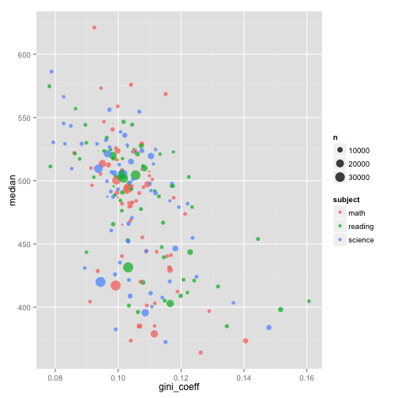
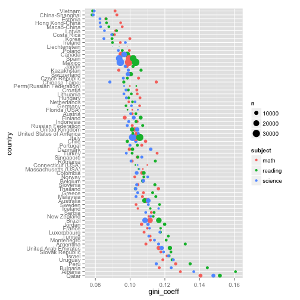
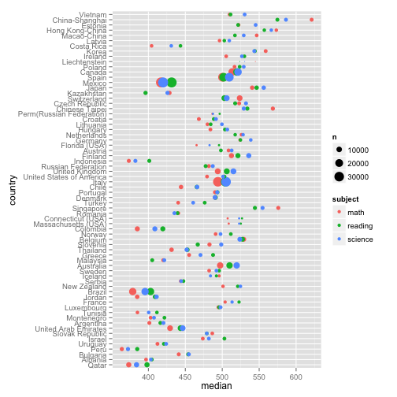

# First pass through the data

This will be a stream-of-concoiusness walk through the data, a first pass to see what I can see.

## Libraries

At some point, we should make sure we agree on which versions of which packages we propose to use. As a starting point, I can show what I am using:


```r
library(stringr)
library(ggplot2)
library(dplyr)
library(tidyr)
library(lubridate)
library(ggvis)
```

Here's my versions:


```r
sessionInfo()
```

```
## R version 3.1.0 (2014-04-10)
## Platform: x86_64-apple-darwin13.1.0 (64-bit)
## 
## locale:
## [1] en_US.UTF-8/en_US.UTF-8/en_US.UTF-8/C/en_US.UTF-8/en_US.UTF-8
## 
## attached base packages:
## [1] stats     graphics  grDevices utils     datasets  methods   base     
## 
## other attached packages:
## [1] ggvis_0.2.0.99  lubridate_1.3.3 tidyr_0.1       dplyr_0.2      
## [5] ggplot2_1.0.0   stringr_0.6.2   knitr_1.6.2    
## 
## loaded via a namespace (and not attached):
##  [1] assertthat_0.1   bitops_1.0-6     caTools_1.17     colorspace_1.2-4
##  [5] digest_0.6.4     evaluate_0.5.5   formatR_0.10     grid_3.1.0      
##  [9] gtable_0.1.2     htmltools_0.2.4  httpuv_1.3.0     magrittr_1.0.1  
## [13] MASS_7.3-31      memoise_0.2.1    munsell_0.4.2    parallel_3.1.0  
## [17] plyr_1.8.1       proto_0.3-10     Rcpp_0.11.2      reshape2_1.4    
## [21] RJSONIO_1.2-0.2  scales_0.2.4     shiny_0.9.1.9015 tools_3.1.0     
## [25] xtable_1.7-3
```

I suspect that for publication, `ggplot2` will be more capable than `ggvis`.

# Load the data


```r
sets <- c("item", "parent", "school", "scoredItem", "student")

# function to build the file names
fn_build <- function(file_name){
 
  template <- c("2012.rda", "2012dict.rda")
 
  file_name %>% 
    vapply(str_join, template, template) %>% 
    file.path("..", "data", .)
}

# load the data
sets %>% fn_build %>% lapply(load, .GlobalEnv)
```

```
## [[1]]
## [1] "item2012"
## 
## [[2]]
## [1] "item2012dict"
## 
## [[3]]
## [1] "parent2012"
## 
## [[4]]
## [1] "parent2012dict"
## 
## [[5]]
## [1] "school2012"
## 
## [[6]]
## [1] "school2012dict"
## 
## [[7]]
## [1] "scoredItem2012"
## 
## [[8]]
## [1] "scoredItem2012dict"
## 
## [[9]]
## [1] "student2012"
## 
## [[10]]
## [1] "student2012dict"
```

```r
# clean
rm(fn_build, sets)
```

The dictionaries are stored as named vectors - I would prefer data frames so that I can use the RStudio GUI to examine them.


```r
# function to convert to data-frames
fn_make_df <- function(named_vector){
  data.frame(
    variable = attr(named_vector, "names"),
    description = named_vector,
    row.names = NULL
  )
}

# there's a clever way to do this, but beyond me for naw
dict_item2012 <- fn_make_df(item2012dict) 
dict_parent2012 <- fn_make_df(parent2012dict) 
dict_school2012 <- fn_make_df(school2012dict) 
dict_scoredItem2012 <- fn_make_df(scoredItem2012dict) 
dict_student2012 <- fn_make_df(student2012dict) 

# clean
rm(fn_make_df)
rm(item2012dict, parent2012dict, school2012dict, scoredItem2012dict, student2012dict)
```

Looking at the number of variables in each of the data frames, I wish I knew how to use ggobi...

One of the tracks to investigate is inequality. I see there is a package, `ineq` on CRAN, that claims to have a Gini-coefficient function, so that seems like a good place to start.


```r
library(ineq)
```

Let's get an idea, for each country and subject, an estimate of the inequality of outcomes.

NOTE: `dplyr` seems to choke on grouping of data.frames with NA, hence the `filter()`.

Also: is there a problem the help text for `dplyr::grouped_df`? The description of `drop` seems backwards to me.


```r
df_twiddle <- student2012 %>%
  select(country = CNT, age = ST06Q01,
         math = PV1MATH, reading = PV1READ, science = PV1SCIE) %>%
  gather(key = subject, value = score, -country, -age) %>%
  do(filter(., complete.cases(.))) %>%
  dplyr::group_by(country, subject) %>%
  summarize(
    n = n(), 
    gini_coeff = ineq(score, type="Gini"), 
    mean = mean(score), 
    median = median(score)) %>%
  arrange(as.character(country))
```

"Alabama first" works to look for a specific country, but lets arrange by something more meaningful. 

Let's get a mean of coefficents over all subjects, to help us order things.


```r
df_twiddle_mean <- df_twiddle %>%
  group_by(country) %>%
  summarize(
    gini_coeff = mean(gini_coeff),
    mean = mean(mean),
    median = mean(median)
  )
```


```r
my_levels <- 
  df_twiddle_mean$country[rev(order(df_twiddle_mean$gini_coeff))] %>%
  as.character

df_twiddle$country <- factor(
  df_twiddle$country,
  levels = my_levels
)

head(my_levels)
```

```
## [1] "Qatar"    "Albania"  "Bulgaria" "Peru"     "Uruguay"  "Israel"
```

```r
tail(my_levels)
```

```
## [1] "Latvia"          "Macao-China"     "Hong Kong-China" "Estonia"        
## [5] "China-Shanghai"  "Vietnam"
```

I know I should figure out the `ggmap` package (I'll look at Di's code), but in the meantinme:


```r
ggplot(
  df_twiddle %>% filter(subject != "mean_subject"), 
  aes(x = gini_coeff, y = median, color = subject, size = n)
) + 
geom_point(alpha = 0.75) + 
scale_size_area()
```

 

This is print, so using ggvis and toolips is out of the question...

There appear two clusters - it will be interesting to see if there is a thread to bind them.


```r
ggplot(
  df_twiddle,
  aes(x = gini_coeff, y = country, color = subject, size = n)
) + 
geom_point() + 
scale_size_area()
```

 

```r
ggplot(
  df_twiddle,
  aes(x = median, y = country, color = subject, size = n)
) + 
geom_point() + 
scale_size_area()
```

 

Hopefully enough to get started.


