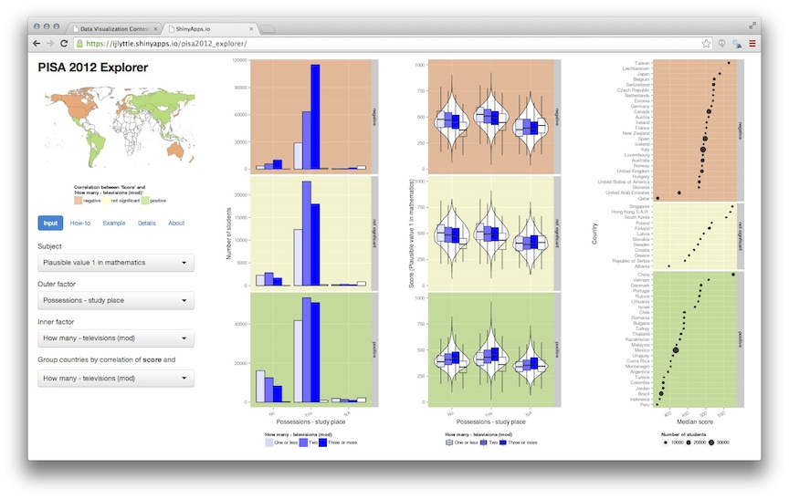

Seven Things That Affect Education Around the World
========================================================

Luke Fostveldt, Alex Shum, Ian Lyttle, Di Cook

Reducing inequities in education outcomes is of great interest to politicians and the public, alike. Dissecting the causes of inequality is a much tougher challenge with no panacea. Nonetheless, tackling inequality in educational outcomes is essential from both moral and economic viewpoints. The Programme for International Student Assessment (PISA) is a triennial survey conducted by the Organization for Economic Cooperation and Development (OECD) with a rotating additional emphasis on one of mathematics, reading, and science. In 2012, the additional emphasis was on mathematics. All 34 member countries of the OECD and 31 partnering countries and economies participated in the survey. This represents over 80% of the global economy. The OECD estimates that if all students could reach a level-2 proficiency in mathematics -- a level-2 proficiency means that a student can only handle the ``simplest and most obvious tasks" -- it would add US$200 trillion to the world's collective GDP. 

The OECD describes the PISA survey as ``the world's global metric for quality, equity and efficiency in school education" (citep[p. 3]{PISA2014a}). The goal of the PISA survey is to assess the workforce readiness of 15-year old students. Nearly 500,000 students were tested across the 65 countries and economies. Students are examined on how well they can apply the knowledge they learned in school to applications outside of school. The scores reported range between 0-1000. Additional information about the students, parents, and schools is also collected. The students completed a questionnaire providing information about themselves, their homes, their schools, and a variety of psychological views regarding factors they believe affects their performance in school. Schools principals responded to a questionnaire covering the school system and learning experiences for students. In some countries, parents completed a questionnaire requesting information about their perceptions regarding the school system, expectations for their child, and their involvement in their child's schooling.  

The data was made available by the OECD as part of a data challenge for the useR! 2014 conference. Entries to the competition can be found at http://beta.icm.edu.pl/PISAcontest/. We learned a lot from this data, and won one of the prizes. This article is a description of the seven main things we learned about 15-year olds, their math, science and reading skills, and some of the factors that affect these skills.

```{r read_me, echo = FALSE}
# Some notes for we authours:
# 
# * If you want to run this code interactively, change your working directory to
# `paper`.
# 
# * If there are packges we are all using, let's load them all once, in the
# load_packages chunk.
# 
# * If there are packages particular to your section, please consider loading
# them there, then detaching at the end of your section.
# 
# * I am being a bit presumptuous by leaving stringr loaded - maybe it makes
# sense to detach it. I'm sure we'll figure out wich way to go with each of our
# loaded packages.
# 
# - IJL
```

```{r load_packages, echo = FALSE, message = FALSE, warning = FALSE, results='hide'}
library(plyr)
library(dplyr)
library(stringr)
library(reshape2)
library(ggplot2)
library(lubridate)
#library(ggvis)
library(maps)
library(ggmap)
library(htmltools)
library(rworldmap)
library(grid)    
library(scales)
library(doBy)
```

```{r load_data, echo = FALSE, message = FALSE, warning = FALSE, results='hide', cache=TRUE}
# This is the scaffolding to import the data
sets <- c("item", "parent", "school", "scoredItem", "student")

# function to build the file names
fn_build <- function(file_name){
 
  template <- c("2012.rda", "2012dict.rda")
  
  file_name %>% 
    vapply(str_join, template, template) %>% 
    file.path("..", "data", .)
}

# load the data
sets %>% fn_build %>% lapply(load, .GlobalEnv)

# clean
rm(fn_build, sets)

# function to convert to data-frames
fn_make_df <- function(named_vector){
  data.frame(
    variable = attr(named_vector, "names"),
    description = named_vector,
    row.names = NULL
  )
}

# there's a clever way to do this, but beyond me for naw
dict_item2012 <- fn_make_df(item2012dict) 
dict_parent2012 <- fn_make_df(parent2012dict) 
dict_school2012 <- fn_make_df(school2012dict) 
dict_scoredItem2012 <- fn_make_df(scoredItem2012dict) 
dict_student2012 <- fn_make_df(student2012dict) 

# clean
rm(fn_make_df)
#rm(item2012dict, parent2012dict, school2012dict, scoredItem2012dict, student2012dict)
dim(student2012)
length(table(student2012$STIDSTD))
```

```{r mapdata, echo = FALSE, message = FALSE, warning = FALSE, results='hide', cache=FALSE}
# Produce the maps
extractPolygons <- function(shapes) {

  dframe <- ldply(1:length(shapes@polygons), function(i) {
    ob <- shapes@polygons[[i]]@Polygons
    dframe <- ldply(1:length(ob), function(j) {
      x <- ob[[j]]
      co <- x@coords
      data.frame(co, order=1:nrow(co), group=j)
    })
    dframe$region <- i
    dframe$name <- shapes@polygons[[i]]@ID
    dframe
  })
  # construct a group variable from both group and polygon:
  dframe$group <- interaction(dframe$region, dframe$group)
  
  dframe
}

# To get a blank background on map
new_theme_empty <- theme_bw()
new_theme_empty$line <- element_blank()
new_theme_empty$rect <- element_blank()
new_theme_empty$strip.text <- element_blank()
new_theme_empty$axis.text <- element_blank()
new_theme_empty$plot.title <- element_blank()
new_theme_empty$axis.title <- element_blank()
new_theme_empty$plot.margin <- structure(c(0, 0, -1, -1), unit = "lines", valid.unit = 3L, class = "unit")

world <- getMap(resolution = "low")
#library(plyr)
world.polys <- extractPolygons(world)
detach("package:plyr")
```

```{r dataprep, echo = FALSE, message = FALSE, warning = FALSE}
colnames(student2012)[1] <- "name"
student2012$name <- as.character(student2012$name)
colnames(school2012)[1] <- "name"
school2012$name <- as.character(school2012$name)

fix_country = function(df) {
df$name = as.character(df$name)
df$name[df$name=="Serbia"] <- "Republic of Serbia"
df$name[df$name=="Korea"] <- "South Korea"
df$name[df$name=="Chinese Taipei"] <- "Taiwan"
df$name[df$name=="Slovak Republic"] <- "Slovakia"
df$name[df$name=="Russian Federation"] <- "Russia"
df$name[df$name=="Perm(Russian Federation)"] <- "Russia"
df$name[df$name=="Hong Kong-China"] <- "Hong Kong S.A.R."
df$name[df$name=="China-Shanghai"] <- "China"
df$name[df$name=="China-Macau"] <- "China"
df$name[df$name=="Connecticut (USA)"] <- "United States of America"
df$name[df$name=="Florida (USA)"] <- "United States of America"
df$name[df$name=="Massachusetts (USA)"] <- "United States of America"

df
}

shorten_countrynames = function(df) {
df$name = as.character(df$name)
df$name[df$name=="Hong Kong S.A.R."] <- "Hong Kong"
df$name[df$name=="Republic of Serbia"] <- "Serbia"
df$name[df$name=="United Arab Emirates"] <- "UAE"
df$name[df$name=="United States of America"] <- "USA"
df$name[df$name=="United Kingdom"] <- "UK"

df
}

# Now add data
#student2012$name[student2012$name=="Serbia"] <- "Republic of Serbia"
#student2012$name[student2012$name=="Korea"] <- "South Korea"
#student2012$name[student2012$name=="Chinese Taipei"] <- "Taiwan"
#student2012$name[student2012$name=="Slovak Republic"] <- "Slovakia"
#student2012$name[student2012$name=="Russian Federation"] <- "Russia"
#student2012$name[student2012$name=="Perm(Russian Federation)"] <- "Russia"
#student2012$name[student2012$name=="Hong Kong-China"] <- "Hong Kong S.A.R."
#student2012$name[student2012$name=="China-Shanghai"] <- "China"
#student2012$name[student2012$name=="China-Macau"] <- "China"
#student2012$name[student2012$name=="Connecticut (USA)"] <- "United States of America"
#student2012$name[student2012$name=="Florida (USA)"] <- "United States of America"
#student2012$name[student2012$name=="Massachusetts (USA)"] <- "United States of America"
student2012$ST06Q01 <- as.numeric(student2012$ST06Q01)
student2012$PV1MATH <- as.numeric(student2012$PV1MATH)
student2012$PV1READ <- as.numeric(student2012$PV1READ)
student2012$PV1SCIE <- as.numeric(student2012$PV1SCIE)
student2012$SENWGT_STU <- as.numeric(student2012$SENWGT_STU)
school2012 = fix_country(school2012)
student2012 = fix_country(student2012)
```

# 1. The gender gap in math is not universal but the reading gap is, in favor of girls.

For each country, average scores on math and reading are calculated separately for boys and girls. These averages are differenced to compute the "gap" between boys and girls. T-statistics were calculated to determine the statistical significance of the difference. The results are plotted in the graphs below. Each dot corresponds to a difference between girls and boys scores, for each country. Color indicates statistical significance (blue in favor of boys, pink in favor of girls and green means there was no significant difference). The size of the dot indicates the proportion of boys in the sample size. For most countries it is roughly equal, but some countries have an imblance, for example, Malaysia has more girls tested than boys. The maps color the countries by the presence of a gender gap.

The countries are sorted from biggest gap to smallest gap. Most countries have a gender gap in math scores in favor of boys. Colombia has the biggest gender gap, about 30 points on average boys do better than girls. It should be noted that this is small, though, because this 30 points is out of a possible 1000 points.  Four countries have gender gaps in favor of girls, and even more surprising, these are middle eastern, or Muslim countries. 

Conversely, though, when we look at reading scores the story is entirely different. Universally, girls score significantly better than boys. Again, the size of the gap is small, between 10 and 80 points. 

Although, not shown here, it also should be noted that this is the difference between the average scores for boys and girls. There is a slightly different story for each country if we look at the top math score for each geneder only, where we would notice that the top score in the USA is achieved by a girl, and is substantially higher than the highest boys' score. There is far more individual variability than the overall average differences. 

```{r gendermath, fig.width=8, fig.height=12, warning=FALSE, message=FALSE, echo=FALSE, cache=FALSE}
student2012.sub <- student2012[, c(1, 12, 501, 541, 546, 634)]
student2012.sub.summary.gap <- summarise(group_by(student2012.sub, name), 
                  mathgap=mean(PV1MATH[ST04Q01=="Male"], na.rm=T)-
                          mean(PV1MATH[ST04Q01=="Female"], na.rm=T),
                  wmathgap=weighted.mean(PV1MATH[ST04Q01=="Male"], w=SENWGT_STU[ST04Q01=="Male"], na.rm=T)-
                          weighted.mean(PV1MATH[ST04Q01=="Female"], w=SENWGT_STU[ST04Q01=="Female"], na.rm=T),
                  mtest.stat = t.test(PV1MATH[ST04Q01=="Male"], PV1MATH[ST04Q01=="Female"])$statistic, 
                  mp.value = t.test(PV1MATH[ST04Q01=="Male"], PV1MATH[ST04Q01=="Female"])$p.value,
                  readgap=mean(PV1READ[ST04Q01=="Male"], na.rm=T)-mean(PV1READ[ST04Q01=="Female"], na.rm=T),
                  rtest.stat = t.test(PV1READ[ST04Q01=="Male"], PV1READ[ST04Q01=="Female"])$statistic, 
                  rp.value = t.test(PV1READ[ST04Q01=="Male"], PV1READ[ST04Q01=="Female"])$p.value,
                  sciencegap=mean(PV1SCIE[ST04Q01=="Male"], na.rm=T)-mean(PV1SCIE[ST04Q01=="Female"], na.rm=T),
                  stest.stat = t.test(PV1SCIE[ST04Q01=="Male"], PV1SCIE[ST04Q01=="Female"])$statistic, 
                  sp.value = t.test(PV1SCIE[ST04Q01=="Male"], PV1SCIE[ST04Q01=="Female"])$p.value,                                         
                  minmale=min(PV1MATH[ST04Q01=="Male"], na.rm=T), 
                  minfemale=min(PV1MATH[ST04Q01=="Female"], na.rm=T), 
                  maxmale=max(PV1MATH[ST04Q01=="Male"], na.rm=T), 
                  maxfemale=max(PV1MATH[ST04Q01=="Female"], na.rm=T), 
                  propmale=length(PV1MATH[ST04Q01=="Male"])/length(PV1MATH), 
                  propfemale=length(PV1MATH[ST04Q01=="Female"])/length(PV1MATH))
#qplot(mathgap, wmathgap, data=student2012.sub.summary.gap, xlab="Mean", ylab="Weighted Mean",
#      xlim=c(-30,30), ylim=c(-30,30)) + geom_abline(slope=1) + theme(aspect.ratio=1)
student2012.sub.summary.gap$msig <- ifelse(student2012.sub.summary.gap$mp.value>0.05, "none", TRUE)
student2012.sub.summary.gap$msig[student2012.sub.summary.gap$msig==TRUE&student2012.sub.summary.gap$mtest.stat>0] <- "male"
student2012.sub.summary.gap$msig[student2012.sub.summary.gap$msig==TRUE&student2012.sub.summary.gap$mtest.stat<0] <- "female"
student2012.sub.summary.gap$name <- factor(student2012.sub.summary.gap$name, 
      levels=student2012.sub.summary.gap$name[order(student2012.sub.summary.gap$mathgap)])
qplot(name, mathgap, data=student2012.sub.summary.gap, size=propmale, color=msig) + 
  xlab("") +  
  scale_colour_manual("Significant", values=c("male"="skyblue", "female"="pink", "none"="lightgreen")) +
  scale_y_continuous("Math Score Gap", breaks=seq(-30, 30, 5), limits=c(-30, 30)) + 
  scale_size("Prop male") +
   geom_hline(yintercept=0, colour="grey80") + coord_flip() + theme_bw() + theme(legend.position="bottom")
```

```{r gendermaps, fig.width=12, fig.height=7, warning=FALSE, message=FALSE, echo=FALSE, cache=FALSE}
student2012.sub.summary.gap$name <- as.character(student2012.sub.summary.gap$name)
student2012.sub.map <- left_join(student2012.sub.summary.gap, world.polys)
student2012.sub.map$msig <- factor(student2012.sub.map$msig)
ggplot(data=world.polys) + geom_path(aes(x=X1, y=X2, order=order, group=group), colour=I("grey90")) + 
  geom_polygon(data=student2012.sub.map, aes(x=X1, y=X2, order=order, group=group, fill=msig)) +
  scale_fill_manual("Significant", values=c("male"="skyblue", "female"="pink", "none"="lightgreen")) +
  new_theme_empty + theme(legend.position="none")
#student2012.sub.summary.gap$name <- factor(student2012.sub.summary.gap$name, 
#      levels=student2012.sub.summary.gap$name[order(student2012.sub.summary.gap$maxmale)])
#qplot(name, maxmale, data=student2012.sub.summary.gap, color=I("skyblue")) + 
#  xlab("") +
#  geom_point(aes(y=maxfemale), colour="pink") + 
#  scale_y_continuous("High Math") + coord_flip() + theme_bw()
#ggsave("gendermathtop.pdf", width=3.5, height=7)
#student2012.sub.summary.gap$name <- factor(student2012.sub.summary.gap$name, 
#      levels=student2012.sub.summary.gap$name[order(student2012.sub.summary.gap$minfemale)])
#qplot(name, minmale, data=student2012.sub.summary.gap, color=I("skyblue")) + 
#  xlab("") +
#  geom_point(aes(y=minfemale), colour="pink") + 
#  scale_y_continuous("Low Math") + coord_flip() + theme_bw()
#ggsave("gendermathbottom.pdf", width=3.5, height=7)
#
```

```{r genderead, fig.width=8, fig.height=12, warning=FALSE, message=FALSE, echo=FALSE, cache=FALSE}
student2012.sub.summary.gap$rsig <- ifelse(student2012.sub.summary.gap$rp.value>0.05, "none", TRUE)
student2012.sub.summary.gap$rsig[student2012.sub.summary.gap$rsig==TRUE&student2012.sub.summary.gap$rtest.stat>0] <- "male"
student2012.sub.summary.gap$rsig[student2012.sub.summary.gap$rsig==TRUE&student2012.sub.summary.gap$rtest.stat<0] <- "female"
student2012.sub.summary.gap$name <- factor(student2012.sub.summary.gap$name, 
      levels=student2012.sub.summary.gap$name[order(student2012.sub.summary.gap$readgap)])
qplot(name, readgap, data=student2012.sub.summary.gap, size=propmale, color=rsig) + 
  xlab("") +
  scale_colour_manual("Significant", values=c("male"="skyblue", "female"="pink", "none"="lightgreen")) +
  scale_y_continuous("Reading Score Gap") + 
  scale_size("Prop male") +
   geom_hline(yintercept=0, colour="grey80") + coord_flip() + theme_bw() + theme(legend.position="bottom")
#ggsave("genderreadgap.pdf", width=5, height=8)
#student2012.sub.summary.gap$ssig <- ifelse(student2012.sub.summary.gap$sp.value>0.05, "none", TRUE)
#student2012.sub.summary.gap$ssig[student2012.sub.summary.gap$ssig==TRUE&student2012.sub.summary.gap$stest.stat>0] <- "male"
#student2012.sub.summary.gap$ssig[student2012.sub.summary.gap$ssig==TRUE&student2012.sub.summary.gap$stest.stat<0] <- "female"
#student2012.sub.summary.gap$name <- factor(student2012.sub.summary.gap$name, 
#      levels=student2012.sub.summary.gap$name[order(student2012.sub.summary.gap$sciencegap)])
#qplot(name, sciencegap, data=student2012.sub.summary.gap, size=propmale, color=ssig) + 
#  xlab("") +
#  scale_colour_manual("Significant", values=c("male"="skyblue", "female"="pink", "none"="lightgreen")) +
#  scale_y_continuous("Science Score Gap") + 
#  scale_size("Prop male") +
#   geom_hline(yintercept=0, colour="grey80") + coord_flip() + theme_bw()
```

```{r gendermaps2, fig.width=12, fig.height=7, warning=FALSE, message=FALSE, echo=FALSE, cache=FALSE}
#ggsave("gendermathmap.pdf", width=12, height=7)
student2012.sub.summary.gap$name <- as.character(student2012.sub.summary.gap$name)
student2012.sub.map <- left_join(student2012.sub.summary.gap, world.polys)
student2012.sub.map$rsig <- factor(student2012.sub.map$rsig)
ggplot(data=world.polys) + geom_path(aes(x=X1, y=X2, order=order, group=group), colour=I("grey90")) + 
  geom_polygon(data=student2012.sub.map, aes(x=X1, y=X2, order=order, group=group, fill=rsig)) +
  scale_fill_manual("Significant", values=c("male"="skyblue", "female"="pink", "none"="lightgreen")) +
  new_theme_empty + theme(legend.position="none")
#ggsave("genderreadmap.pdf", width=12, height=7)
#ggplot(data=world.polys) + geom_path(aes(x=X1, y=X2, order=order, group=group), colour=I("grey90")) + 
#  geom_polygon(data=student2012.sub.map, aes(x=X1, y=X2, order=order, group=group, fill=ssig)) +
#  scale_fill_manual("Significant", values=c("male"="skyblue", "female"="pink", "none"="lightgreen")) +
#  new_theme_empty + theme(legend.position="none")
```


# 2. Starting school at an older age generates lower average math scores. 

For each country we have computed the average math test score by age that the children started school. In additon, for each country we computed the median age that children in the study started school. There are differences in typical school start age between countries. Ireland has the youngest median start age - children head to school at age 4. Britain, and its past colonies, Australia, Canada and New Zealand, have a median start age of 5. For many other countries the median start age is 6, and for northern Europe, much of Asia and Brazil median start age is as late as 7. Some countries appear to have rigid starting ages, eg in Japan all children start at age 6.

Within a country, looking at the average math score for each start age, the score typically declines, especially after age 6. This is almost uniformly the pattern across all of the countries in the study. For several countries - Russia, Denmark, Bulgaria - if a child starts school at age 4 their math scores were much better on average than another other starting age group. School start age matters, that children need to start school in the 4-6 age range to expect better math scores, on average. 

```{r age, fig.width=10, fig.height=12, echo = FALSE, message = FALSE, warning = FALSE}
student2012.sub <- student2012[, c(1, 6, 12, 14, 501, 541, 546, 634)]
student2012.sub.age <- summarise(group_by(student2012.sub, name), 
                  math4 = mean(PV1MATH[ST06Q01 == 4], na.rm = T), 
                  math5 = mean(PV1MATH[ST06Q01 == 5], na.rm = T), 
                  math6 = mean(PV1MATH[ST06Q01 == 6], na.rm = T), 
                  math7 = mean(PV1MATH[ST06Q01 == 7], na.rm = T), 
                  math8 = mean(PV1MATH[ST06Q01 >  7], na.rm = T))
student2012.sub.age.m <- melt(student2012.sub.age)
student2012.sub.age.m$variable <- substr(student2012.sub.age.m$variable, 5, 5)
student2012.sub.age.m$variable <- as.numeric(student2012.sub.age.m$variable)
student2012.sub.agemedian <- summarise(group_by(student2012.sub, name), medianstart = median(ST06Q01, na.rm=T))
orderedbymedianage <- student2012.sub.agemedian$name[order(student2012.sub.agemedian$medianstart)]
student2012.sub.age.m.median <- left_join(student2012.sub.age.m, student2012.sub.agemedian)
student2012.sub.age.m.median$medianstart <- factor(student2012.sub.age.m.median$medianstart)
student2012.sub.age.m.median$name <- factor(student2012.sub.age.m.median$name, levels=orderedbymedianage)
qplot(variable, value, data=student2012.sub.age.m.median, xlab="Age at start", ylab="Math Scores", 
      geom=c("point","smooth"), se=F, group=name, colour=medianstart) + 
 facet_wrap(~name, ncol=8) + theme_bw() + theme(legend.position="none")
# ggsave("school-start.pdf", width=14, height=14)
#student2012.sub.age <- summarise(group_by(student2012.sub, name), 
#                  read4 = mean(PV1READ[ST06Q01 == 4], na.rm = T), 
#                  read5 = mean(PV1READ[ST06Q01 == 5], na.rm = T), 
#                  read6 = mean(PV1READ[ST06Q01 == 6], na.rm = T), 
#                  read7 = mean(PV1READ[ST06Q01 == 7], na.rm = T), 
#                  read8 = mean(PV1READ[ST06Q01 >  7], na.rm = T))
#student2012.sub.age.m <- melt(student2012.sub.age)
#student2012.sub.age.m$variable <- substr(student2012.sub.age.m$variable, 5, 5)
#student2012.sub.age.m$variable <- as.numeric(student2012.sub.age.m$variable)
#qplot(variable, value, data=student2012.sub.age.m, xlab="Age at start", ylab="Reading Score", 
#      geom=c("point","smooth"), se=F, group=name) + 
# facet_wrap(~name, ncol=8) + theme_bw() 
#student2012.sub.age <- summarise(group_by(student2012.sub, name), 
#                  scie4 = mean(PV1SCIE[ST06Q01 == 4], na.rm = T), 
#                  scie5 = mean(PV1SCIE[ST06Q01 == 5], na.rm = T), 
#                  scie6 = mean(PV1SCIE[ST06Q01 == 6], na.rm = T), 
#                  scie7 = mean(PV1SCIE[ST06Q01 == 7], na.rm = T), 
#                  scie8 = mean(PV1SCIE[ST06Q01 >  7], na.rm = T))
#student2012.sub.age.m <- melt(student2012.sub.age)
#student2012.sub.age.m$variable <- substr(student2012.sub.age.m$variable, 5, 5)
#student2012.sub.age.m$variable <- as.numeric(student2012.sub.age.m$variable)
#qplot(variable, value, data=student2012.sub.age.m, xlab="Age at start", ylab="Science Score", 
#      geom=c("point","smooth"), se=F, group=name) + 
# facet_wrap(~name, ncol=8) + theme_bw() 
```

```{r agemaps, fig.width=12, fig.height=7, echo = FALSE, message = FALSE, warning = FALSE}
student2012.sub.agemedian$medianstart <- factor(student2012.sub.agemedian$medianstart)
student2012.sub.map <- left_join(student2012.sub.agemedian, world.polys)
ggplot(data=world.polys) + geom_path(aes(x=X1, y=X2, order=order, group=group), colour=I("grey90")) + 
  geom_polygon(data=student2012.sub.map, aes(x=X1, y=X2, order=order, group=group, fill=medianstart)) +
  scale_fill_discrete("Median Start Age") +
  new_theme_empty + theme(legend.position="bottom")
#ggsave("agestartmap.pdf", width=12, height=7)
```

# 3. Teachers, computers, and libraries at school make a difference in math scores

Within the PISA dataset, the school table has information about shortages on items viewed as being important for good instruction. The plot below examines at three of these: lack of teachers, lack of computers and shortage of library materials. These factors are compared with math, reading and science scores from the student table, across countries. For most countries, scores decrease on average the greater the shortage. 

```{r shortencountrynames, warning=FALSE, message=FALSE, echo=FALSE, results='hide'}
#school2012$name <- as.character(school2012$name)
#student2012$name <- as.character(student2012$name)
school2012 = shorten_countrynames(school2012)
student2012 = shorten_countrynames(student2012)
```

```{r shortages, fig.width=4, fig.height=4, warning=FALSE, message=FALSE, echo=FALSE}
school2012.sub = school2012[, c("name", "SCHOOLID", "SC14Q02", "SC14Q07", "SC14Q10")]
student2012.sub = student2012[, c("name", "SCHOOLID", "PV1MATH", "PV1READ", "PV1SCIE")]

scores_by_school = student2012.sub %>% group_by(name, SCHOOLID) %>% 
  summarise(mmath = mean(PV1MATH), mread = mean(PV1READ), msci = mean(PV1SCIE))

df = scores_by_school %>% left_join(school2012.sub)
df$SC14Q02 <- factor(df$SC14Q02, labels=c(0,1,2,3))
df$SC14Q07 <- factor(df$SC14Q07, labels=c(0,1,2,3))
df$SC14Q10 <- factor(df$SC14Q10, labels=c(0,1,2,3))
df.mshort <- df[!is.na(df$SC14Q02),] %>% group_by(name, SC14Q02) %>% summarise(mmath2 = mean(mmath, na.rm=T))
#qplot(SC14Q02, mmath2, data = df.mshort, facets = ~name, 
#      xlab="Math teacher shortage (0=None, 1=Very little, 2=To some extent, 3=A lot)", 
#      ylab="Math Score", geom=c("point","line"), group=name)
df.lshort <- df[!is.na(df$SC14Q10),] %>% group_by(name, SC14Q10) %>% summarise(mmath2 = mean(mmath, na.rm=T))
#qplot(SC14Q10, mmath2, data = df.lshort, facets = ~name, 
#      xlab="Library shortages (0=None, 1=Very little, 2=To some extent, 3=A lot)", 
#      ylab="Math Score", geom=c("point","line"), group=name)
df2 <- summarise(group_by(df[!is.na(df$SC14Q02),], name, SC14Q02), teachers = mean(mmath, na.rm=T))
colnames(df2)[2] <- "levels"
df3 <- summarise(group_by(df[!is.na(df$SC14Q07),], name, SC14Q07), computers = mean(mmath, na.rm=T))
colnames(df3)[2] <- "levels"
df4 <- summarise(group_by(df[!is.na(df$SC14Q10),], name, SC14Q10), libmaterials = mean(mmath, na.rm=T))
colnames(df4)[2] <- "levels"
df.all <- merge(df2, df3)
df.all <- merge(df.all, df4)
df.m <- melt(df.all, id=c("name", "levels"))
colnames(df.m)[4] <- "math"
qplot(SC14Q02, data=df, geom="histogram", xlab="Teacher shortage", fill=I("#1B9E77"))
#ggsave("teacher-shortages.pdf", width=5, height=5)
qplot(SC14Q07, data=df, geom="histogram", xlab="Computer shortage", fill=I("#D95F02"))
#ggsave("computer-shortages.pdf", width=5, height=5)
qplot(SC14Q10, data=df, geom="histogram", xlab="Library materials shortage", fill=I("#7570B3"))
#ggsave("library-shortages.pdf", width=5, height=5)
#ggsave("shortages.pdf", width=14, height=14)
```

```{r shortagesbars, fig.width=10, fig.height=12, warning=FALSE, message=FALSE, echo=FALSE}
qplot(levels, math, data = df.m, facets = ~name, 
      xlab="Shortages (0=None, 1=Very little, 2=To some extent, 3=A lot)", 
      ylab="Math Score", geom=c("point","line"), group=variable, colour=variable) +
      scale_colour_manual("Type", values=c("teachers"="#1B9E77", "computers"="#D95F02", "libmaterials"="#7570B3")) +
      theme(legend.position="bottom") 
```

# 4. Time spent out of school studying is important, but only up to a point.

For each country we have provided loess-smoothed curves of the relationship between the mathematics score and the time spent studying outside of school. The most prominent feature that we observe is the decreasing benefit of studying. For every country there is evidence of a substantial positive relationship for the students who spend less time studying. However, those students who continue to study for long hours see diminishing returns for their efforts. This pattern is consistent across most countries with a few notable exceptions. Most of the Asian countries still have gains for longer hours studied. 

The vast majority of students spend less than 10 hours studying per week. It is among the students that spend 5 or less hours per week that could see improvement in their scores if they put in more time. The pattern tends to level off at 10 hours. 

It is possible that there may be a selection issue occuring where more talented students spend less time studying as they complete their homework faster. Nonetheless the pattern suggest decreasing benefits to increased out of school study time after 10 hour.

```{r studying, fig.width=10, fig.height=12, echo = FALSE, message = FALSE, warning = FALSE}
student.luke <- student2012[,c("name","PV1MATH","PV1READ","PV1SCIE","ST57Q01")]
#study.luke <- melt(student.luke,id=c("name","ST57Q01"))
studyplot <- ggplot(data = student.luke, aes(ST57Q01, PV1MATH), xlab="Time spent", ylab="Math scores") + facet_wrap(~name) + stat_smooth(se=F)
studyplot
```


```{r studyingbar, fig.width=4, fig.height=4, echo = FALSE, message = FALSE, warning = FALSE}
studybar <- ggplot(data = student.luke, aes(ST57Q01) ) + geom_histogram(binwidth=4) + xlab("Hours spent studying")
studybar
```


# 5. Parents matter!
### a. Number of parents in the home
Looking at the number of parents in a household shows that students in two-parent households are on average performing better than students not in a two-parent households. Students with just a mother at home do tend to perform better than students with only a father at home. Students with no parents at home are performing the worst, on average.

```{r par_athomebar, fig.width=4, fig.height=4, echo = FALSE, message = FALSE, warning = FALSE}
athome = student2012[,c("name", "SCHOOLID", "STIDSTD", "OECD", "PV1MATH", "PV1SCIE", "PV1READ","ST11Q01", "ST11Q02", "ST11Q03","ST11Q04", "ST11Q05", "ST11Q06")]
athome = athome %>% filter(!is.na(athome$ST11Q01) & !is.na(athome$ST11Q02))
athome$parents = NA
athome[athome$ST11Q01 == "Yes" & athome$ST11Q02 == "Yes", ]$parents = "Both"
athome[athome$ST11Q01 == "Yes" & athome$ST11Q02 == "No", ]$parents = "Mother"
athome[athome$ST11Q01 == "No" & athome$ST11Q02 == "Yes", ]$parents = "Father"
athome[athome$ST11Q01 == "No" & athome$ST11Q02 == "No", ]$parents = "Neither"
athome$parents <- factor(athome$parents, levels=c("Both", "Mother", "Father", "Neither"))
#athome$name <- reorder(athome$name,athome$PV1MATH,mean, decreasing=F)
pbarhome <- qplot(x = parents, data = athome, xlab="Parents in home") 
pbarhome
```


```{r par_athome, fig.width=10, fig.height=12, echo = FALSE, message = FALSE, warning = FALSE}
phome <- qplot(x = parents, y = PV1MATH, geom = "boxplot", outlier.size = 1, data = athome) + ylab("Math") + facet_wrap(~name, scales="free_y") + scale_x_discrete("Family Structure", labels=c("Mother"="M", "Father"="F", "Both"="B", "Neither"="N")) 
phome
```


### b. Parent's Occupation Status
One of the variables the survey addressed was the occupation status of each of the parents. There were five possible categories: “Full-Time”, “Part-Time”, “Not working, but looking for a job”, “Other (e.g. home duties, retired)”, and no response. The distribution of the number of parents who selected each of the categories can be seen in the bar chart. The chart shows that fathers primarily have full-time jobs. However, there are large numbers of mothers who work full-time, part-time, or are stay-at-home moms. With women making up a larger portion of the work-force, it is interesting to look at how the parents' occupations relate to students' performance in mathematics, reading, and science. 

The plot below shows the average performance of students' performance based on the parents' occupational statuses. The countries are sorted according to the average score for students with a "stay-at-home" mother. The averages for each parent in each of the work status categories are distinguished by color.  In each of the plots below, students with mothers who work part-time or full-time tend outperform those students with stay-at-home mothers. This pattern holds with only a few exceptions. Meanwhile, when the father is employed part-time, students tend to have much lower achievement that if the father stayed at home. Those students whose fathers have full-time jobs have the highest average achievement among the possible work statuses for the father. The patterns described hold across mathematics, reading, and science. 

```{r parentsjob, fig.width=10, fig.height=12, echo = FALSE, message = FALSE, warning = FALSE}
studentLuke <- student2012
studentLuke$ST15Q01 <- addNA(studentLuke$ST15Q01)
studentLuke$ST19Q01 <- addNA(studentLuke$ST19Q01)

#studentLuke$name <- as.character(studentLuke$CNT)
# unique(anti_join(studentLuke.sub, world.polys)[1])
#studentLuke$name[studentLuke$name=="United Arab Emirates"] <- "UAE"
#studentLuke$name[studentLuke$name=="United Kingdom"] <- "UK"
#studentLuke$name[studentLuke$name=="Serbia"] <- "Serbia"
#studentLuke$name[studentLuke$name=="Korea"] <- "South Korea"
#studentLuke$name[studentLuke$name=="Chinese Taipei"] <- "Taiwan"
#studentLuke$name[studentLuke$name=="Slovak Republic"] <- "Slovakia"
#studentLuke$name[studentLuke$name=="Russian Federation"] <- "Russia"
#studentLuke$name[studentLuke$name=="Perm(Russian Federation)"] <- "Russia"
#studentLuke$name[studentLuke$name=="Hong Kong-China"] <- "Hong Kong"
#studentLuke$name[studentLuke$name=="China-Shanghai"] <- "China"
#studentLuke$name[studentLuke$name=="Macau"] <- "China"
#studentLuke$name[studentLuke$name=="Connecticut (USA)"] <- "USA"
#studentLuke$name[studentLuke$name=="Florida (USA)"] <- "USA"
#studentLuke$name[studentLuke$name=="Massachusetts (USA)"] <- "USA"
#studentLuke$name[studentLuke$name=="United States of America"] <- "USA"
#unique(studentLuke$name)
studentLuke$name <- factor(studentLuke$name)

a6 <- summaryBy(data=studentLuke, PV1MATH + ESCS ~ ST15Q01+ name,FUN=mean,rm.na=T)
a7 <- summaryBy(data=studentLuke, PV1MATH + ESCS ~ ST19Q01+ name,FUN=mean,rm.na=T)
colnames(a6) <- colnames(a7) <- c("Job.Status","name","Math","ESCS")
levels(a6$Job.Status) <- levels(a7$Job.Status)  <- c("Full-Time","Part-Time","Unemployed","Other","NA")

a8 <- rbind(cbind(a6,Parent="Mother"),cbind(a7,Parent="Father"))
#a2 <- melt(a1)
ind <- which(a8$Job.Status=="Full-Time"& a8$Parent=="Mother")
a8$name <- factor(a8$name,levels(a8$name)[order(a8$Math[ind])])
p <- qplot(name, Math, col=Job.Status, data = a8) +coord_flip() + facet_wrap(~Parent)
p
```

# 6. Albania is not like anyone else!

Albania appears to be an outlier in many educational trends.  Many socioeconomic and school factors that play a role in other nations' test scores do not appear to affect Albania's test scores.  For example, Albania has one of the smallest gender gaps for math and reading scores.  Additionally number of possessions and truancy rates affected test scores for every nation except Albania.  

```{r clean, echo=FALSE, message = FALSE, warning = FALSE}
#student2012$CNT = student2012$name
student2012$OECD <- as.character(student2012$OECD)
#student2012[student2012$name == "Albania", ]$OECD = "Albania"
student2012$math = as.numeric(student2012[, "PV1MATH"])
student2012$read = as.numeric(student2012[, "PV1READ"])
student2012$sci = as.numeric(student2012[, "PV1SCIE"])

student2012.sub = student2012 %>% dplyr::select(name, SCHOOLID, math, read, sci, OUTHOURS, STIDSTD, ST04Q01, ST11Q01, ST11Q02, ST15Q01, ST19Q01, ST26Q01, ST26Q02, ST26Q03, ST26Q04, ST26Q05, ST26Q06, ST26Q07, ST26Q08, ST26Q09, ST26Q10, ST26Q11, ST26Q12, ST26Q13, ST26Q14, ST27Q01, ST27Q02, ST27Q03, ST27Q04, ST27Q05, ST28Q01, OECD)

for (i in 13:26) {
    student2012.sub[, i] <- as.character(student2012.sub[, i])
    student2012.sub[is.na(student2012.sub[, i]), i] <- ""
    student2012.sub[student2012.sub[, i] == "Yes", i] <- "1"
    student2012.sub[student2012.sub[, i] == "No", i] <- "0"
    student2012.sub[, i] <- as.numeric(student2012.sub[, i])
}
for (i in 27:31) {
    student2012.sub[, i] <- as.character(student2012.sub[, i])
    student2012.sub[is.na(student2012.sub[, i]), i] <- ""
    student2012.sub[student2012.sub[, i] == "None", i] <- "0"
    student2012.sub[student2012.sub[, i] == "One", i] <- "1"
    student2012.sub[student2012.sub[, i] == "Two", i] <- "2"
    student2012.sub[student2012.sub[, i] == "Three or more", i] <- "3"
    student2012.sub[, i] <- as.numeric(student2012.sub[, i])
}
student2012.sub[, 32] <- as.character(student2012.sub[, 32])
student2012.sub[is.na(student2012.sub[,32]), 32] <- ""
student2012.sub[student2012.sub[, 32] == "0-10 books ", 32] <- "0"
student2012.sub[student2012.sub[, 32] == "11-25 books ", 32] <- "1"
student2012.sub[student2012.sub[, 32] == "26-100 books ", 32] <- "2"
student2012.sub[student2012.sub[, 32] == "101-200 books ", 32] <- "3"
student2012.sub[student2012.sub[, 32] == "201-500 books ", 32] <- "4"
student2012.sub[student2012.sub[, 32] == "More than 500 books", 32] <- "5"
student2012.sub[, 32] <- as.numeric(student2012.sub[, 32])

#aggregate possessions
student2012.sub$numposs <- apply(student2012.sub[, 13:26], 1, sum, na.rm = T)
student2012.sub$numedposs <- apply(student2012.sub[, 27:31], 1, sum, na.rm = T)
```

Generally, students with more possessions are expected to perform better in math, reading and science.  The number of possessions is a surrogate for a student's economic standing.  The survey records whether students have desks, computers, internet, books, a place to study and dozens of other possessions.  After aggregating total number of possessions together, the figure ?*? shows that increasing number of possessions is correlated with higher test scores in all nations except Albania.

```{r albania-possessions, fig.width=10, fig.height=12, echo = FALSE, message = FALSE, warning = FALSE}
#df = melt(student2012.sub %>% group_by(name, numposs, OECD) %>% summarise(mmath = mean(math), msci = mean(sci), mread = mean(read)), id=c("name", "numposs", "OECD"))
df = melt(student2012.sub %>% group_by(name, numposs, OECD) %>% summarise(mmath = mean(math)), id=c("name", "numposs", "OECD"))

#df$group = paste0(df$name, df$variable)
#qplot(x = numposs, y = value, data = df, facets = ~OECD, geom = "line", color = variable, group = group) + ylab("test scores") + xlab("number of possessions") + scale_colour_discrete(name = "Subject", labels=c("Math", "Science", "Reading"))
qplot(x = numposs, y = value, data = df, facets = ~name, geom = "line") + ylab("Math Scores") + xlab("Number of Possessions") + theme_bw()
```

A similar aberration is seen with school reported truancy rates.  Each school reports the level of student truancy: not at all, very little, to some extent, or a lot.  We group schools together by reported truancy level and aggregate the test scores for students at these schools.  Generally students at schools with high truancy rates average lower test scores than students at schools with lower truancy rates except for schools in Albania.

```{r truancyschool, fig.width=10, fig.height=12, echo = FALSE, message = FALSE, warning = FALSE}
#school2012$name = school2012$name
school2012.sub = school2012 %>% dplyr::select(name, SCHOOLID, SC22Q01)
student2012.sub = student2012 %>% dplyr::select(name, SCHOOLID, math, read, sci, OECD)
#truancy.df = melt( student2012.sub %>% 
#  group_by(name, SCHOOLID) %>% 
#  left_join(school2012.sub, by = c("name", "SCHOOLID")) %>% 
#  group_by(name, SC22Q01, OECD) %>% summarise(math = mean(math), read = mean(read), sci = mean(sci)), 
#  id = c("name", "SC22Q01", "OECD")) %>% filter(!is.na(SC22Q01))
truancy.df = melt( student2012.sub %>% 
  group_by(name, SCHOOLID) %>% 
  left_join(school2012.sub, by = c("name", "SCHOOLID")) %>% 
  group_by(name, SC22Q01, OECD) %>% summarise(math = mean(math)), 
  id = c("name", "SC22Q01", "OECD")) %>% filter(!is.na(SC22Q01))
levels(truancy.df$SC22Q01) = c("Not", "Little", "Some", "Lot")

#truancy.df$group = paste0(truancy.df$name, truancy.df$variable)

#qplot(x = SC22Q01, y = value, color = variable, facets = ~name, data = truancy.df, group = group, geom = "line") + xlab("Reported Truancy") + ylab("Test Scores") + scale_colour_discrete(name = "Subject", labels=c("Math", "Science", "Reading"))
qplot(x = SC22Q01, y = value, facets = ~name, data = truancy.df, group=name, geom="smooth", se=F) + 
  scale_x_discrete("Reported Truancy, 0=None, 1=Little, 2=Some, 3=Lot", labels=c("Not"="0", "Little"="1", "Some"="2", "Lot"="3")) + 
  ylab("Math Scores") + theme_bw()
```

# 7. More TVs yield higher math scores in the developing world, but lower in the developed countries.

One of the factors in the data is the number of televisions in the student's household. Possible values were: "zero", "one", "two", or "three or more". Because there were so (relatively) few observations of "zero", for this invesitgation, the "zero" and "one" categories were combined to form a "one or less" category.

A linear model is fitted the students of each country, using the math score as the dependent variable and the number of televisions as the independent variable (as an ordered factor). The direction and significance of the correlation was determined for each country. Significance is indicated by the p-value for a given regression being less than the conventional 0.05.

For many countries, a significant relationship was be found between math scores and number of household televisions. The interesting part was to notice that those countries with a significant *positive* relationship appear to include much of the developing world (with lower median-scores), while those countries with a significant *negative* relationship appear to include much of the developed world (with higher median-scores).

The figure below illustrates the relationship, along with another factor, student has a place to study. It is a complex diagram, but of interest is the middle column of plots - the boxplots overlaid on other information show the math scores of students relative to the number of TVs in the household, separately plotted for countries falling into one of three categories, negative, zero or  positive correlation. The white regions are violin plots of math scores by presence or absence of a place to study. A place to study universally leads to better math scores on average. The map is colored by correlation between number of TVs and math scores. The bar charts indicates sample size for the categories. The dot plots show average math scores by country, separately for each correlation group.

Although results shown here are for math only, a similar set of relationships is found using the reading and science scores. 

It seems that television is a great equalizer. 



### Play with the data yourself.

The PISA dataset contains hundreds of factors, and this article can describe just a few findings. The reader is welcome to explore the data themselves using an  [interactive web tool](http://bit.ly/pisa2012_explorer), made with RStudio's [Shiny](http://shiny.rstudio.com). Shiny is a open-source tool that allows an investigator to create web-based appications powered by R. 

### Acknowledgements

The following R packages were used to conduct the data exploration: shiny, plyr, dplyr, ggplot2, stringr, reshape2, lubridate, maps, ggmap, htmltools, rworldmap, grid, scales, doBy.
